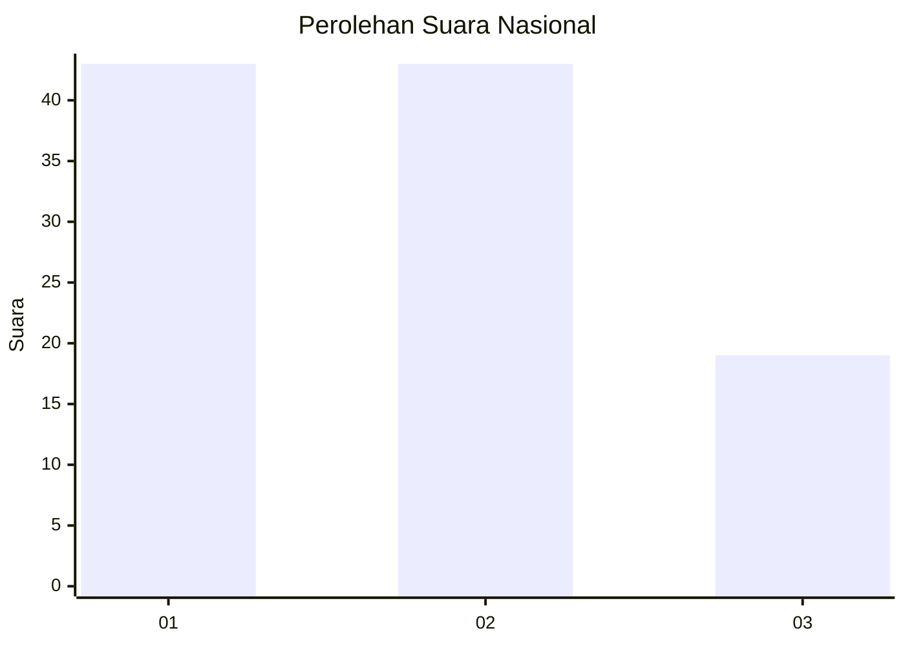
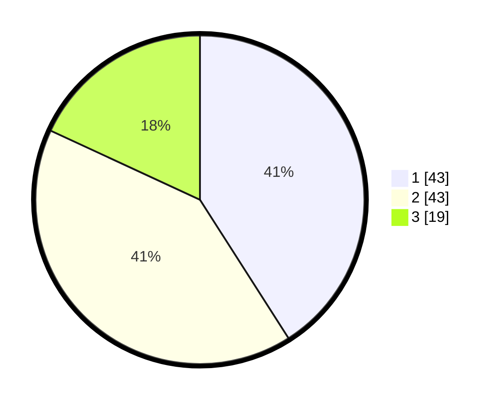

# Hasil

## Grafik

## Tabel

| No. | Nama Paslon    | Suara | Suara (raw) | Persentase |
|:--- |:-------------- | -----:| -----------:| ----------:|
| 1   | ANIES MUHAIMIN | 43    | [43][p-1]   | 40,95      |
| 2   | PRABOWO GIBRAN | 43    | [43][p-2]   | 40,95      |
| 3   | GANJAR MAHFUD  | 19    | [19][p-3]   | 18,10      |

[p-1]: https://github.com/gigit-pemilu/pemilu-2024/blob/main/pilpres/hitung-suara/sub/31-dki-jakarta/sub/72-jakarta-utara/sub/01-penjaringan/sub/1001-penjaringan/sub/010-tps/sub/paslon-1.txt
[p-2]: https://github.com/gigit-pemilu/pemilu-2024/blob/main/pilpres/hitung-suara/sub/31-dki-jakarta/sub/72-jakarta-utara/sub/01-penjaringan/sub/1001-penjaringan/sub/010-tps/sub/paslon-2.txt
[p-3]: https://github.com/gigit-pemilu/pemilu-2024/blob/main/pilpres/hitung-suara/sub/31-dki-jakarta/sub/72-jakarta-utara/sub/01-penjaringan/sub/1001-penjaringan/sub/010-tps/sub/paslon-3.txt

## Foto C Plano

https://sirekap-obj-formc.kpu.go.id/d7cf/pemilu/ppwp/31/72/01/10/01/3172011001010-20240221-221412--5a3b48ed-bae4-42a9-b937-4f6174905cd2.jpg

https://sirekap-obj-formc.kpu.go.id/d7cf/pemilu/ppwp/31/72/01/10/01/3172011001010-20240218-141422--f823684a-ec9c-434c-a432-d833c378a11f.jpg

https://sirekap-obj-formc.kpu.go.id/d7cf/pemilu/ppwp/31/72/01/10/01/3172011001010-20240218-141538--92535344-4a18-491c-aae7-38db8eca76d7.jpg

## Metadata

| Key        | Value               |
| ---------- | ------------------- |
| Time Stamp | 2024-02-21 23:00:00 |

