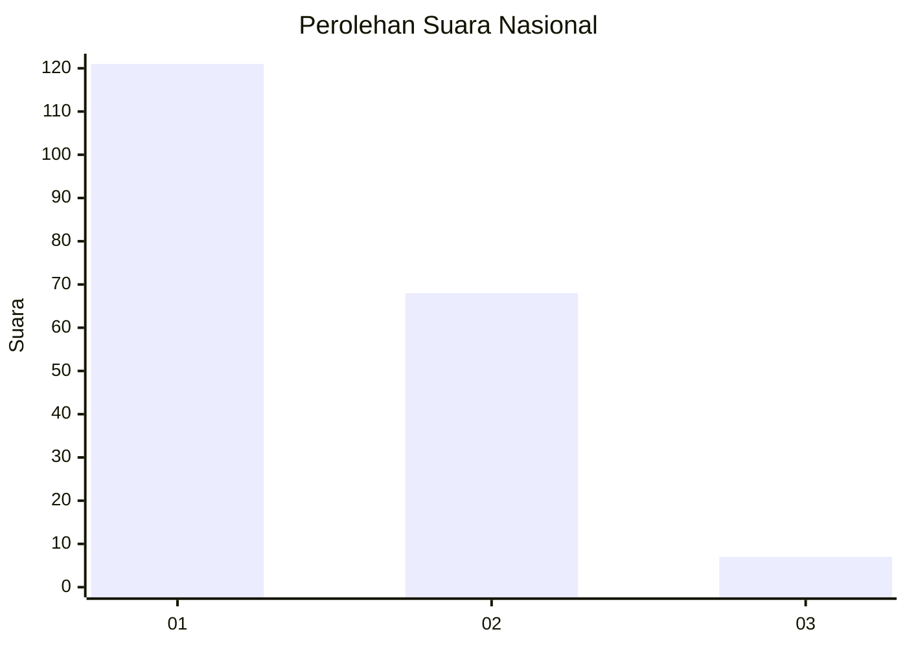
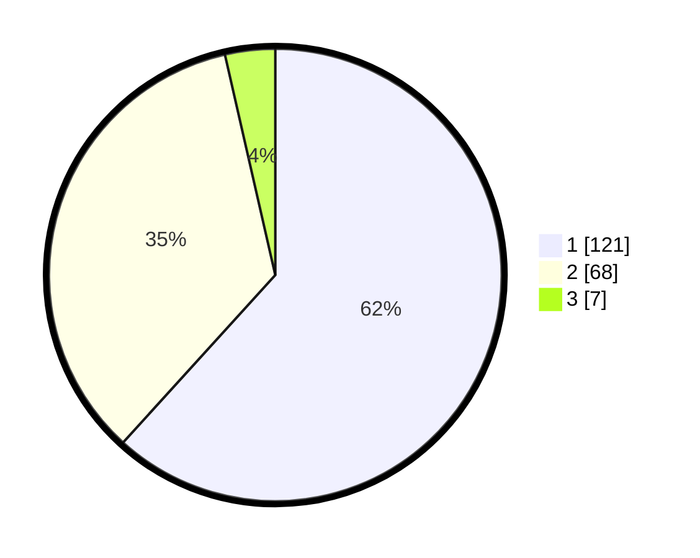

# Hasil

## Grafik

## Tabel

| No.    | Nama Paslon    | Suara | Suara (raw) | Persentase |
|:------ |:-------------- | -----:| -----------:| ----------:|
| 100025 | ANIES MUHAIMIN | 121   | [121][p-1]  | 61,73      |
| 100026 | PRABOWO GIBRAN | 68    | [68][p-2]   | 34,69      |
| 100027 | GANJAR MAHFUD  | 7     | [7][p-3]    | 3,57       |

[p-1]: https://github.com/gigit-pemilu/pemilu-2024/blob/main/pilpres/hitung-suara/sub/31-dki-jakarta/sub/72-jakarta-utara/sub/01-penjaringan/sub/1001-penjaringan/sub/016-tps/sub/paslon-1.txt
[p-2]: https://github.com/gigit-pemilu/pemilu-2024/blob/main/pilpres/hitung-suara/sub/31-dki-jakarta/sub/72-jakarta-utara/sub/01-penjaringan/sub/1001-penjaringan/sub/016-tps/sub/paslon-2.txt
[p-3]: https://github.com/gigit-pemilu/pemilu-2024/blob/main/pilpres/hitung-suara/sub/31-dki-jakarta/sub/72-jakarta-utara/sub/01-penjaringan/sub/1001-penjaringan/sub/016-tps/sub/paslon-3.txt

## Foto C Plano

https://sirekap-obj-formc.kpu.go.id/d820/pemilu/ppwp/31/72/01/10/01/3172011001016-20240218-201638--5f66eb55-2afa-479e-bb8b-5d9e1e304346.jpg

https://sirekap-obj-formc.kpu.go.id/d820/pemilu/ppwp/31/72/01/10/01/3172011001016-20240218-201350--dd5aff2a-15f4-4c9d-8e4c-2994ab2d599b.jpg

https://sirekap-obj-formc.kpu.go.id/d820/pemilu/ppwp/31/72/01/10/01/3172011001016-20240218-201439--63a87466-9159-4bb6-80c4-684b67fbc380.jpg

## Metadata

| Key        | Value               |
| ---------- | ------------------- |
| Time Stamp | 2024-02-21 15:00:00 |

