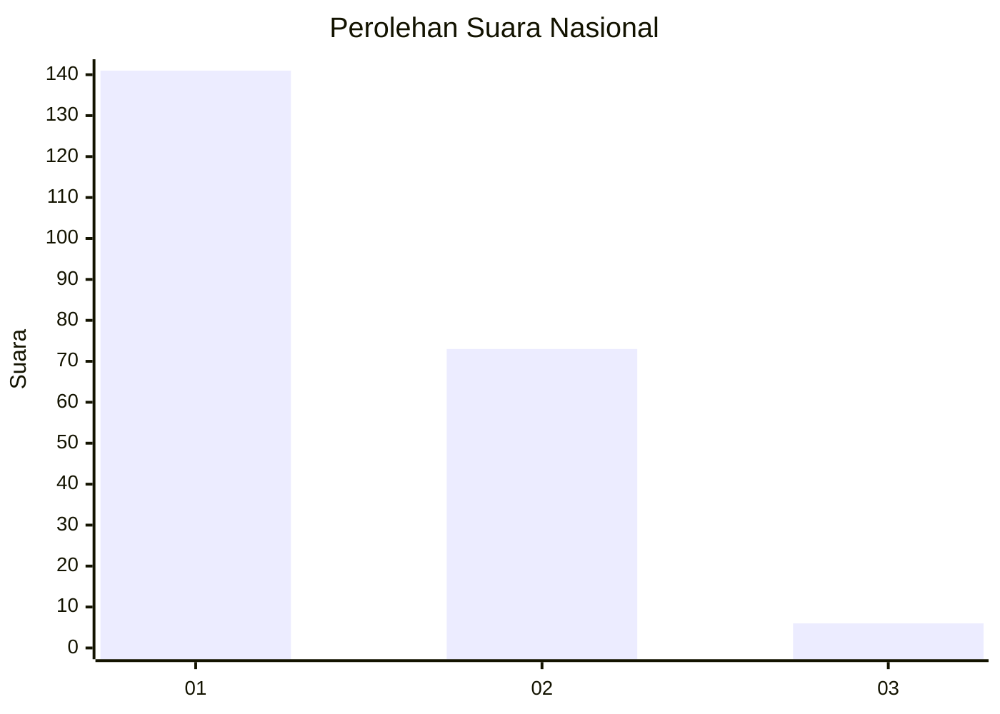
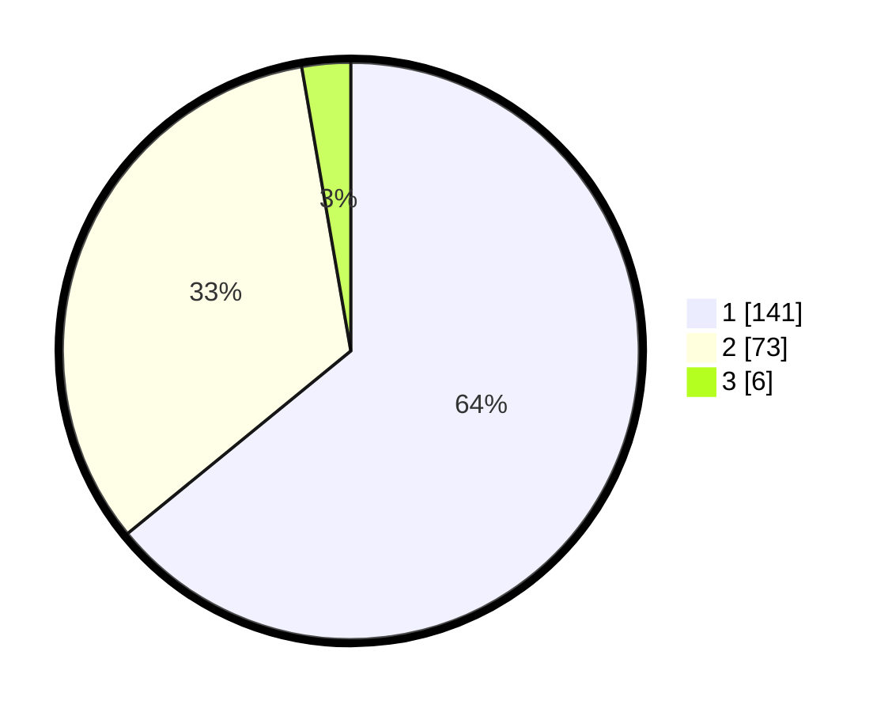

# Hasil

## Grafik

## Tabel

| No.    | Nama Paslon    | Suara | Suara (raw) | Persentase |
|:------ |:-------------- | -----:| -----------:| ----------:|
| 100025 | ANIES MUHAIMIN | 141   | [141][p-1]  | 64,09      |
| 100026 | PRABOWO GIBRAN | 73    | [73][p-2]   | 33,18      |
| 100027 | GANJAR MAHFUD  | 6     | [6][p-3]    | 2,73       |

[p-1]: https://github.com/gigit-pemilu/pemilu-2024/blob/main/pilpres/hitung-suara/sub/31-dki-jakarta/sub/72-jakarta-utara/sub/01-penjaringan/sub/1001-penjaringan/sub/019-tps/sub/paslon-1.txt
[p-2]: https://github.com/gigit-pemilu/pemilu-2024/blob/main/pilpres/hitung-suara/sub/31-dki-jakarta/sub/72-jakarta-utara/sub/01-penjaringan/sub/1001-penjaringan/sub/019-tps/sub/paslon-2.txt
[p-3]: https://github.com/gigit-pemilu/pemilu-2024/blob/main/pilpres/hitung-suara/sub/31-dki-jakarta/sub/72-jakarta-utara/sub/01-penjaringan/sub/1001-penjaringan/sub/019-tps/sub/paslon-3.txt

## Foto C Plano

https://sirekap-obj-formc.kpu.go.id/3bc3/pemilu/ppwp/31/72/01/10/01/3172011001019-20240216-151402--7f6e7a15-75af-4109-be7b-ec967671702b.jpg

https://sirekap-obj-formc.kpu.go.id/3bc3/pemilu/ppwp/31/72/01/10/01/3172011001019-20240216-150542--794cd529-e8b5-4354-adf5-df29120c4a9b.jpg

https://sirekap-obj-formc.kpu.go.id/3bc3/pemilu/ppwp/31/72/01/10/01/3172011001019-20240216-150631--a4955ce1-84df-49c7-bcc4-b0ebfa71fd5e.jpg

## Metadata

| Key        | Value               |
| ---------- | ------------------- |
| Time Stamp | 2024-02-16 16:25:10 |

