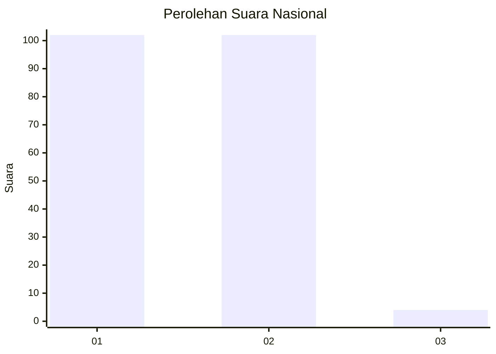
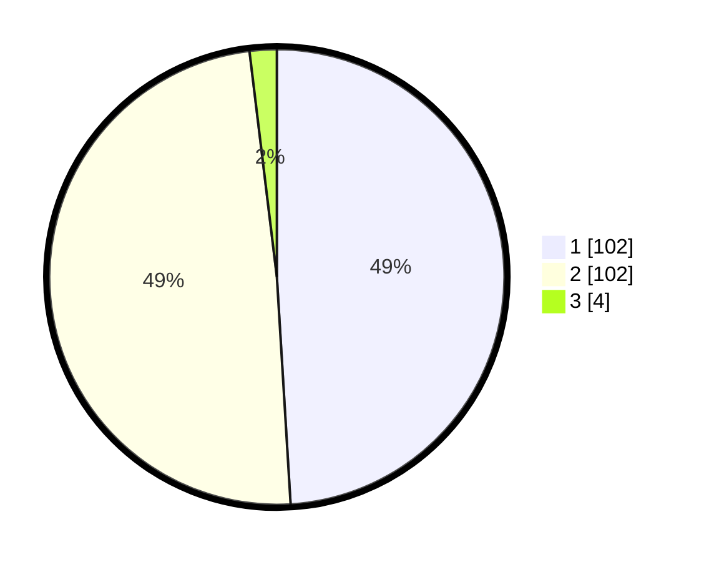

# Hasil

## Grafik

## Tabel

| No.    | Nama Paslon    | Suara | Suara (raw) | Persentase |
|:------ |:-------------- | -----:| -----------:| ----------:|
| 100025 | ANIES MUHAIMIN | 102   | [102][p-1]  | 49,04      |
| 100026 | PRABOWO GIBRAN | 102   | [102][p-2]  | 49,04      |
| 100027 | GANJAR MAHFUD  | 4     | [4][p-3]    | 1,92       |

[p-1]: https://github.com/gigit-pemilu/pemilu-2024/blob/main/pilpres/hitung-suara/sub/31-dki-jakarta/sub/72-jakarta-utara/sub/01-penjaringan/sub/1001-penjaringan/sub/032-tps/sub/paslon-1.txt
[p-2]: https://github.com/gigit-pemilu/pemilu-2024/blob/main/pilpres/hitung-suara/sub/31-dki-jakarta/sub/72-jakarta-utara/sub/01-penjaringan/sub/1001-penjaringan/sub/032-tps/sub/paslon-2.txt
[p-3]: https://github.com/gigit-pemilu/pemilu-2024/blob/main/pilpres/hitung-suara/sub/31-dki-jakarta/sub/72-jakarta-utara/sub/01-penjaringan/sub/1001-penjaringan/sub/032-tps/sub/paslon-3.txt

## Foto C Plano

https://sirekap-obj-formc.kpu.go.id/d062/pemilu/ppwp/31/72/01/10/01/3172011001032-20240216-172458--364e8bb8-dffc-40bf-9be2-68ce8df065b8.jpg

https://sirekap-obj-formc.kpu.go.id/d062/pemilu/ppwp/31/72/01/10/01/3172011001032-20240216-172531--f7b268b8-d727-4d1c-802e-25b665415ecb.jpg

https://sirekap-obj-formc.kpu.go.id/d062/pemilu/ppwp/31/72/01/10/01/3172011001032-20240216-172553--58f58be4-e1ae-40d7-bded-4e43c01ca683.jpg

## Metadata

| Key        | Value               |
| ---------- | ------------------- |
| Time Stamp | 2024-02-21 15:00:00 |

