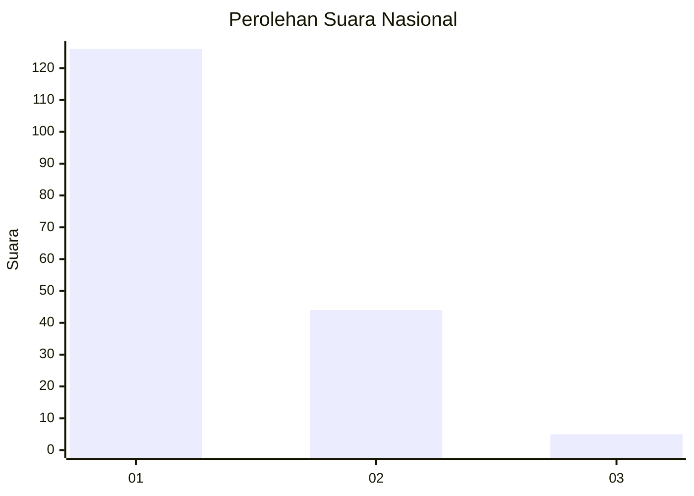
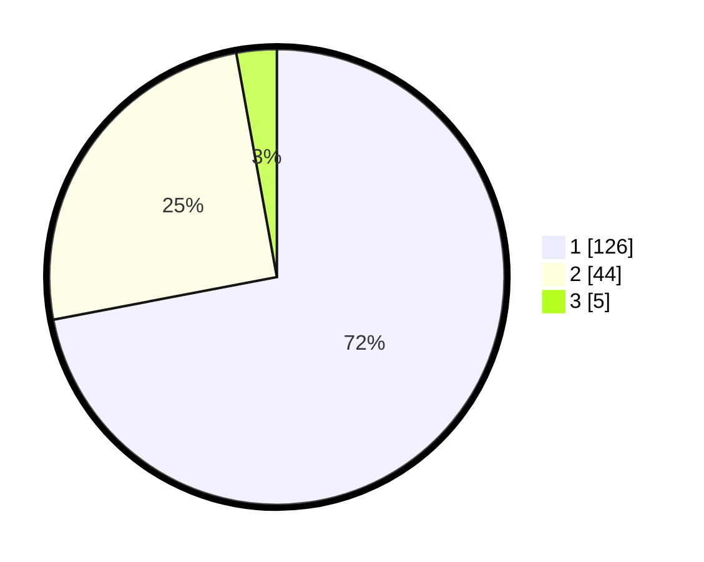

# Hasil

## Grafik

## Tabel

| No.    | Nama Paslon    | Suara | Suara (raw) | Persentase |
|:------ |:-------------- | -----:| -----------:| ----------:|
| 100025 | ANIES MUHAIMIN | 126   | [126][p-1]  | 72,00      |
| 100026 | PRABOWO GIBRAN | 44    | [44][p-2]   | 25,14      |
| 100027 | GANJAR MAHFUD  | 5     | [5][p-3]    | 2,86       |

[p-1]: https://github.com/gigit-pemilu/pemilu-2024/blob/main/pilpres/hitung-suara/sub/31-dki-jakarta/sub/72-jakarta-utara/sub/01-penjaringan/sub/1001-penjaringan/sub/033-tps/sub/paslon-1.txt
[p-2]: https://github.com/gigit-pemilu/pemilu-2024/blob/main/pilpres/hitung-suara/sub/31-dki-jakarta/sub/72-jakarta-utara/sub/01-penjaringan/sub/1001-penjaringan/sub/033-tps/sub/paslon-2.txt
[p-3]: https://github.com/gigit-pemilu/pemilu-2024/blob/main/pilpres/hitung-suara/sub/31-dki-jakarta/sub/72-jakarta-utara/sub/01-penjaringan/sub/1001-penjaringan/sub/033-tps/sub/paslon-3.txt

## Foto C Plano

https://sirekap-obj-formc.kpu.go.id/8754/pemilu/ppwp/31/72/01/10/01/3172011001033-20240216-172732--58f4bfa1-1df2-490c-88e5-c412ce2d846b.jpg

https://sirekap-obj-formc.kpu.go.id/8754/pemilu/ppwp/31/72/01/10/01/3172011001033-20240216-172835--218267bf-6dd2-4af6-91b8-d1870d86b49a.jpg

https://sirekap-obj-formc.kpu.go.id/8754/pemilu/ppwp/31/72/01/10/01/3172011001033-20240216-173003--794b094b-2f47-4424-a668-2ddc9b2b733e.jpg

## Metadata

| Key        | Value               |
| ---------- | ------------------- |
| Time Stamp | 2024-02-21 13:00:00 |

