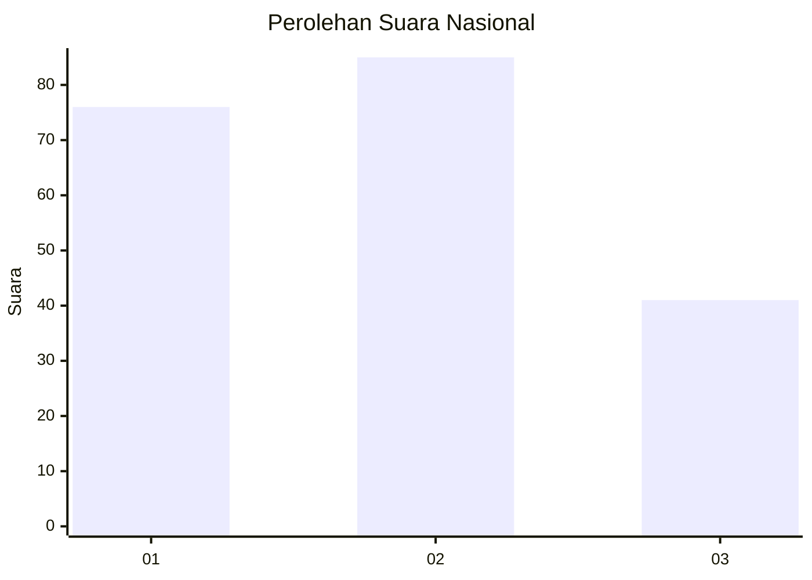
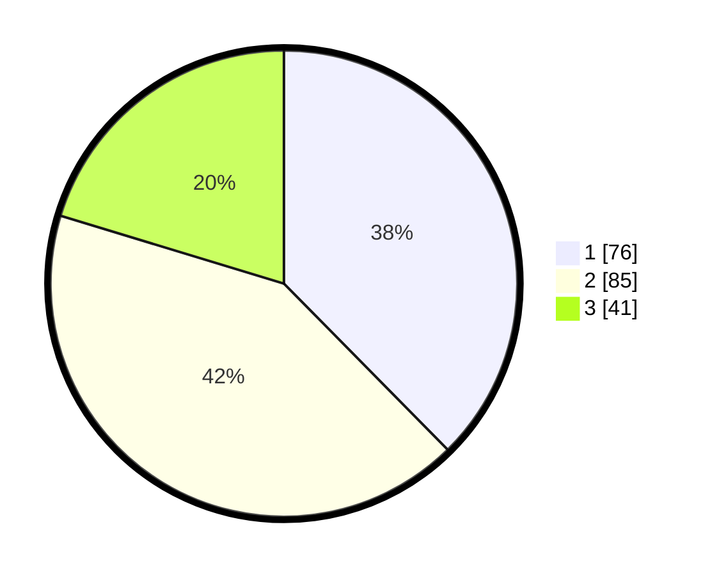

# Hasil

## Grafik

## Tabel

| No.    | Nama Paslon    | Suara | Suara (raw) | Persentase |
|:------ |:-------------- | -----:| -----------:| ----------:|
| 100025 | ANIES MUHAIMIN | 76    | [76][p-1]   | 37,62      |
| 100026 | PRABOWO GIBRAN | 85    | [85][p-2]   | 42,08      |
| 100027 | GANJAR MAHFUD  | 41    | [41][p-3]   | 20,30      |

[p-1]: https://github.com/gigit-pemilu/pemilu-2024/blob/main/pilpres/hitung-suara/sub/31-dki-jakarta/sub/72-jakarta-utara/sub/01-penjaringan/sub/1001-penjaringan/sub/034-tps/sub/paslon-1.txt
[p-2]: https://github.com/gigit-pemilu/pemilu-2024/blob/main/pilpres/hitung-suara/sub/31-dki-jakarta/sub/72-jakarta-utara/sub/01-penjaringan/sub/1001-penjaringan/sub/034-tps/sub/paslon-2.txt
[p-3]: https://github.com/gigit-pemilu/pemilu-2024/blob/main/pilpres/hitung-suara/sub/31-dki-jakarta/sub/72-jakarta-utara/sub/01-penjaringan/sub/1001-penjaringan/sub/034-tps/sub/paslon-3.txt

## Foto C Plano

https://sirekap-obj-formc.kpu.go.id/5217/pemilu/ppwp/31/72/01/10/01/3172011001034-20240216-173407--d21de77d-d76c-4e8b-89e6-2b59d11dece4.jpg

https://sirekap-obj-formc.kpu.go.id/5217/pemilu/ppwp/31/72/01/10/01/3172011001034-20240216-173832--3c86f451-5f27-4e71-a3ab-b46eaf2e5cd0.jpg

https://sirekap-obj-formc.kpu.go.id/5217/pemilu/ppwp/31/72/01/10/01/3172011001034-20240216-173858--6ec68996-72b0-4e6f-840f-013eb88d5e41.jpg

## Metadata

| Key        | Value               |
| ---------- | ------------------- |
| Time Stamp | 2024-02-21 13:00:00 |

