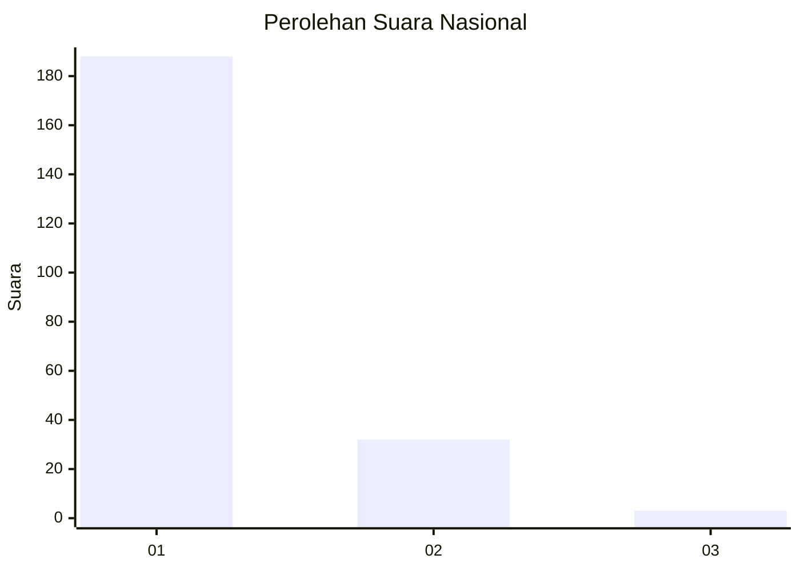
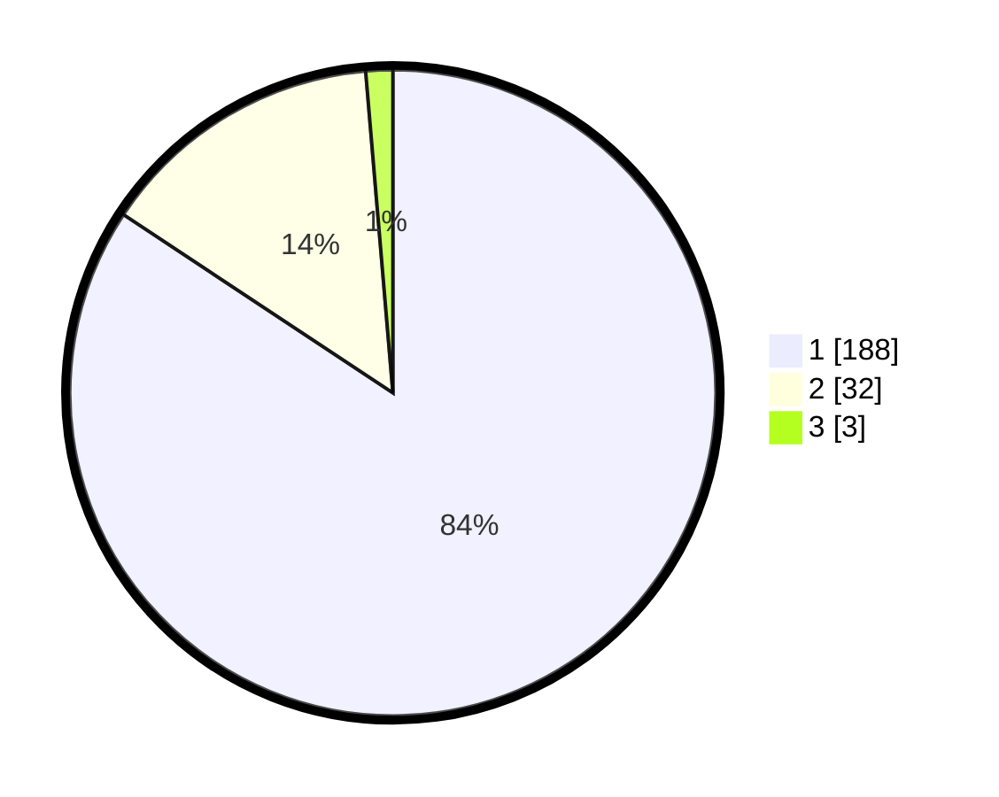

# Hasil

## Grafik

## Tabel

| No. | Nama Paslon    | Suara | Suara (raw) | Persentase |
|:--- |:-------------- | -----:| -----------:| ----------:|
| 1   | ANIES MUHAIMIN | 188   | [188][p-1]  | 84,30      |
| 2   | PRABOWO GIBRAN | 32    | [32][p-2]   | 14,35      |
| 3   | GANJAR MAHFUD  | 3     | [3][p-3]    | 1,35       |

[p-1]: https://github.com/gigit-pemilu/pemilu-2024/blob/main/pilpres/hitung-suara/sub/31-dki-jakarta/sub/72-jakarta-utara/sub/01-penjaringan/sub/1001-penjaringan/sub/035-tps/sub/paslon-1.txt
[p-2]: https://github.com/gigit-pemilu/pemilu-2024/blob/main/pilpres/hitung-suara/sub/31-dki-jakarta/sub/72-jakarta-utara/sub/01-penjaringan/sub/1001-penjaringan/sub/035-tps/sub/paslon-2.txt
[p-3]: https://github.com/gigit-pemilu/pemilu-2024/blob/main/pilpres/hitung-suara/sub/31-dki-jakarta/sub/72-jakarta-utara/sub/01-penjaringan/sub/1001-penjaringan/sub/035-tps/sub/paslon-3.txt

## Foto C Plano

https://sirekap-obj-formc.kpu.go.id/5aff/pemilu/ppwp/31/72/01/10/01/3172011001035-20240216-173943--843e361b-1cfb-4d4d-be68-4e7ca8c0c387.jpg

https://sirekap-obj-formc.kpu.go.id/5aff/pemilu/ppwp/31/72/01/10/01/3172011001035-20240216-174002--1b8f824b-b93d-4259-b4db-f4ddf985d6c1.jpg

https://sirekap-obj-formc.kpu.go.id/5aff/pemilu/ppwp/31/72/01/10/01/3172011001035-20240216-174026--0c4a9a14-09a0-4aa8-99a6-45ad7726d4ac.jpg

## Metadata

| Key        | Value               |
| ---------- | ------------------- |
| Time Stamp | 2024-02-21 13:00:00 |

