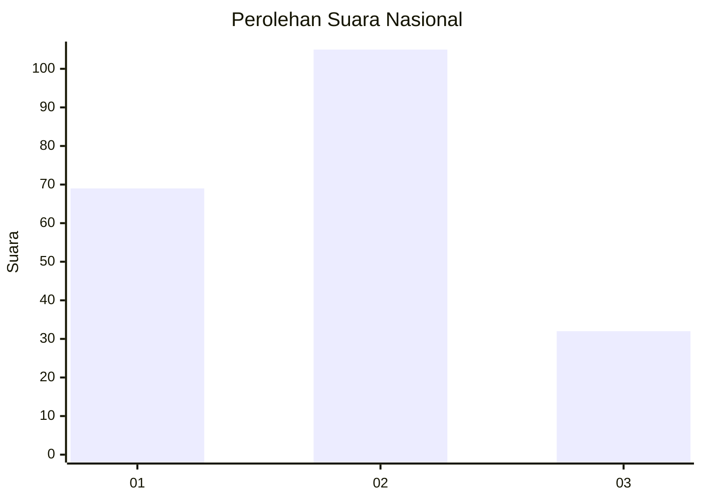
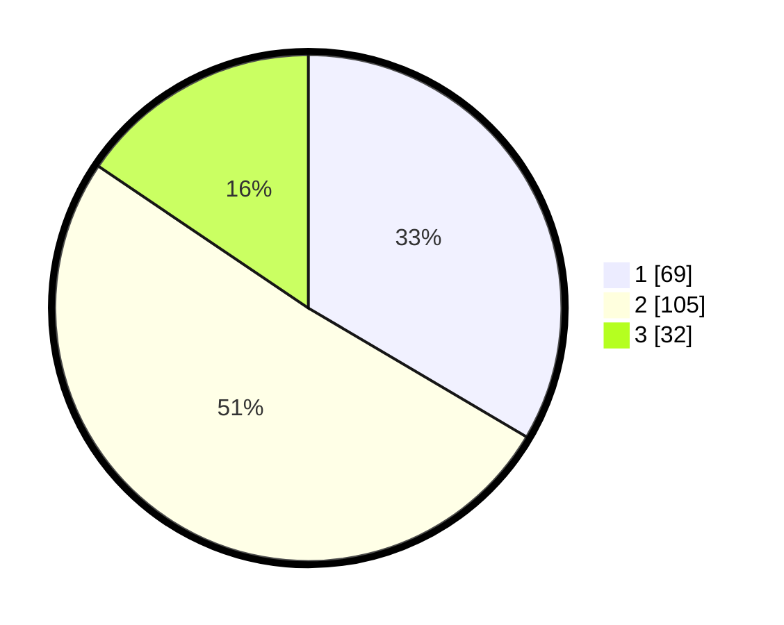

# Hasil

## Grafik

## Tabel

| No.    | Nama Paslon    | Suara | Suara (raw) | Persentase |
|:------ |:-------------- | -----:| -----------:| ----------:|
| 100025 | ANIES MUHAIMIN | 69    | [69][p-1]   | 33,50      |
| 100026 | PRABOWO GIBRAN | 105   | [105][p-2]  | 50,97      |
| 100027 | GANJAR MAHFUD  | 32    | [32][p-3]   | 15,53      |

[p-1]: https://github.com/gigit-pemilu/pemilu-2024/blob/main/pilpres/hitung-suara/sub/31-dki-jakarta/sub/72-jakarta-utara/sub/01-penjaringan/sub/1001-penjaringan/sub/037-tps/sub/paslon-1.txt
[p-2]: https://github.com/gigit-pemilu/pemilu-2024/blob/main/pilpres/hitung-suara/sub/31-dki-jakarta/sub/72-jakarta-utara/sub/01-penjaringan/sub/1001-penjaringan/sub/037-tps/sub/paslon-2.txt
[p-3]: https://github.com/gigit-pemilu/pemilu-2024/blob/main/pilpres/hitung-suara/sub/31-dki-jakarta/sub/72-jakarta-utara/sub/01-penjaringan/sub/1001-penjaringan/sub/037-tps/sub/paslon-3.txt

## Foto C Plano

https://sirekap-obj-formc.kpu.go.id/35e3/pemilu/ppwp/31/72/01/10/01/3172011001037-20240216-174547--21404062-b151-47c0-977f-609e3766e91f.jpg

https://sirekap-obj-formc.kpu.go.id/35e3/pemilu/ppwp/31/72/01/10/01/3172011001037-20240216-174639--14792d02-ae6b-485c-b1ec-77812621cc17.jpg

https://sirekap-obj-formc.kpu.go.id/35e3/pemilu/ppwp/31/72/01/10/01/3172011001037-20240216-174835--e17a1ad7-9c55-4af6-8437-ad7510af31cc.jpg

## Metadata

| Key        | Value               |
| ---------- | ------------------- |
| Time Stamp | 2024-02-20 15:00:00 |

