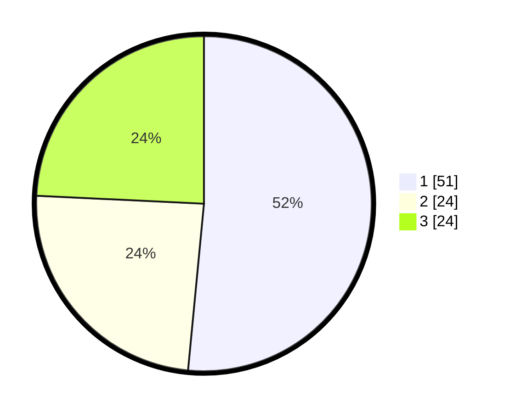

# Hasil

## Grafik

## Tabel

| No.    | Nama Paslon    | Suara | Suara (raw) | Persentase |
|:------ |:-------------- | -----:| -----------:| ----------:|
| 100025 | ANIES MUHAIMIN | 51    | [51][p-1]   | 51,52      |
| 100026 | PRABOWO GIBRAN | 24    | [24][p-2]   | 24,24      |
| 100027 | GANJAR MAHFUD  | 24    | [24][p-3]   | 24,24      |

[p-1]: https://github.com/gigit-pemilu/pemilu-2024/blob/main/pilpres/hitung-suara/sub/31-dki-jakarta/sub/72-jakarta-utara/sub/01-penjaringan/sub/1001-penjaringan/sub/041-tps/sub/paslon-1.txt
[p-2]: https://github.com/gigit-pemilu/pemilu-2024/blob/main/pilpres/hitung-suara/sub/31-dki-jakarta/sub/72-jakarta-utara/sub/01-penjaringan/sub/1001-penjaringan/sub/041-tps/sub/paslon-2.txt
[p-3]: https://github.com/gigit-pemilu/pemilu-2024/blob/main/pilpres/hitung-suara/sub/31-dki-jakarta/sub/72-jakarta-utara/sub/01-penjaringan/sub/1001-penjaringan/sub/041-tps/sub/paslon-3.txt

## Foto C Plano

https://sirekap-obj-formc.kpu.go.id/57ca/pemilu/ppwp/31/72/01/10/01/3172011001041-20240216-175419--0bc4c283-c179-418c-a288-71365b0c542f.jpg

https://sirekap-obj-formc.kpu.go.id/57ca/pemilu/ppwp/31/72/01/10/01/3172011001041-20240216-175436--22f0e7be-3f4f-438d-bff2-c1ec5c3b65e2.jpg

https://sirekap-obj-formc.kpu.go.id/57ca/pemilu/ppwp/31/72/01/10/01/3172011001041-20240216-175702--703c8a56-beb8-4549-9b94-3590287907c1.jpg

## Metadata

| Key        | Value               |
| ---------- | ------------------- |
| Time Stamp | 2024-02-21 14:00:00 |

