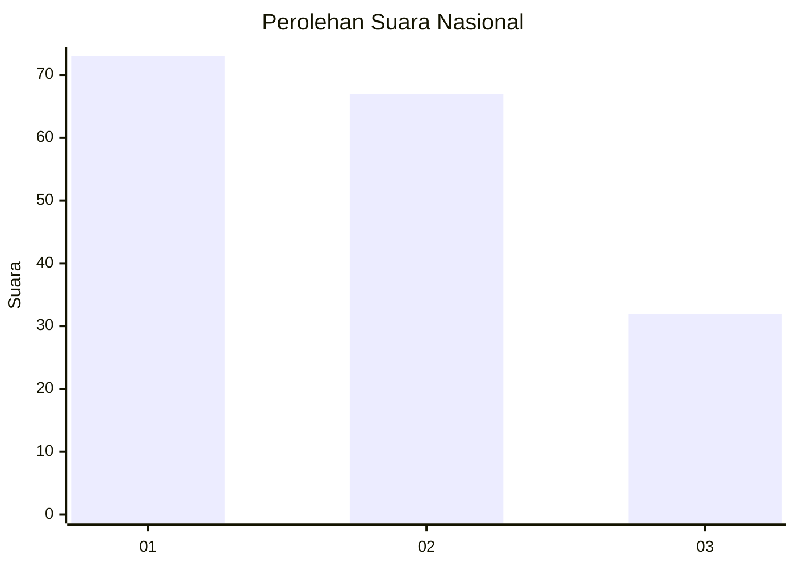
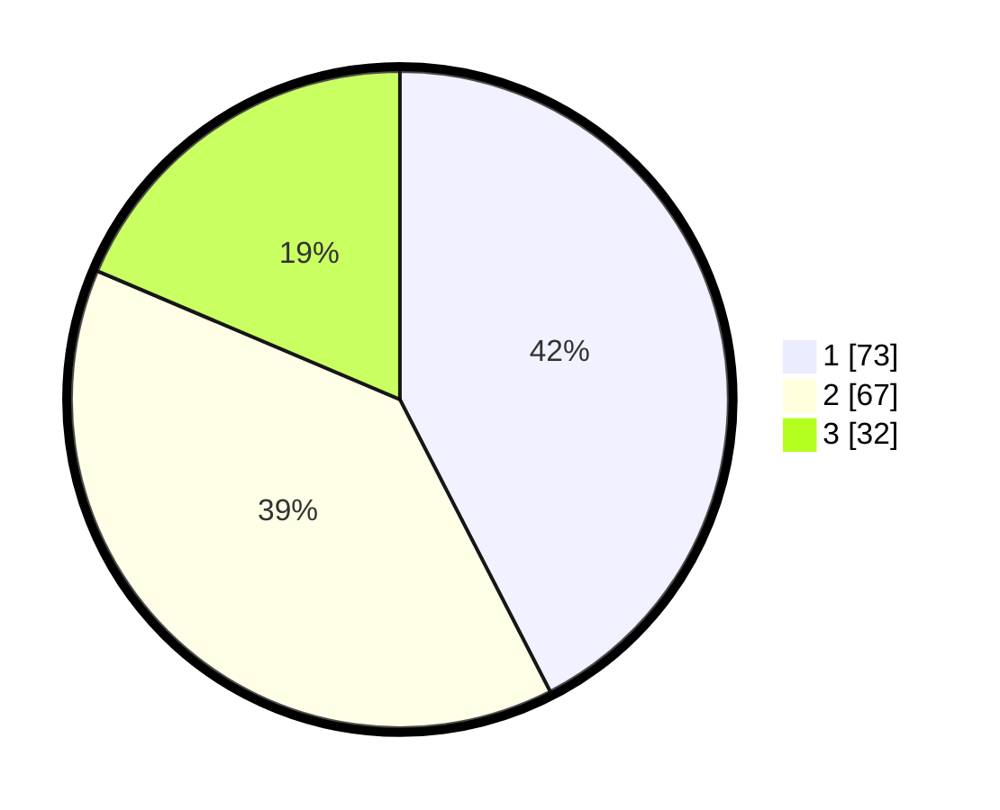

# Hasil

## Grafik

## Tabel

| No.    | Nama Paslon    | Suara | Suara (raw) | Persentase |
|:------ |:-------------- | -----:| -----------:| ----------:|
| 100025 | ANIES MUHAIMIN | 73    | [73][p-1]   | 42,44      |
| 100026 | PRABOWO GIBRAN | 67    | [67][p-2]   | 38,95      |
| 100027 | GANJAR MAHFUD  | 32    | [32][p-3]   | 18,60      |

[p-1]: https://github.com/gigit-pemilu/pemilu-2024/blob/main/pilpres/hitung-suara/sub/31-dki-jakarta/sub/72-jakarta-utara/sub/01-penjaringan/sub/1001-penjaringan/sub/042-tps/sub/paslon-1.txt
[p-2]: https://github.com/gigit-pemilu/pemilu-2024/blob/main/pilpres/hitung-suara/sub/31-dki-jakarta/sub/72-jakarta-utara/sub/01-penjaringan/sub/1001-penjaringan/sub/042-tps/sub/paslon-2.txt
[p-3]: https://github.com/gigit-pemilu/pemilu-2024/blob/main/pilpres/hitung-suara/sub/31-dki-jakarta/sub/72-jakarta-utara/sub/01-penjaringan/sub/1001-penjaringan/sub/042-tps/sub/paslon-3.txt

## Foto C Plano

https://sirekap-obj-formc.kpu.go.id/a75b/pemilu/ppwp/31/72/01/10/01/3172011001042-20240216-200514--0f10a3cc-d741-43f9-84e6-a38fda866529.jpg

https://sirekap-obj-formc.kpu.go.id/a75b/pemilu/ppwp/31/72/01/10/01/3172011001042-20240216-200422--2fb7e48e-ffed-4ca3-93f0-c8010da4399c.jpg

https://sirekap-obj-formc.kpu.go.id/a75b/pemilu/ppwp/31/72/01/10/01/3172011001042-20240216-200440--758f0204-3946-4aa0-a2ff-94a7396ff5a9.jpg

## Metadata

| Key        | Value               |
| ---------- | ------------------- |
| Time Stamp | 2024-02-21 15:00:00 |

