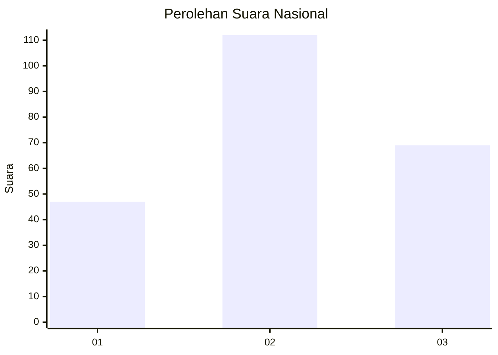
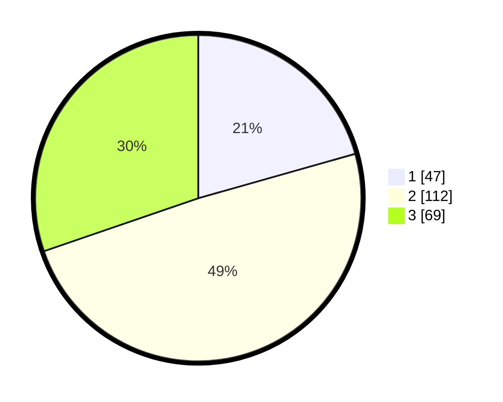

# Hasil

## Grafik

## Tabel

| No.    | Nama Paslon    | Suara | Suara (raw) | Persentase |
|:------ |:-------------- | -----:| -----------:| ----------:|
| 100025 | ANIES MUHAIMIN | 47    | [47][p-1]   | 20,61      |
| 100026 | PRABOWO GIBRAN | 112   | [112][p-2]  | 49,12      |
| 100027 | GANJAR MAHFUD  | 69    | [69][p-3]   | 30,26      |

[p-1]: https://github.com/gigit-pemilu/pemilu-2024/blob/main/pilpres/hitung-suara/sub/31-dki-jakarta/sub/72-jakarta-utara/sub/01-penjaringan/sub/1001-penjaringan/sub/046-tps/sub/paslon-1.txt
[p-2]: https://github.com/gigit-pemilu/pemilu-2024/blob/main/pilpres/hitung-suara/sub/31-dki-jakarta/sub/72-jakarta-utara/sub/01-penjaringan/sub/1001-penjaringan/sub/046-tps/sub/paslon-2.txt
[p-3]: https://github.com/gigit-pemilu/pemilu-2024/blob/main/pilpres/hitung-suara/sub/31-dki-jakarta/sub/72-jakarta-utara/sub/01-penjaringan/sub/1001-penjaringan/sub/046-tps/sub/paslon-3.txt

## Foto C Plano

https://sirekap-obj-formc.kpu.go.id/71fd/pemilu/ppwp/31/72/01/10/01/3172011001046-20240216-201511--261231c8-1413-43d8-8392-07cf61affc5a.jpg

https://sirekap-obj-formc.kpu.go.id/71fd/pemilu/ppwp/31/72/01/10/01/3172011001046-20240216-201535--589aad8b-be81-410a-94e6-dfc08333caa4.jpg

https://sirekap-obj-formc.kpu.go.id/71fd/pemilu/ppwp/31/72/01/10/01/3172011001046-20240216-201618--e4721980-6fdd-40fc-b040-8c1a6ed73695.jpg

## Metadata

| Key        | Value               |
| ---------- | ------------------- |
| Time Stamp | 2024-02-21 15:00:00 |

