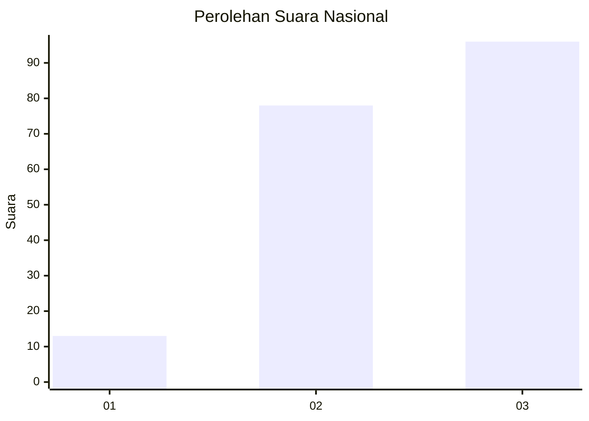
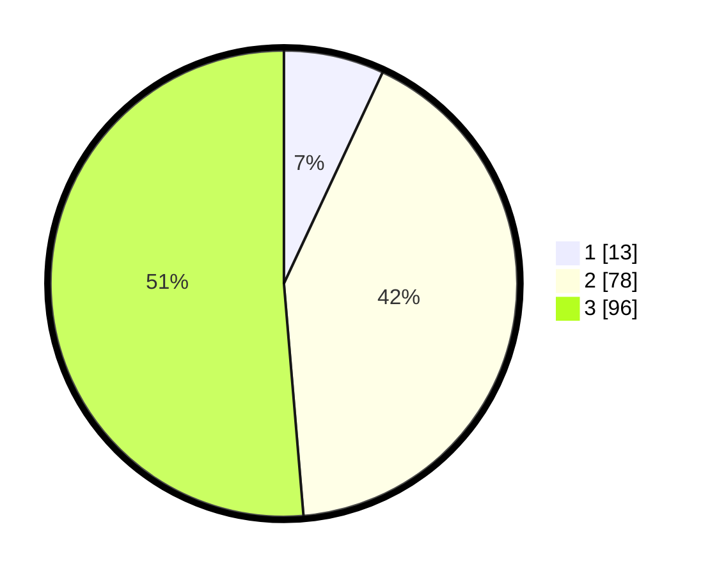

# Hasil

## Grafik

## Tabel

| No.    | Nama Paslon    | Suara | Suara (raw) | Persentase |
|:------ |:-------------- | -----:| -----------:| ----------:|
| 100025 | ANIES MUHAIMIN | 13    | [13][p-1]   | 6,95       |
| 100026 | PRABOWO GIBRAN | 78    | [78][p-2]   | 41,71      |
| 100027 | GANJAR MAHFUD  | 96    | [96][p-3]   | 51,34      |

[p-1]: https://github.com/gigit-pemilu/pemilu-2024/blob/main/pilpres/hitung-suara/sub/31-dki-jakarta/sub/72-jakarta-utara/sub/01-penjaringan/sub/1001-penjaringan/sub/048-tps/sub/paslon-1.txt
[p-2]: https://github.com/gigit-pemilu/pemilu-2024/blob/main/pilpres/hitung-suara/sub/31-dki-jakarta/sub/72-jakarta-utara/sub/01-penjaringan/sub/1001-penjaringan/sub/048-tps/sub/paslon-2.txt
[p-3]: https://github.com/gigit-pemilu/pemilu-2024/blob/main/pilpres/hitung-suara/sub/31-dki-jakarta/sub/72-jakarta-utara/sub/01-penjaringan/sub/1001-penjaringan/sub/048-tps/sub/paslon-3.txt

## Foto C Plano

https://sirekap-obj-formc.kpu.go.id/ba04/pemilu/ppwp/31/72/01/10/01/3172011001048-20240216-202107--c66eb2fa-1de4-4b96-8ab2-556f0a5e6413.jpg

https://sirekap-obj-formc.kpu.go.id/ba04/pemilu/ppwp/31/72/01/10/01/3172011001048-20240216-202204--df2a0c47-a7eb-4295-bf90-24b55563ac8b.jpg

https://sirekap-obj-formc.kpu.go.id/ba04/pemilu/ppwp/31/72/01/10/01/3172011001048-20240216-202238--9fc4b84e-3f84-40c0-b4d9-54ed21d54e9b.jpg

## Metadata

| Key        | Value               |
| ---------- | ------------------- |
| Time Stamp | 2024-02-21 14:00:00 |

