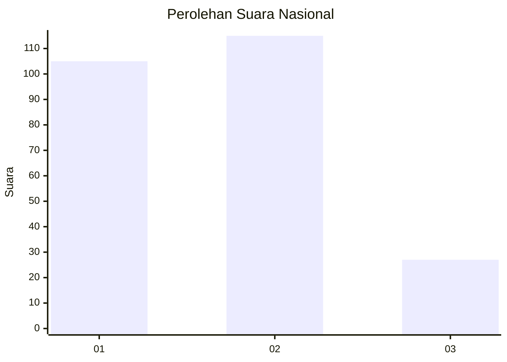
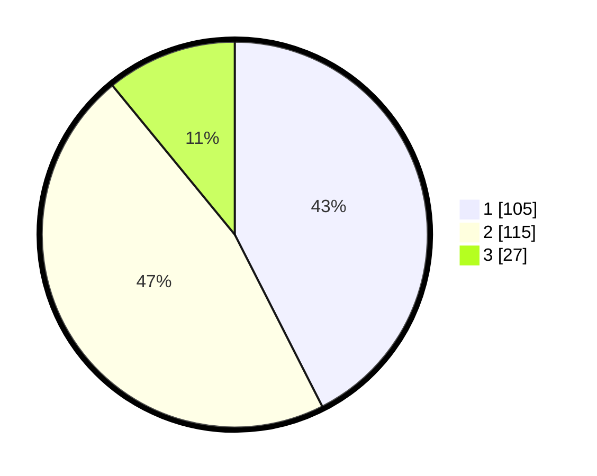

# Hasil

## Grafik

## Tabel

| No.    | Nama Paslon    | Suara | Suara (raw) | Persentase |
|:------ |:-------------- | -----:| -----------:| ----------:|
| 100025 | ANIES MUHAIMIN | 105   | [105][p-1]  | 42,51      |
| 100026 | PRABOWO GIBRAN | 115   | [115][p-2]  | 46,56      |
| 100027 | GANJAR MAHFUD  | 27    | [27][p-3]   | 10,93      |

[p-1]: https://github.com/gigit-pemilu/pemilu-2024/blob/main/pilpres/hitung-suara/sub/31-dki-jakarta/sub/72-jakarta-utara/sub/01-penjaringan/sub/1001-penjaringan/sub/054-tps/sub/paslon-1.txt
[p-2]: https://github.com/gigit-pemilu/pemilu-2024/blob/main/pilpres/hitung-suara/sub/31-dki-jakarta/sub/72-jakarta-utara/sub/01-penjaringan/sub/1001-penjaringan/sub/054-tps/sub/paslon-2.txt
[p-3]: https://github.com/gigit-pemilu/pemilu-2024/blob/main/pilpres/hitung-suara/sub/31-dki-jakarta/sub/72-jakarta-utara/sub/01-penjaringan/sub/1001-penjaringan/sub/054-tps/sub/paslon-3.txt

## Foto C Plano

https://sirekap-obj-formc.kpu.go.id/5c3e/pemilu/ppwp/31/72/01/10/01/3172011001054-20240216-210117--00c59048-7567-4636-9177-f033335611a3.jpg

https://sirekap-obj-formc.kpu.go.id/5c3e/pemilu/ppwp/31/72/01/10/01/3172011001054-20240216-203713--e95f98eb-5e8e-4704-8043-1c1387d5fb22.jpg

https://sirekap-obj-formc.kpu.go.id/5c3e/pemilu/ppwp/31/72/01/10/01/3172011001054-20240216-205930--f699cf8e-e40c-4dbd-83aa-20631f711d64.jpg

## Metadata

| Key        | Value               |
| ---------- | ------------------- |
| Time Stamp | 2024-02-21 14:00:00 |

