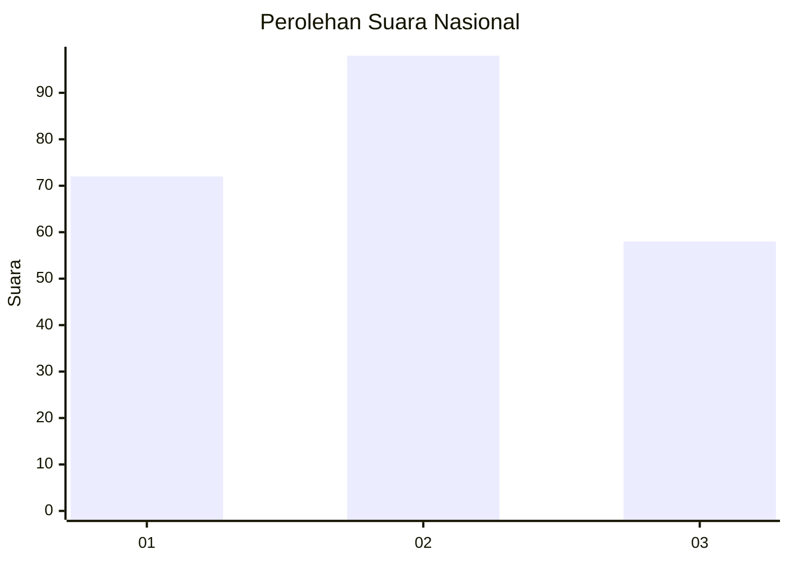
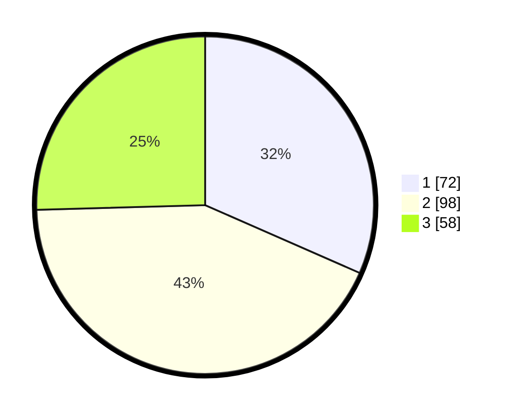

# Hasil

## Grafik

## Tabel

| No.    | Nama Paslon    | Suara | Suara (raw) | Persentase |
|:------ |:-------------- | -----:| -----------:| ----------:|
| 100025 | ANIES MUHAIMIN | 72    | [72][p-1]   | 31,58      |
| 100026 | PRABOWO GIBRAN | 98    | [98][p-2]   | 42,98      |
| 100027 | GANJAR MAHFUD  | 58    | [58][p-3]   | 25,44      |

[p-1]: https://github.com/gigit-pemilu/pemilu-2024/blob/main/pilpres/hitung-suara/sub/31-dki-jakarta/sub/72-jakarta-utara/sub/01-penjaringan/sub/1001-penjaringan/sub/058-tps/sub/paslon-1.txt
[p-2]: https://github.com/gigit-pemilu/pemilu-2024/blob/main/pilpres/hitung-suara/sub/31-dki-jakarta/sub/72-jakarta-utara/sub/01-penjaringan/sub/1001-penjaringan/sub/058-tps/sub/paslon-2.txt
[p-3]: https://github.com/gigit-pemilu/pemilu-2024/blob/main/pilpres/hitung-suara/sub/31-dki-jakarta/sub/72-jakarta-utara/sub/01-penjaringan/sub/1001-penjaringan/sub/058-tps/sub/paslon-3.txt

## Foto C Plano

https://sirekap-obj-formc.kpu.go.id/4527/pemilu/ppwp/31/72/01/10/01/3172011001058-20240216-204718--476fbf83-7b3a-44e2-bcba-8817d656c02f.jpg

https://sirekap-obj-formc.kpu.go.id/4527/pemilu/ppwp/31/72/01/10/01/3172011001058-20240216-204757--dee681e6-cf90-46c9-a162-273da2f80ff6.jpg

https://sirekap-obj-formc.kpu.go.id/4527/pemilu/ppwp/31/72/01/10/01/3172011001058-20240216-204817--8c8ed466-6b0a-4200-b4b3-1f2074b987da.jpg

## Metadata

| Key        | Value               |
| ---------- | ------------------- |
| Time Stamp | 2024-02-21 14:00:00 |

