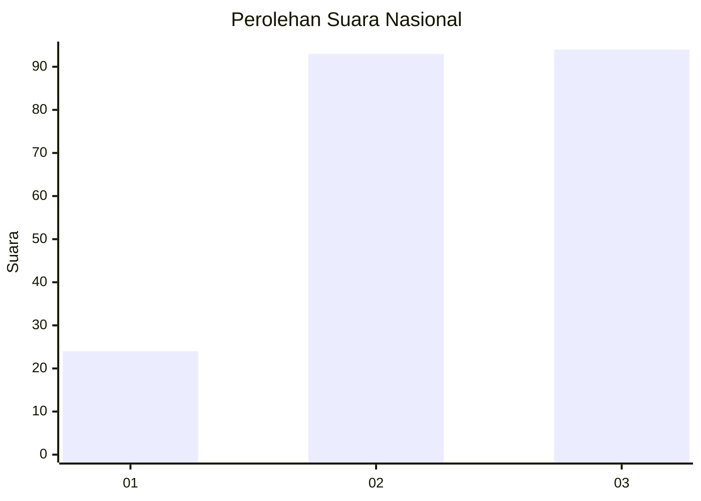
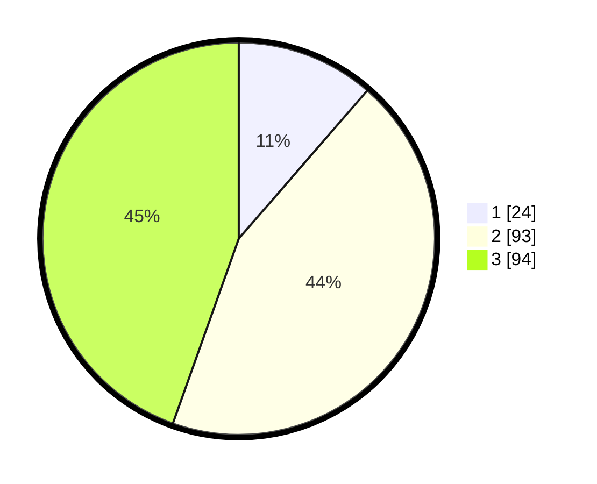

# Hasil

## Grafik

## Tabel

| No.    | Nama Paslon    | Suara | Suara (raw) | Persentase |
|:------ |:-------------- | -----:| -----------:| ----------:|
| 100025 | ANIES MUHAIMIN | 24    | [24][p-1]   | 11,37      |
| 100026 | PRABOWO GIBRAN | 93    | [93][p-2]   | 44,08      |
| 100027 | GANJAR MAHFUD  | 94    | [94][p-3]   | 44,55      |

[p-1]: https://github.com/gigit-pemilu/pemilu-2024/blob/main/pilpres/hitung-suara/sub/31-dki-jakarta/sub/72-jakarta-utara/sub/01-penjaringan/sub/1001-penjaringan/sub/061-tps/sub/paslon-1.txt
[p-2]: https://github.com/gigit-pemilu/pemilu-2024/blob/main/pilpres/hitung-suara/sub/31-dki-jakarta/sub/72-jakarta-utara/sub/01-penjaringan/sub/1001-penjaringan/sub/061-tps/sub/paslon-2.txt
[p-3]: https://github.com/gigit-pemilu/pemilu-2024/blob/main/pilpres/hitung-suara/sub/31-dki-jakarta/sub/72-jakarta-utara/sub/01-penjaringan/sub/1001-penjaringan/sub/061-tps/sub/paslon-3.txt

## Foto C Plano

https://sirekap-obj-formc.kpu.go.id/5c6d/pemilu/ppwp/31/72/01/10/01/3172011001061-20240216-205211--e77a1804-374d-467e-9fd1-30ddce6207ef.jpg

https://sirekap-obj-formc.kpu.go.id/5c6d/pemilu/ppwp/31/72/01/10/01/3172011001061-20240216-205234--c6b94e3c-f7b8-4f10-9494-85ff92ba9adc.jpg

https://sirekap-obj-formc.kpu.go.id/5c6d/pemilu/ppwp/31/72/01/10/01/3172011001061-20240216-205311--a5cff192-4e5b-440f-8be7-171aee5eb040.jpg

## Metadata

| Key        | Value               |
| ---------- | ------------------- |
| Time Stamp | 2024-02-21 14:00:00 |

