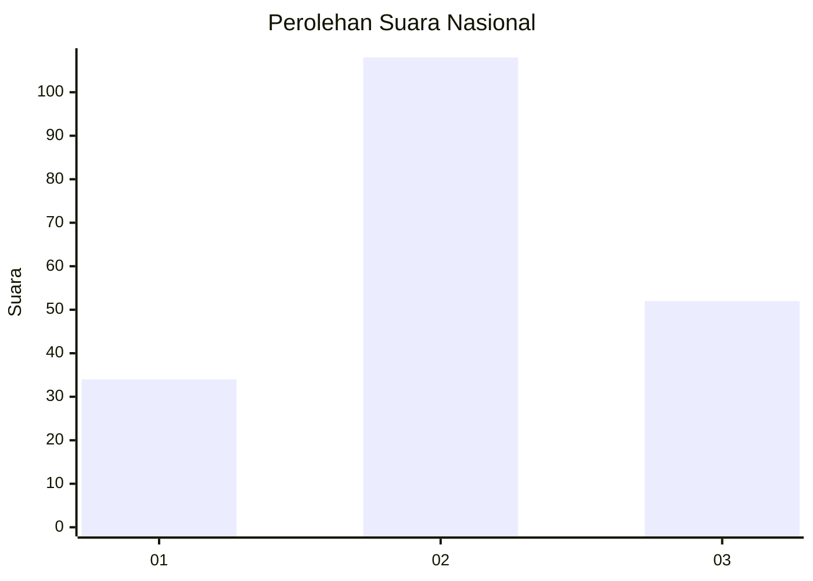
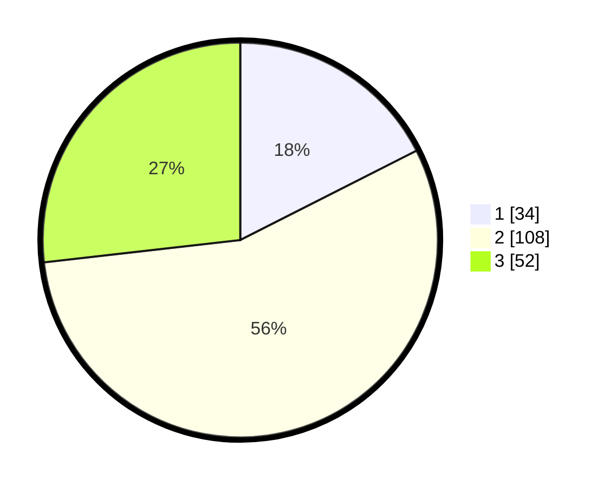

# Hasil

## Grafik

## Tabel

| No.    | Nama Paslon    | Suara | Suara (raw) | Persentase |
|:------ |:-------------- | -----:| -----------:| ----------:|
| 100025 | ANIES MUHAIMIN | 34    | [34][p-1]   | 17,53      |
| 100026 | PRABOWO GIBRAN | 108   | [108][p-2]  | 55,67      |
| 100027 | GANJAR MAHFUD  | 52    | [52][p-3]   | 26,80      |

[p-1]: https://github.com/gigit-pemilu/pemilu-2024/blob/main/pilpres/hitung-suara/sub/31-dki-jakarta/sub/72-jakarta-utara/sub/01-penjaringan/sub/1001-penjaringan/sub/062-tps/sub/paslon-1.txt
[p-2]: https://github.com/gigit-pemilu/pemilu-2024/blob/main/pilpres/hitung-suara/sub/31-dki-jakarta/sub/72-jakarta-utara/sub/01-penjaringan/sub/1001-penjaringan/sub/062-tps/sub/paslon-2.txt
[p-3]: https://github.com/gigit-pemilu/pemilu-2024/blob/main/pilpres/hitung-suara/sub/31-dki-jakarta/sub/72-jakarta-utara/sub/01-penjaringan/sub/1001-penjaringan/sub/062-tps/sub/paslon-3.txt

## Foto C Plano

https://sirekap-obj-formc.kpu.go.id/5771/pemilu/ppwp/31/72/01/10/01/3172011001062-20240216-205412--efda75ab-ab8d-490c-af76-2de96edb4e11.jpg

https://sirekap-obj-formc.kpu.go.id/5771/pemilu/ppwp/31/72/01/10/01/3172011001062-20240216-205435--aa614562-7975-482e-8d73-c981181e723e.jpg

https://sirekap-obj-formc.kpu.go.id/5771/pemilu/ppwp/31/72/01/10/01/3172011001062-20240216-205539--b5bd83a2-f562-4381-a441-9cd608d97a5f.jpg

## Metadata

| Key        | Value               |
| ---------- | ------------------- |
| Time Stamp | 2024-02-21 14:00:00 |

