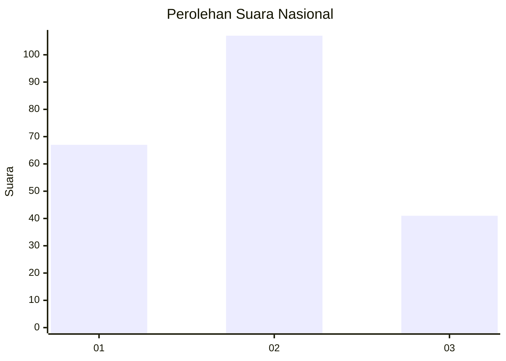
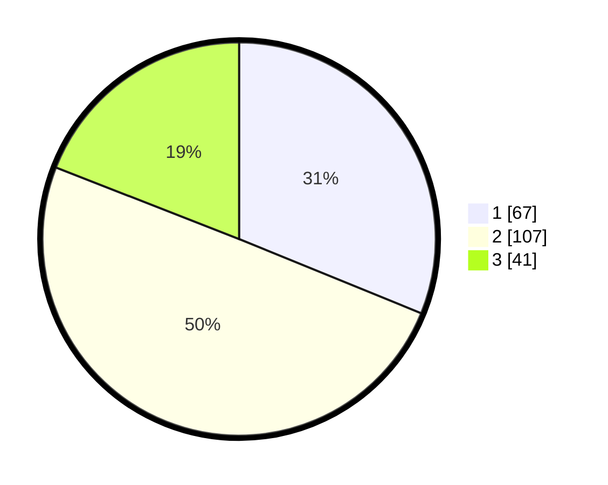

# Hasil

## Grafik

## Tabel

| No.    | Nama Paslon    | Suara | Suara (raw) | Persentase |
|:------ |:-------------- | -----:| -----------:| ----------:|
| 100025 | ANIES MUHAIMIN | 67    | [67][p-1]   | 31,16      |
| 100026 | PRABOWO GIBRAN | 107   | [107][p-2]  | 49,77      |
| 100027 | GANJAR MAHFUD  | 41    | [41][p-3]   | 19,07      |

[p-1]: https://github.com/gigit-pemilu/pemilu-2024/blob/main/pilpres/hitung-suara/sub/31-dki-jakarta/sub/72-jakarta-utara/sub/01-penjaringan/sub/1001-penjaringan/sub/063-tps/sub/paslon-1.txt
[p-2]: https://github.com/gigit-pemilu/pemilu-2024/blob/main/pilpres/hitung-suara/sub/31-dki-jakarta/sub/72-jakarta-utara/sub/01-penjaringan/sub/1001-penjaringan/sub/063-tps/sub/paslon-2.txt
[p-3]: https://github.com/gigit-pemilu/pemilu-2024/blob/main/pilpres/hitung-suara/sub/31-dki-jakarta/sub/72-jakarta-utara/sub/01-penjaringan/sub/1001-penjaringan/sub/063-tps/sub/paslon-3.txt

## Foto C Plano

https://sirekap-obj-formc.kpu.go.id/dcf8/pemilu/ppwp/31/72/01/10/01/3172011001063-20240216-205745--e3eeef5a-c60e-491a-933e-76059c1d55bb.jpg

https://sirekap-obj-formc.kpu.go.id/dcf8/pemilu/ppwp/31/72/01/10/01/3172011001063-20240216-205806--53a4c6fb-a323-46be-bec7-c6ab7958a22e.jpg

https://sirekap-obj-formc.kpu.go.id/dcf8/pemilu/ppwp/31/72/01/10/01/3172011001063-20240216-205827--a5d78516-d6d3-4199-adb5-2aa20e34076c.jpg

## Metadata

| Key        | Value               |
| ---------- | ------------------- |
| Time Stamp | 2024-02-21 15:00:00 |

