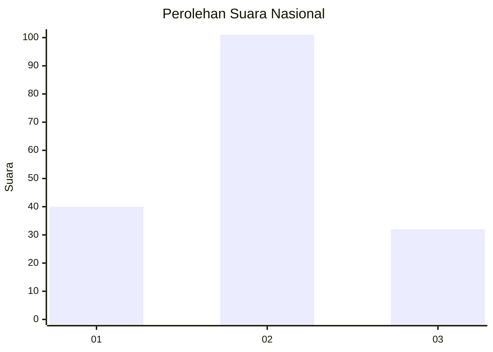
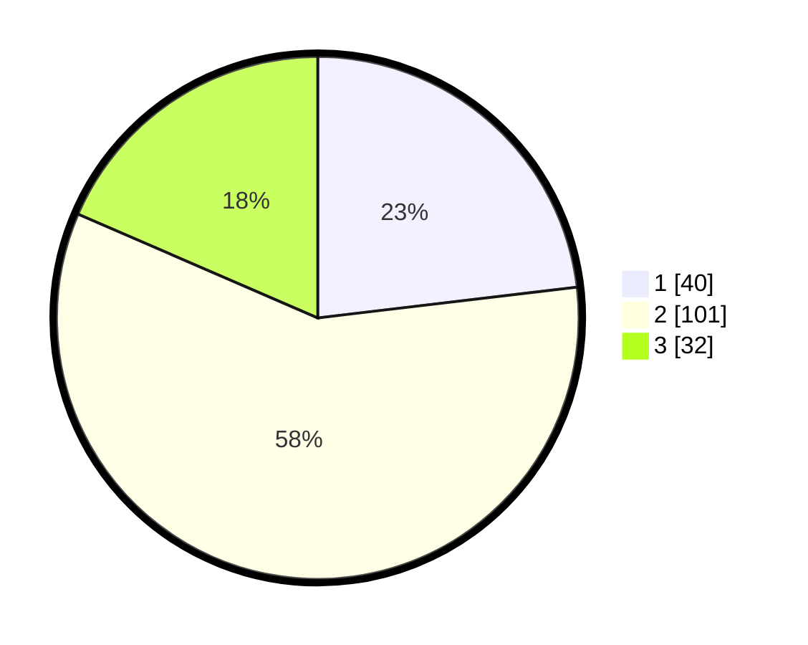

# Hasil

## Grafik

## Tabel

| No.    | Nama Paslon    | Suara | Suara (raw) | Persentase |
|:------ |:-------------- | -----:| -----------:| ----------:|
| 100025 | ANIES MUHAIMIN | 40    | [40][p-1]   | 23,12      |
| 100026 | PRABOWO GIBRAN | 101   | [101][p-2]  | 58,38      |
| 100027 | GANJAR MAHFUD  | 32    | [32][p-3]   | 18,50      |

[p-1]: https://github.com/gigit-pemilu/pemilu-2024/blob/main/pilpres/hitung-suara/sub/31-dki-jakarta/sub/72-jakarta-utara/sub/01-penjaringan/sub/1001-penjaringan/sub/064-tps/sub/paslon-1.txt
[p-2]: https://github.com/gigit-pemilu/pemilu-2024/blob/main/pilpres/hitung-suara/sub/31-dki-jakarta/sub/72-jakarta-utara/sub/01-penjaringan/sub/1001-penjaringan/sub/064-tps/sub/paslon-2.txt
[p-3]: https://github.com/gigit-pemilu/pemilu-2024/blob/main/pilpres/hitung-suara/sub/31-dki-jakarta/sub/72-jakarta-utara/sub/01-penjaringan/sub/1001-penjaringan/sub/064-tps/sub/paslon-3.txt

## Foto C Plano

https://sirekap-obj-formc.kpu.go.id/31d4/pemilu/ppwp/31/72/01/10/01/3172011001064-20240216-205929--4cd79055-74c4-466a-8619-641136bc79e3.jpg

https://sirekap-obj-formc.kpu.go.id/31d4/pemilu/ppwp/31/72/01/10/01/3172011001064-20240216-205954--57a73184-c11c-4180-a79b-4f57c38968ba.jpg

https://sirekap-obj-formc.kpu.go.id/31d4/pemilu/ppwp/31/72/01/10/01/3172011001064-20240216-210015--6861395a-45c3-4ee4-8958-87a879721723.jpg

## Metadata

| Key        | Value               |
| ---------- | ------------------- |
| Time Stamp | 2024-02-21 14:00:00 |

