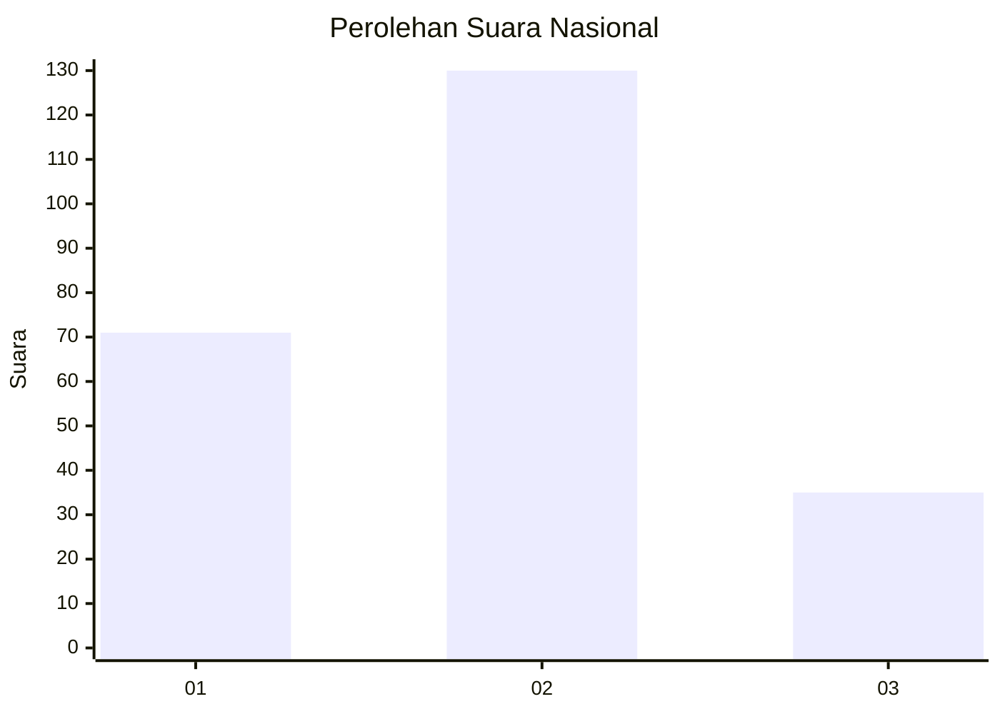
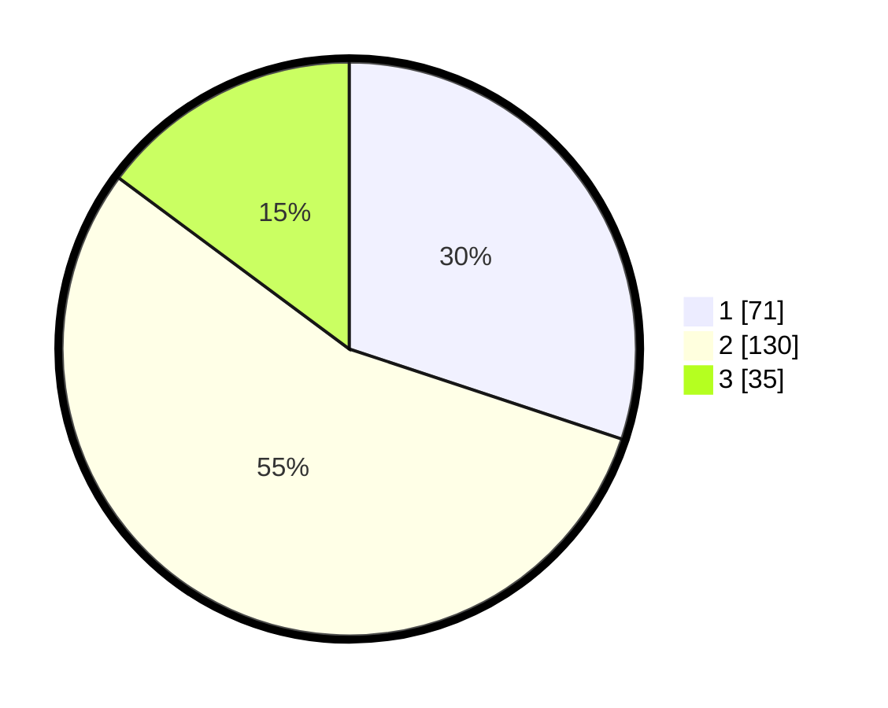

# Hasil

## Grafik

## Tabel

| No.    | Nama Paslon    | Suara | Suara (raw) | Persentase |
|:------ |:-------------- | -----:| -----------:| ----------:|
| 100025 | ANIES MUHAIMIN | 71    | [71][p-1]   | 30,08      |
| 100026 | PRABOWO GIBRAN | 130   | [130][p-2]  | 55,08      |
| 100027 | GANJAR MAHFUD  | 35    | [35][p-3]   | 14,83      |

[p-1]: https://github.com/gigit-pemilu/pemilu-2024/blob/main/pilpres/hitung-suara/sub/31-dki-jakarta/sub/72-jakarta-utara/sub/01-penjaringan/sub/1001-penjaringan/sub/067-tps/sub/paslon-1.txt
[p-2]: https://github.com/gigit-pemilu/pemilu-2024/blob/main/pilpres/hitung-suara/sub/31-dki-jakarta/sub/72-jakarta-utara/sub/01-penjaringan/sub/1001-penjaringan/sub/067-tps/sub/paslon-2.txt
[p-3]: https://github.com/gigit-pemilu/pemilu-2024/blob/main/pilpres/hitung-suara/sub/31-dki-jakarta/sub/72-jakarta-utara/sub/01-penjaringan/sub/1001-penjaringan/sub/067-tps/sub/paslon-3.txt

## Foto C Plano

https://sirekap-obj-formc.kpu.go.id/1507/pemilu/ppwp/31/72/01/10/01/3172011001067-20240216-210504--cdc577b3-c053-4eab-863e-23d558f34d06.jpg

https://sirekap-obj-formc.kpu.go.id/1507/pemilu/ppwp/31/72/01/10/01/3172011001067-20240216-210557--3c6440d4-f6d7-428c-a31c-21675881ec15.jpg

https://sirekap-obj-formc.kpu.go.id/1507/pemilu/ppwp/31/72/01/10/01/3172011001067-20240216-210531--3eda3314-bd07-4228-90e9-886345c9a247.jpg

## Metadata

| Key        | Value               |
| ---------- | ------------------- |
| Time Stamp | 2024-02-21 14:00:00 |

