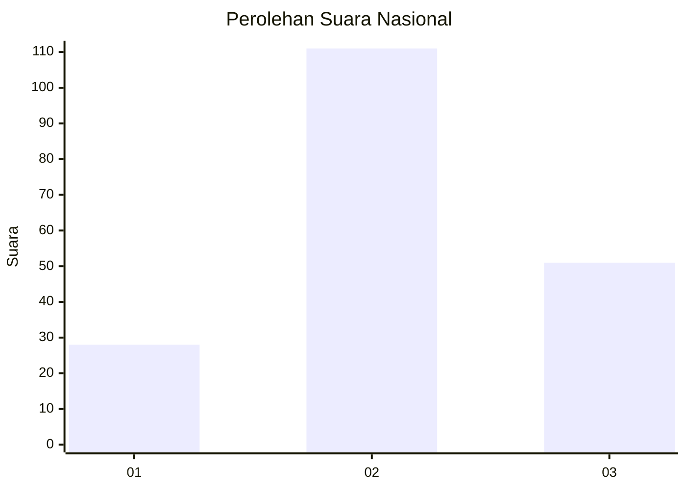
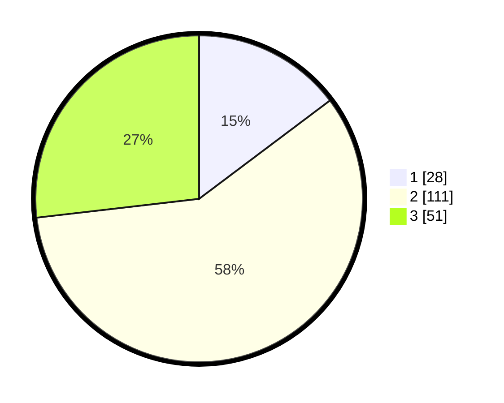

# Hasil

## Grafik

## Tabel

| No.    | Nama Paslon    | Suara | Suara (raw) | Persentase |
|:------ |:-------------- | -----:| -----------:| ----------:|
| 100025 | ANIES MUHAIMIN | 28    | [28][p-1]   | 14,74      |
| 100026 | PRABOWO GIBRAN | 111   | [111][p-2]  | 58,42      |
| 100027 | GANJAR MAHFUD  | 51    | [51][p-3]   | 26,84      |

[p-1]: https://github.com/gigit-pemilu/pemilu-2024/blob/main/pilpres/hitung-suara/sub/31-dki-jakarta/sub/72-jakarta-utara/sub/01-penjaringan/sub/1001-penjaringan/sub/070-tps/sub/paslon-1.txt
[p-2]: https://github.com/gigit-pemilu/pemilu-2024/blob/main/pilpres/hitung-suara/sub/31-dki-jakarta/sub/72-jakarta-utara/sub/01-penjaringan/sub/1001-penjaringan/sub/070-tps/sub/paslon-2.txt
[p-3]: https://github.com/gigit-pemilu/pemilu-2024/blob/main/pilpres/hitung-suara/sub/31-dki-jakarta/sub/72-jakarta-utara/sub/01-penjaringan/sub/1001-penjaringan/sub/070-tps/sub/paslon-3.txt

## Foto C Plano

https://sirekap-obj-formc.kpu.go.id/e0b8/pemilu/ppwp/31/72/01/10/01/3172011001070-20240216-211304--a23a76c3-d97c-41a7-b4ac-4467efbcaf02.jpg

https://sirekap-obj-formc.kpu.go.id/e0b8/pemilu/ppwp/31/72/01/10/01/3172011001070-20240216-211327--71a398ff-ffc8-4286-9eed-0cbc42626b11.jpg

https://sirekap-obj-formc.kpu.go.id/e0b8/pemilu/ppwp/31/72/01/10/01/3172011001070-20240216-211347--bd341c48-e382-419f-8cc8-689c0ac29cdb.jpg

## Metadata

| Key        | Value               |
| ---------- | ------------------- |
| Time Stamp | 2024-02-21 17:00:00 |

