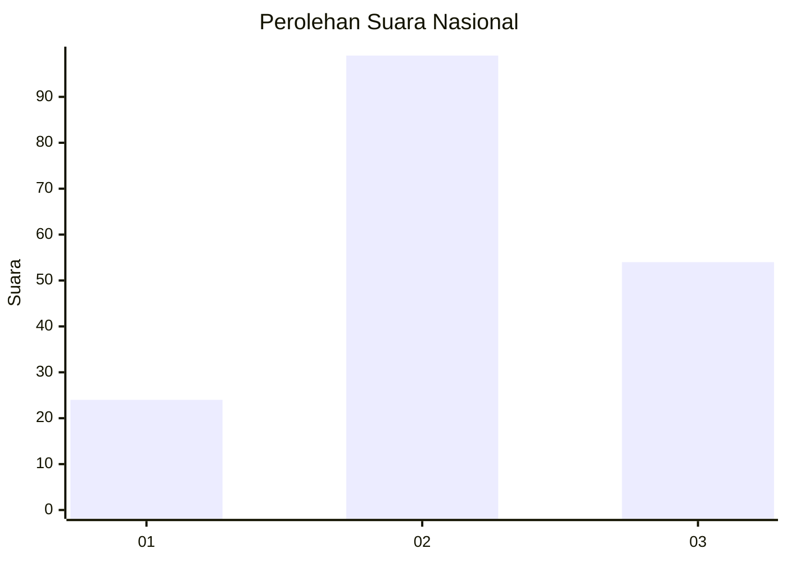
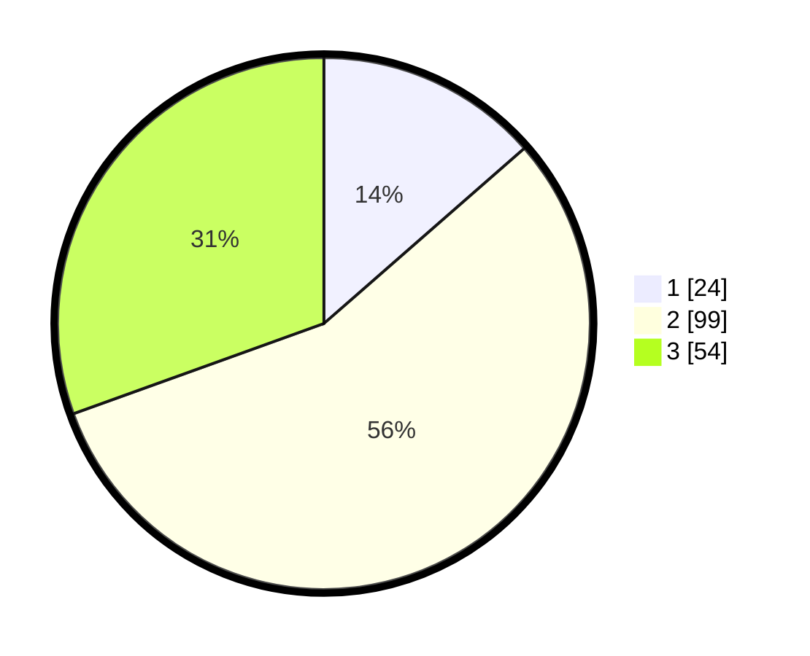

# Hasil

## Grafik

## Tabel

| No.    | Nama Paslon    | Suara | Suara (raw) | Persentase |
|:------ |:-------------- | -----:| -----------:| ----------:|
| 100025 | ANIES MUHAIMIN | 24    | [24][p-1]   | 13,56      |
| 100026 | PRABOWO GIBRAN | 99    | [99][p-2]   | 55,93      |
| 100027 | GANJAR MAHFUD  | 54    | [54][p-3]   | 30,51      |

[p-1]: https://github.com/gigit-pemilu/pemilu-2024/blob/main/pilpres/hitung-suara/sub/31-dki-jakarta/sub/72-jakarta-utara/sub/01-penjaringan/sub/1001-penjaringan/sub/074-tps/sub/paslon-1.txt
[p-2]: https://github.com/gigit-pemilu/pemilu-2024/blob/main/pilpres/hitung-suara/sub/31-dki-jakarta/sub/72-jakarta-utara/sub/01-penjaringan/sub/1001-penjaringan/sub/074-tps/sub/paslon-2.txt
[p-3]: https://github.com/gigit-pemilu/pemilu-2024/blob/main/pilpres/hitung-suara/sub/31-dki-jakarta/sub/72-jakarta-utara/sub/01-penjaringan/sub/1001-penjaringan/sub/074-tps/sub/paslon-3.txt

## Foto C Plano

https://sirekap-obj-formc.kpu.go.id/9b2e/pemilu/ppwp/31/72/01/10/01/3172011001074-20240216-211958--b75c0d4d-e1f5-48e0-93ba-5aac9263d285.jpg

https://sirekap-obj-formc.kpu.go.id/9b2e/pemilu/ppwp/31/72/01/10/01/3172011001074-20240216-212209--53e92a83-333e-4df8-9fe2-19fefee2be8d.jpg

https://sirekap-obj-formc.kpu.go.id/9b2e/pemilu/ppwp/31/72/01/10/01/3172011001074-20240216-212231--45270ee4-1e6c-4452-9694-fa5fb4ac148e.jpg

## Metadata

| Key        | Value               |
| ---------- | ------------------- |
| Time Stamp | 2024-02-21 17:00:00 |

