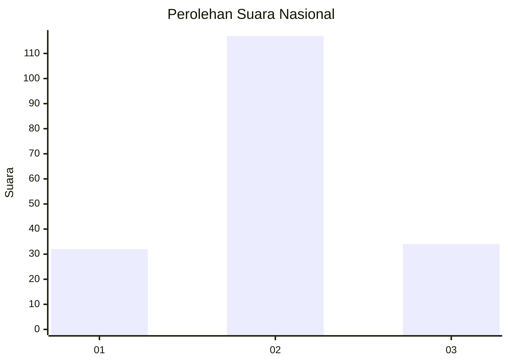
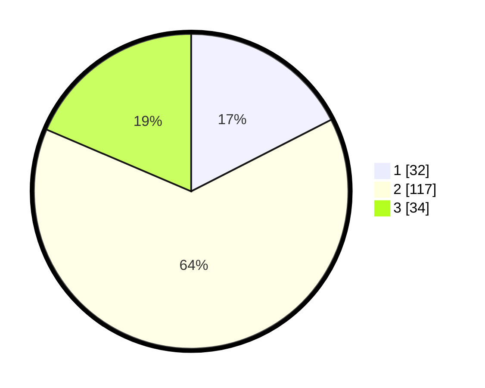

# Hasil

## Grafik

## Tabel

| No.    | Nama Paslon    | Suara | Suara (raw) | Persentase |
|:------ |:-------------- | -----:| -----------:| ----------:|
| 100025 | ANIES MUHAIMIN | 32    | [32][p-1]   | 17,49      |
| 100026 | PRABOWO GIBRAN | 117   | [117][p-2]  | 63,93      |
| 100027 | GANJAR MAHFUD  | 34    | [34][p-3]   | 18,58      |

[p-1]: https://github.com/gigit-pemilu/pemilu-2024/blob/main/pilpres/hitung-suara/sub/31-dki-jakarta/sub/72-jakarta-utara/sub/01-penjaringan/sub/1001-penjaringan/sub/076-tps/sub/paslon-1.txt
[p-2]: https://github.com/gigit-pemilu/pemilu-2024/blob/main/pilpres/hitung-suara/sub/31-dki-jakarta/sub/72-jakarta-utara/sub/01-penjaringan/sub/1001-penjaringan/sub/076-tps/sub/paslon-2.txt
[p-3]: https://github.com/gigit-pemilu/pemilu-2024/blob/main/pilpres/hitung-suara/sub/31-dki-jakarta/sub/72-jakarta-utara/sub/01-penjaringan/sub/1001-penjaringan/sub/076-tps/sub/paslon-3.txt

## Foto C Plano

https://sirekap-obj-formc.kpu.go.id/22c4/pemilu/ppwp/31/72/01/10/01/3172011001076-20240216-212544--9c407887-dc4d-4fd6-a124-79674a45e9b5.jpg

https://sirekap-obj-formc.kpu.go.id/22c4/pemilu/ppwp/31/72/01/10/01/3172011001076-20240216-212608--0a70eaca-c4ea-445d-9e82-464c4c998899.jpg

https://sirekap-obj-formc.kpu.go.id/22c4/pemilu/ppwp/31/72/01/10/01/3172011001076-20240216-212631--3a36c976-8278-4580-88e1-ba253b73a5ce.jpg

## Metadata

| Key        | Value               |
| ---------- | ------------------- |
| Time Stamp | 2024-02-21 17:00:00 |

