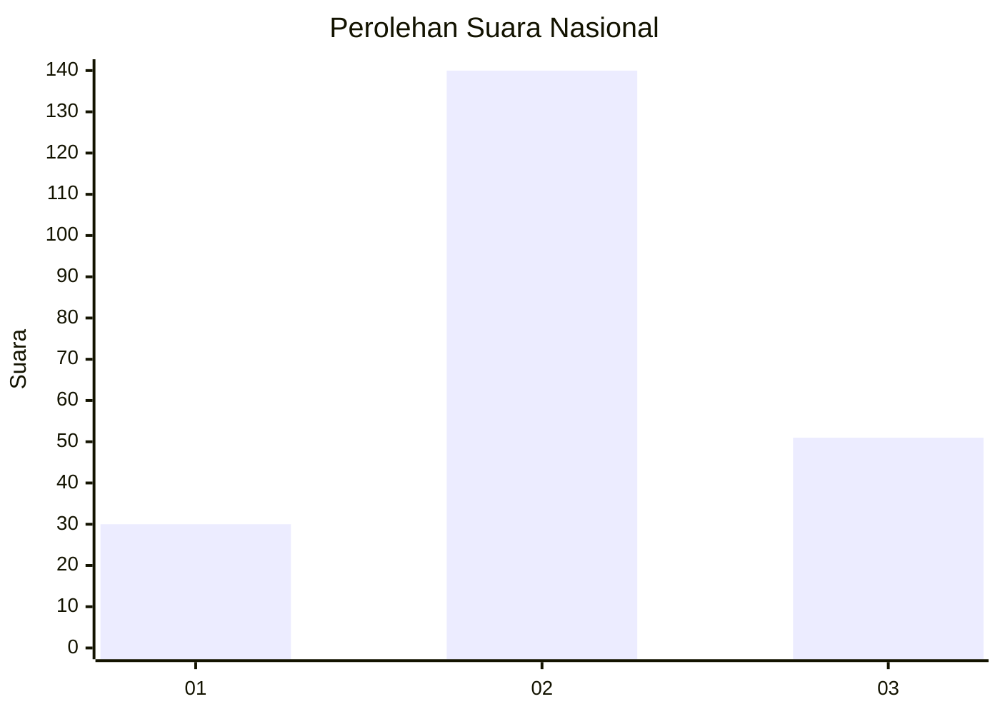
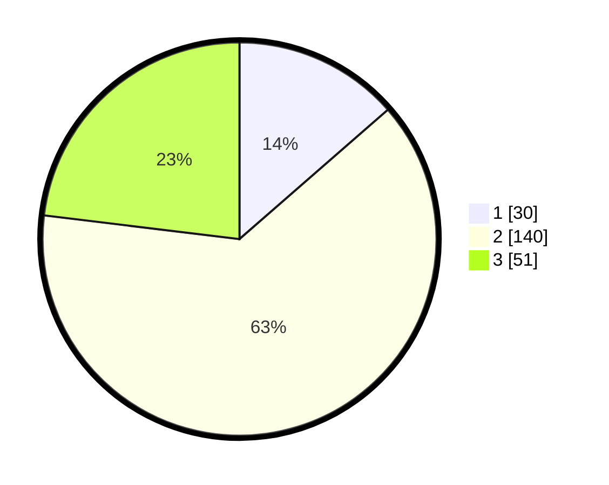

# Hasil

## Grafik

## Tabel

| No.    | Nama Paslon    | Suara | Suara (raw) | Persentase |
|:------ |:-------------- | -----:| -----------:| ----------:|
| 100025 | ANIES MUHAIMIN | 30    | [30][p-1]   | 13,57      |
| 100026 | PRABOWO GIBRAN | 140   | [140][p-2]  | 63,35      |
| 100027 | GANJAR MAHFUD  | 51    | [51][p-3]   | 23,08      |

[p-1]: https://github.com/gigit-pemilu/pemilu-2024/blob/main/pilpres/hitung-suara/sub/31-dki-jakarta/sub/72-jakarta-utara/sub/01-penjaringan/sub/1001-penjaringan/sub/079-tps/sub/paslon-1.txt
[p-2]: https://github.com/gigit-pemilu/pemilu-2024/blob/main/pilpres/hitung-suara/sub/31-dki-jakarta/sub/72-jakarta-utara/sub/01-penjaringan/sub/1001-penjaringan/sub/079-tps/sub/paslon-2.txt
[p-3]: https://github.com/gigit-pemilu/pemilu-2024/blob/main/pilpres/hitung-suara/sub/31-dki-jakarta/sub/72-jakarta-utara/sub/01-penjaringan/sub/1001-penjaringan/sub/079-tps/sub/paslon-3.txt

## Foto C Plano

https://sirekap-obj-formc.kpu.go.id/6e9a/pemilu/ppwp/31/72/01/10/01/3172011001079-20240216-213614--bf453eaf-7f8d-44a7-b450-4d0d956cb65f.jpg

https://sirekap-obj-formc.kpu.go.id/6e9a/pemilu/ppwp/31/72/01/10/01/3172011001079-20240216-213636--f3c902f2-17b2-4723-83c0-78840e9ec8ee.jpg

https://sirekap-obj-formc.kpu.go.id/6e9a/pemilu/ppwp/31/72/01/10/01/3172011001079-20240216-213713--fc74ffeb-a28e-4674-bde1-bea03ab9f2c0.jpg

## Metadata

| Key        | Value               |
| ---------- | ------------------- |
| Time Stamp | 2024-02-20 15:00:00 |

