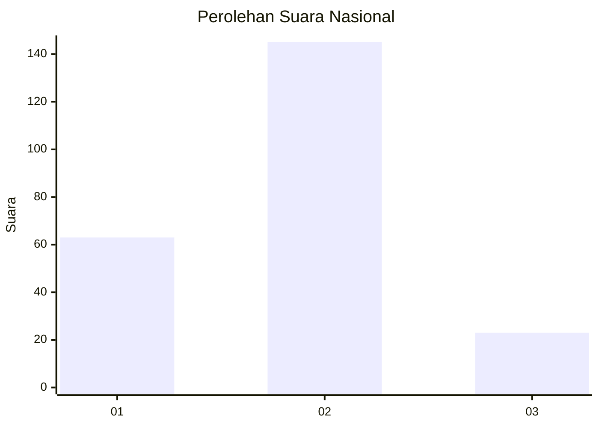
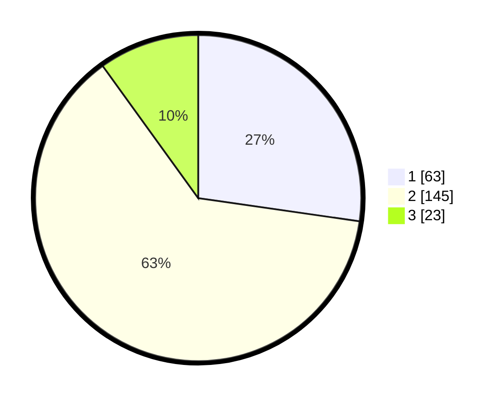

# Hasil

## Grafik

## Tabel

| No.    | Nama Paslon    | Suara | Suara (raw) | Persentase |
|:------ |:-------------- | -----:| -----------:| ----------:|
| 100025 | ANIES MUHAIMIN | 63    | [63][p-1]   | 27,27      |
| 100026 | PRABOWO GIBRAN | 145   | [145][p-2]  | 62,77      |
| 100027 | GANJAR MAHFUD  | 23    | [23][p-3]   | 9,96       |

[p-1]: https://github.com/gigit-pemilu/pemilu-2024/blob/main/pilpres/hitung-suara/sub/31-dki-jakarta/sub/72-jakarta-utara/sub/01-penjaringan/sub/1001-penjaringan/sub/080-tps/sub/paslon-1.txt
[p-2]: https://github.com/gigit-pemilu/pemilu-2024/blob/main/pilpres/hitung-suara/sub/31-dki-jakarta/sub/72-jakarta-utara/sub/01-penjaringan/sub/1001-penjaringan/sub/080-tps/sub/paslon-2.txt
[p-3]: https://github.com/gigit-pemilu/pemilu-2024/blob/main/pilpres/hitung-suara/sub/31-dki-jakarta/sub/72-jakarta-utara/sub/01-penjaringan/sub/1001-penjaringan/sub/080-tps/sub/paslon-3.txt

## Foto C Plano

https://sirekap-obj-formc.kpu.go.id/9840/pemilu/ppwp/31/72/01/10/01/3172011001080-20240216-213827--f01fd85b-90a0-4010-97a5-26e5b329946e.jpg

https://sirekap-obj-formc.kpu.go.id/9840/pemilu/ppwp/31/72/01/10/01/3172011001080-20240216-213853--af6205c0-86b0-4c45-9a7d-0ea04e288cdc.jpg

https://sirekap-obj-formc.kpu.go.id/9840/pemilu/ppwp/31/72/01/10/01/3172011001080-20240216-213916--31a2b409-7dd4-4efc-a2f1-d9361cc7e8b6.jpg

## Metadata

| Key        | Value               |
| ---------- | ------------------- |
| Time Stamp | 2024-02-21 17:00:00 |

