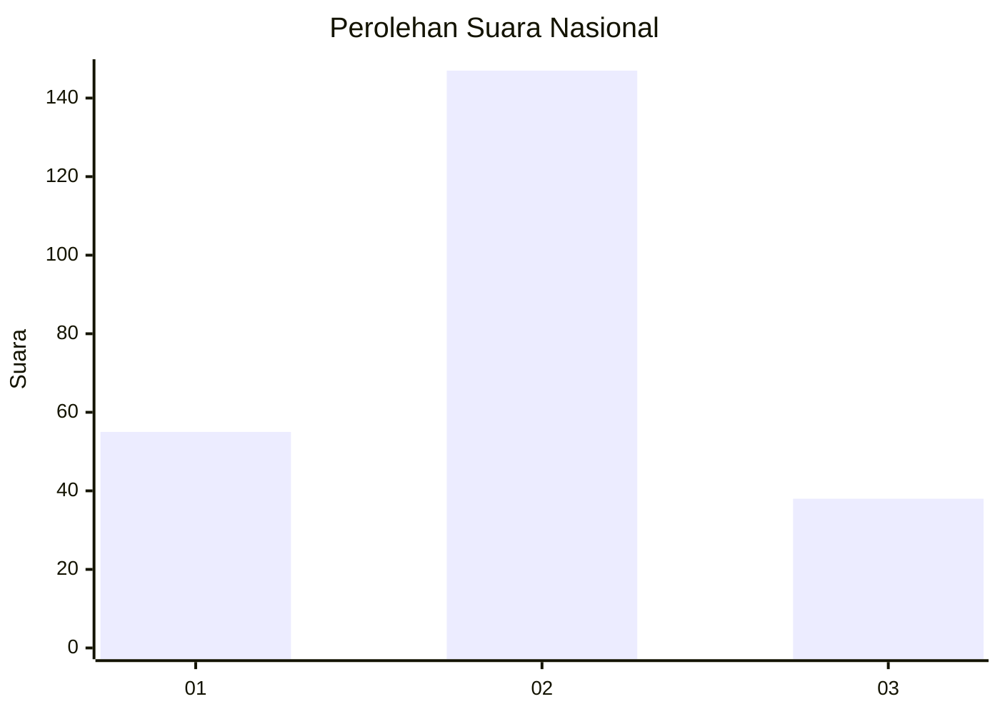
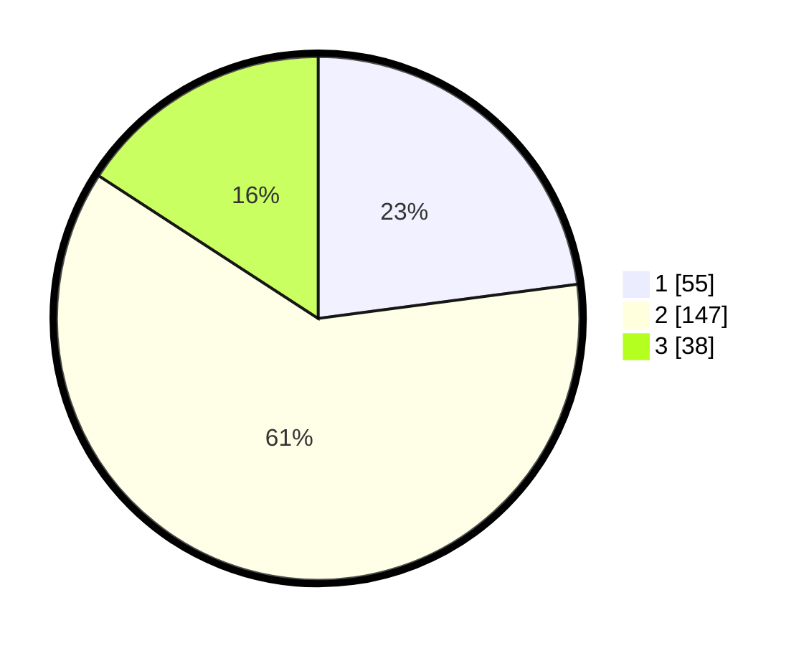

# Hasil

## Grafik

## Tabel

| No.    | Nama Paslon    | Suara | Suara (raw) | Persentase |
|:------ |:-------------- | -----:| -----------:| ----------:|
| 100025 | ANIES MUHAIMIN | 55    | [55][p-1]   | 22,92      |
| 100026 | PRABOWO GIBRAN | 147   | [147][p-2]  | 61,25      |
| 100027 | GANJAR MAHFUD  | 38    | [38][p-3]   | 15,83      |

[p-1]: https://github.com/gigit-pemilu/pemilu-2024/blob/main/pilpres/hitung-suara/sub/31-dki-jakarta/sub/72-jakarta-utara/sub/01-penjaringan/sub/1001-penjaringan/sub/086-tps/sub/paslon-1.txt
[p-2]: https://github.com/gigit-pemilu/pemilu-2024/blob/main/pilpres/hitung-suara/sub/31-dki-jakarta/sub/72-jakarta-utara/sub/01-penjaringan/sub/1001-penjaringan/sub/086-tps/sub/paslon-2.txt
[p-3]: https://github.com/gigit-pemilu/pemilu-2024/blob/main/pilpres/hitung-suara/sub/31-dki-jakarta/sub/72-jakarta-utara/sub/01-penjaringan/sub/1001-penjaringan/sub/086-tps/sub/paslon-3.txt

## Foto C Plano

https://sirekap-obj-formc.kpu.go.id/882a/pemilu/ppwp/31/72/01/10/01/3172011001086-20240217-110413--78750254-4919-40f3-b878-c87009ce4108.jpg

https://sirekap-obj-formc.kpu.go.id/882a/pemilu/ppwp/31/72/01/10/01/3172011001086-20240217-110429--c3bbb220-a6c4-4d65-9031-59facb9b38b6.jpg

https://sirekap-obj-formc.kpu.go.id/882a/pemilu/ppwp/31/72/01/10/01/3172011001086-20240217-110447--fa5af162-37e5-4a23-9762-80d72dd00c73.jpg

## Metadata

| Key        | Value               |
| ---------- | ------------------- |
| Time Stamp | 2024-02-21 17:00:00 |

