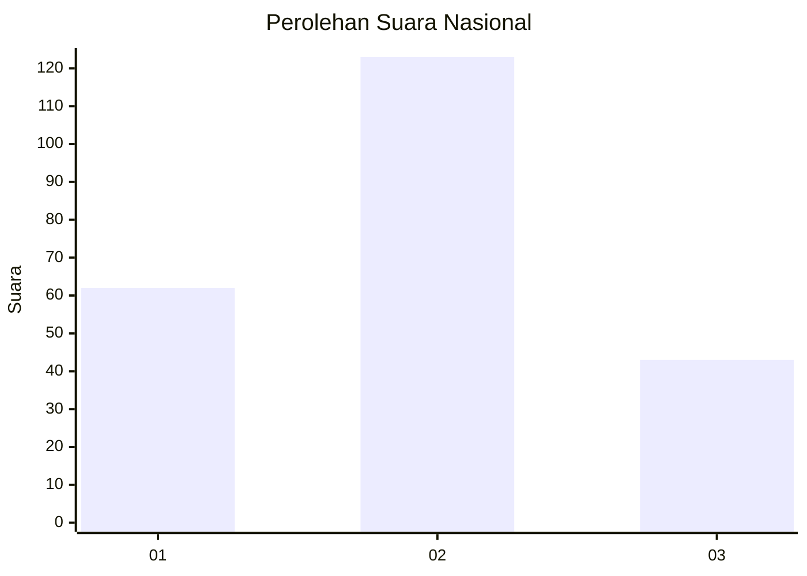
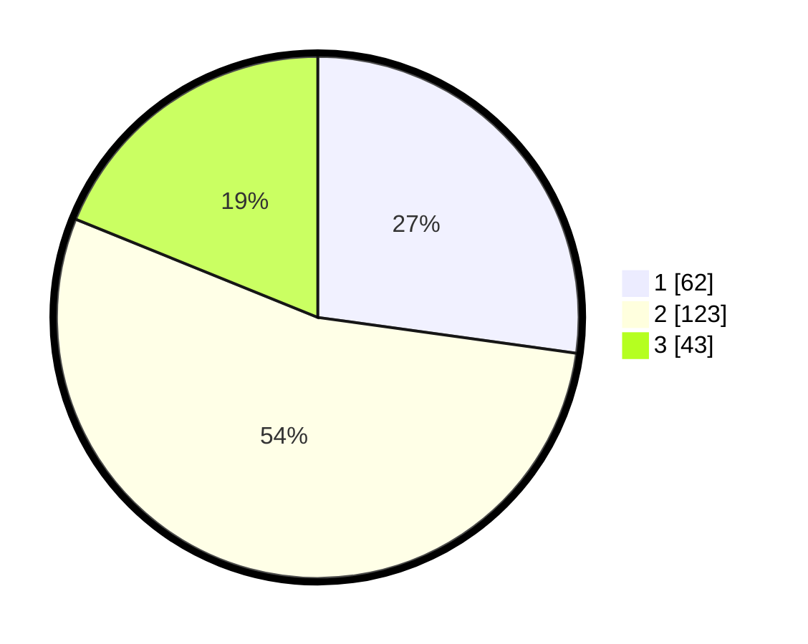

# Hasil

## Grafik

## Tabel

| No.    | Nama Paslon    | Suara | Suara (raw) | Persentase |
|:------ |:-------------- | -----:| -----------:| ----------:|
| 100025 | ANIES MUHAIMIN | 62    | [62][p-1]   | 27,19      |
| 100026 | PRABOWO GIBRAN | 123   | [123][p-2]  | 53,95      |
| 100027 | GANJAR MAHFUD  | 43    | [43][p-3]   | 18,86      |

[p-1]: https://github.com/gigit-pemilu/pemilu-2024/blob/main/pilpres/hitung-suara/sub/31-dki-jakarta/sub/72-jakarta-utara/sub/01-penjaringan/sub/1001-penjaringan/sub/090-tps/sub/paslon-1.txt
[p-2]: https://github.com/gigit-pemilu/pemilu-2024/blob/main/pilpres/hitung-suara/sub/31-dki-jakarta/sub/72-jakarta-utara/sub/01-penjaringan/sub/1001-penjaringan/sub/090-tps/sub/paslon-2.txt
[p-3]: https://github.com/gigit-pemilu/pemilu-2024/blob/main/pilpres/hitung-suara/sub/31-dki-jakarta/sub/72-jakarta-utara/sub/01-penjaringan/sub/1001-penjaringan/sub/090-tps/sub/paslon-3.txt

## Foto C Plano

https://sirekap-obj-formc.kpu.go.id/95ae/pemilu/ppwp/31/72/01/10/01/3172011001090-20240217-111209--7863cda1-7b78-412e-a476-0a304e0b0d0d.jpg

https://sirekap-obj-formc.kpu.go.id/95ae/pemilu/ppwp/31/72/01/10/01/3172011001090-20240217-111236--46350b49-21d4-4150-9db0-c5a75d44ca72.jpg

https://sirekap-obj-formc.kpu.go.id/95ae/pemilu/ppwp/31/72/01/10/01/3172011001090-20240217-111250--29429544-2aee-446f-8acb-46753e8ef4fd.jpg

## Metadata

| Key        | Value               |
| ---------- | ------------------- |
| Time Stamp | 2024-02-21 17:00:00 |

