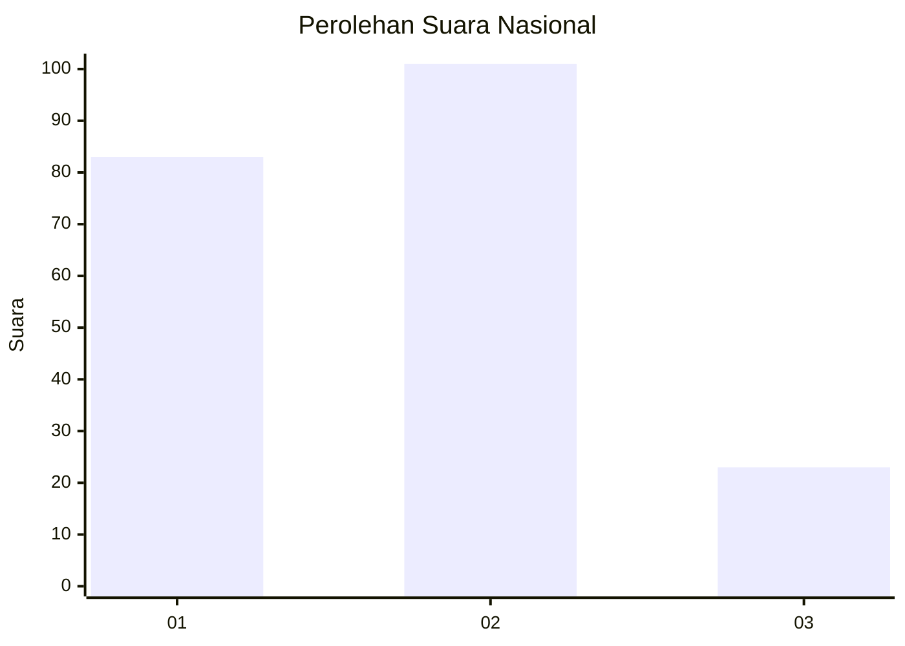
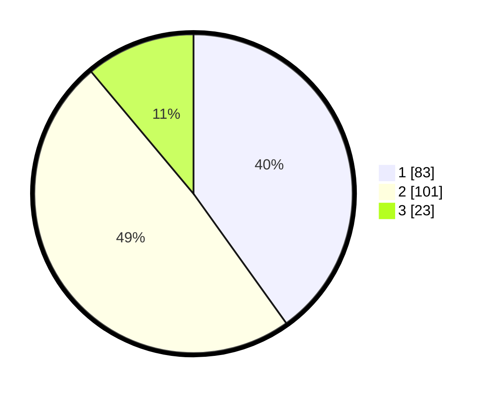

# Hasil

## Grafik

## Tabel

| No.    | Nama Paslon    | Suara | Suara (raw) | Persentase |
|:------ |:-------------- | -----:| -----------:| ----------:|
| 100025 | ANIES MUHAIMIN | 83    | [83][p-1]   | 40,10      |
| 100026 | PRABOWO GIBRAN | 101   | [101][p-2]  | 48,79      |
| 100027 | GANJAR MAHFUD  | 23    | [23][p-3]   | 11,11      |

[p-1]: https://github.com/gigit-pemilu/pemilu-2024/blob/main/pilpres/hitung-suara/sub/31-dki-jakarta/sub/72-jakarta-utara/sub/01-penjaringan/sub/1001-penjaringan/sub/096-tps/sub/paslon-1.txt
[p-2]: https://github.com/gigit-pemilu/pemilu-2024/blob/main/pilpres/hitung-suara/sub/31-dki-jakarta/sub/72-jakarta-utara/sub/01-penjaringan/sub/1001-penjaringan/sub/096-tps/sub/paslon-2.txt
[p-3]: https://github.com/gigit-pemilu/pemilu-2024/blob/main/pilpres/hitung-suara/sub/31-dki-jakarta/sub/72-jakarta-utara/sub/01-penjaringan/sub/1001-penjaringan/sub/096-tps/sub/paslon-3.txt

## Foto C Plano

https://sirekap-obj-formc.kpu.go.id/e994/pemilu/ppwp/31/72/01/10/01/3172011001096-20240217-112418--aa2ea7df-5613-4111-acc3-5efc7260174f.jpg

https://sirekap-obj-formc.kpu.go.id/e994/pemilu/ppwp/31/72/01/10/01/3172011001096-20240217-112442--41e6c383-3fda-4641-801d-d8ddce52dc1a.jpg

https://sirekap-obj-formc.kpu.go.id/e994/pemilu/ppwp/31/72/01/10/01/3172011001096-20240217-112523--ac2cbba0-d4c1-401e-85d4-c68198705feb.jpg

## Metadata

| Key        | Value               |
| ---------- | ------------------- |
| Time Stamp | 2024-02-21 18:00:00 |

