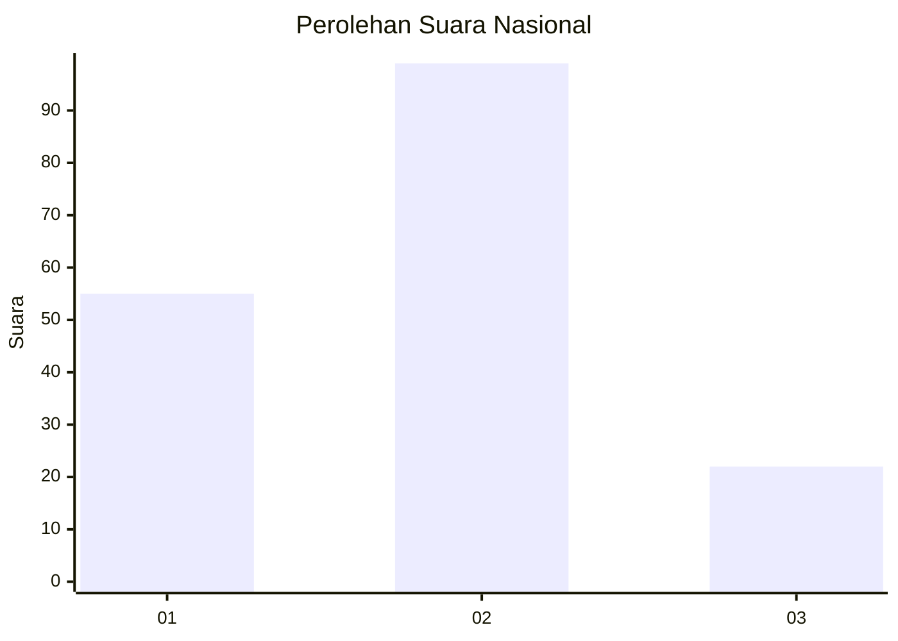
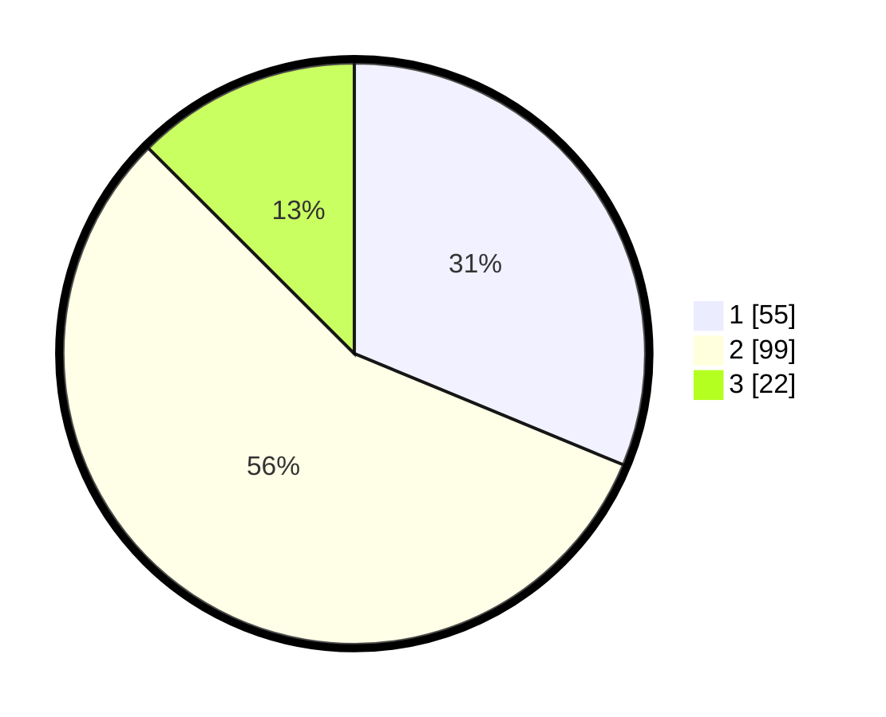

# Hasil

## Grafik

## Tabel

| No.    | Nama Paslon    | Suara | Suara (raw) | Persentase |
|:------ |:-------------- | -----:| -----------:| ----------:|
| 100025 | ANIES MUHAIMIN | 55    | [55][p-1]   | 31,25      |
| 100026 | PRABOWO GIBRAN | 99    | [99][p-2]   | 56,25      |
| 100027 | GANJAR MAHFUD  | 22    | [22][p-3]   | 12,50      |

[p-1]: https://github.com/gigit-pemilu/pemilu-2024/blob/main/pilpres/hitung-suara/sub/31-dki-jakarta/sub/72-jakarta-utara/sub/01-penjaringan/sub/1001-penjaringan/sub/102-tps/sub/paslon-1.txt
[p-2]: https://github.com/gigit-pemilu/pemilu-2024/blob/main/pilpres/hitung-suara/sub/31-dki-jakarta/sub/72-jakarta-utara/sub/01-penjaringan/sub/1001-penjaringan/sub/102-tps/sub/paslon-2.txt
[p-3]: https://github.com/gigit-pemilu/pemilu-2024/blob/main/pilpres/hitung-suara/sub/31-dki-jakarta/sub/72-jakarta-utara/sub/01-penjaringan/sub/1001-penjaringan/sub/102-tps/sub/paslon-3.txt

## Foto C Plano

https://sirekap-obj-formc.kpu.go.id/2ce4/pemilu/ppwp/31/72/01/10/01/3172011001102-20240217-115347--c52fff5b-fff8-470b-a548-5b9c19dcf953.jpg

https://sirekap-obj-formc.kpu.go.id/2ce4/pemilu/ppwp/31/72/01/10/01/3172011001102-20240217-115431--f49f00e4-7fa0-43ba-813f-9a07ee2adb35.jpg

https://sirekap-obj-formc.kpu.go.id/2ce4/pemilu/ppwp/31/72/01/10/01/3172011001102-20240217-115453--4a3001ec-bcfa-46dd-804d-adc1092efeb2.jpg

## Metadata

| Key        | Value               |
| ---------- | ------------------- |
| Time Stamp | 2024-02-21 18:00:00 |

