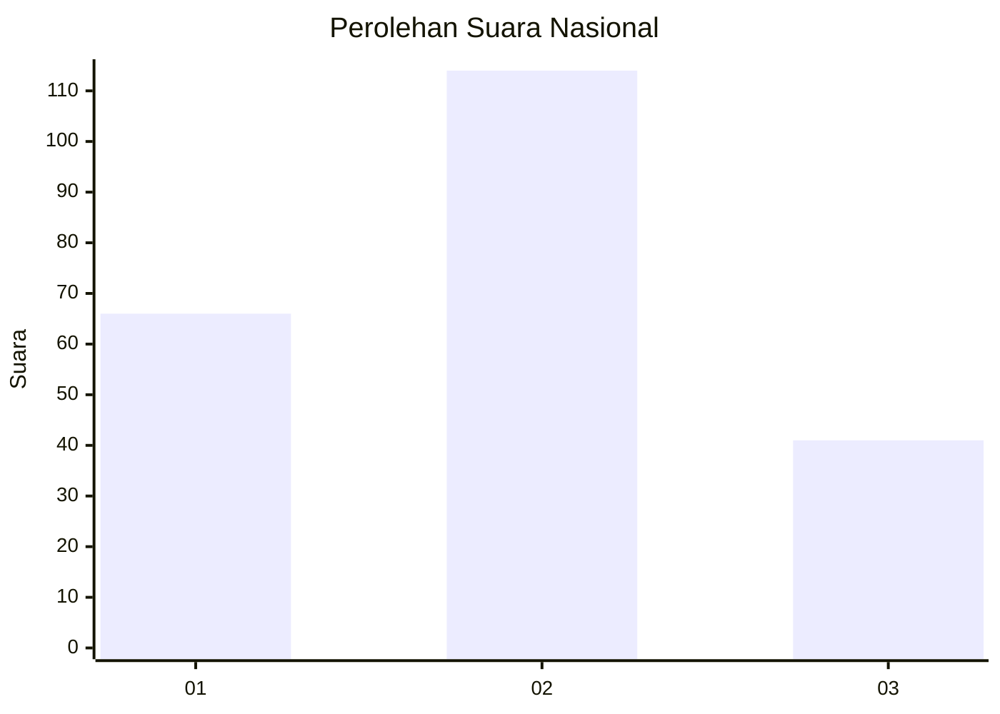
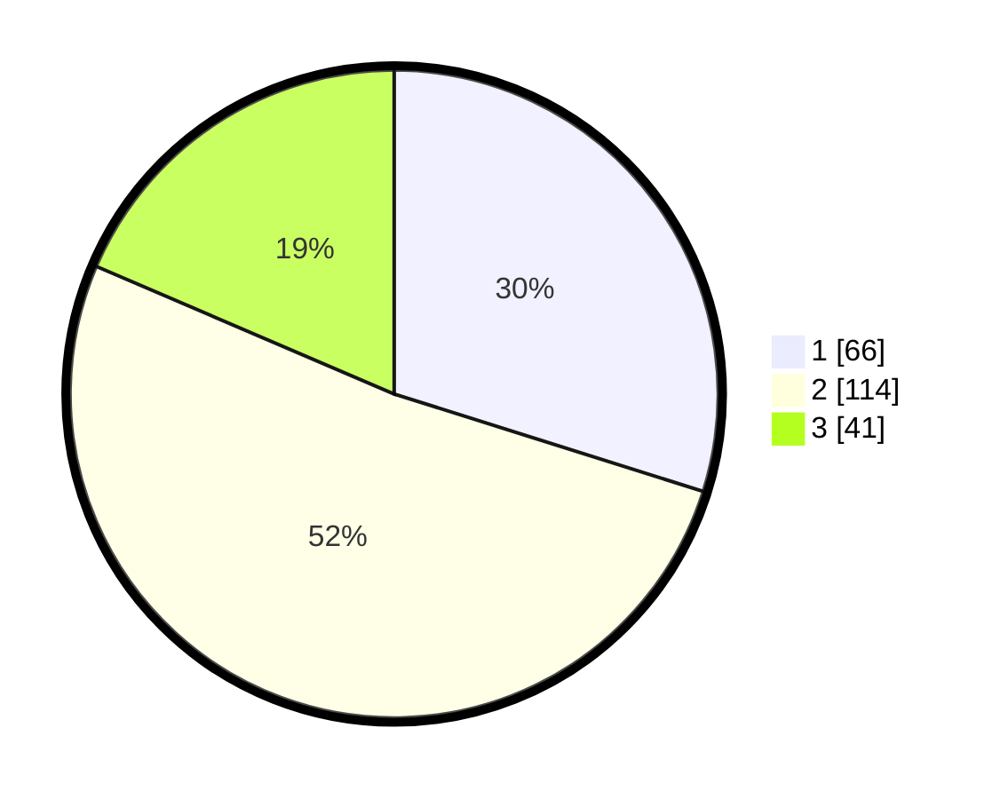

# Hasil

## Grafik

## Tabel

| No.    | Nama Paslon    | Suara | Suara (raw) | Persentase |
|:------ |:-------------- | -----:| -----------:| ----------:|
| 100025 | ANIES MUHAIMIN | 66    | [66][p-1]   | 29,86      |
| 100026 | PRABOWO GIBRAN | 114   | [114][p-2]  | 51,58      |
| 100027 | GANJAR MAHFUD  | 41    | [41][p-3]   | 18,55      |

[p-1]: https://github.com/gigit-pemilu/pemilu-2024/blob/main/pilpres/hitung-suara/sub/31-dki-jakarta/sub/72-jakarta-utara/sub/01-penjaringan/sub/1001-penjaringan/sub/104-tps/sub/paslon-1.txt
[p-2]: https://github.com/gigit-pemilu/pemilu-2024/blob/main/pilpres/hitung-suara/sub/31-dki-jakarta/sub/72-jakarta-utara/sub/01-penjaringan/sub/1001-penjaringan/sub/104-tps/sub/paslon-2.txt
[p-3]: https://github.com/gigit-pemilu/pemilu-2024/blob/main/pilpres/hitung-suara/sub/31-dki-jakarta/sub/72-jakarta-utara/sub/01-penjaringan/sub/1001-penjaringan/sub/104-tps/sub/paslon-3.txt

## Foto C Plano

https://sirekap-obj-formc.kpu.go.id/62f7/pemilu/ppwp/31/72/01/10/01/3172011001104-20240217-115832--e3985d33-1ba6-4915-95fc-f046dc44218e.jpg

https://sirekap-obj-formc.kpu.go.id/62f7/pemilu/ppwp/31/72/01/10/01/3172011001104-20240217-115845--2698b732-1c13-490f-bd47-76b2fff2fabd.jpg

https://sirekap-obj-formc.kpu.go.id/62f7/pemilu/ppwp/31/72/01/10/01/3172011001104-20240217-115924--e415c214-70b6-413a-85a8-4c63275bdfdc.jpg

## Metadata

| Key        | Value               |
| ---------- | ------------------- |
| Time Stamp | 2024-02-21 18:00:00 |

