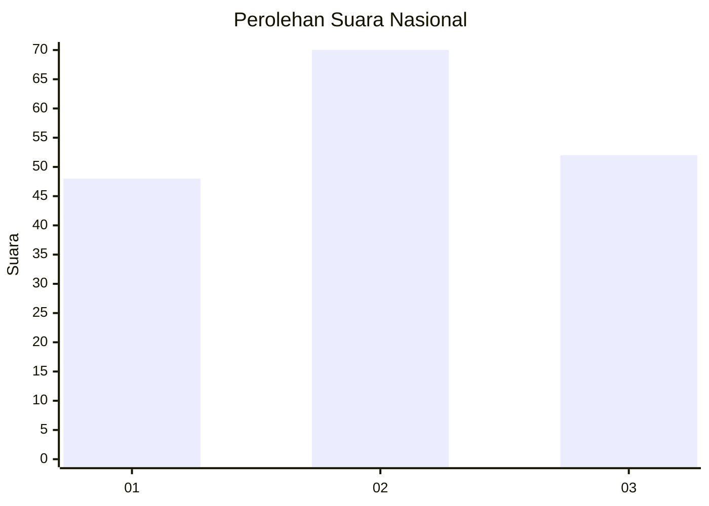
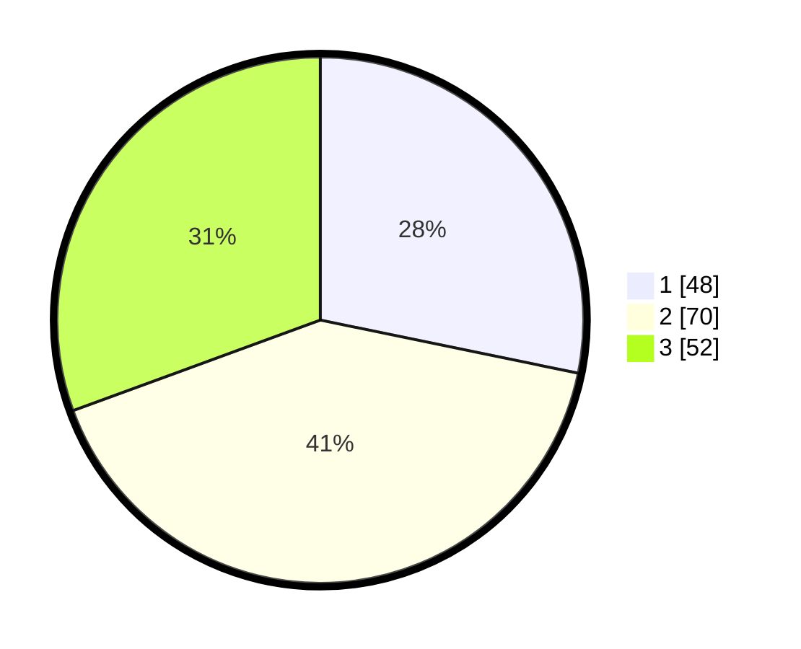

# Hasil

## Grafik

## Tabel

| No.    | Nama Paslon    | Suara | Suara (raw) | Persentase |
|:------ |:-------------- | -----:| -----------:| ----------:|
| 100025 | ANIES MUHAIMIN | 48    | [48][p-1]   | 28,24      |
| 100026 | PRABOWO GIBRAN | 70    | [70][p-2]   | 41,18      |
| 100027 | GANJAR MAHFUD  | 52    | [52][p-3]   | 30,59      |

[p-1]: https://github.com/gigit-pemilu/pemilu-2024/blob/main/pilpres/hitung-suara/sub/31-dki-jakarta/sub/72-jakarta-utara/sub/01-penjaringan/sub/1001-penjaringan/sub/109-tps/sub/paslon-1.txt
[p-2]: https://github.com/gigit-pemilu/pemilu-2024/blob/main/pilpres/hitung-suara/sub/31-dki-jakarta/sub/72-jakarta-utara/sub/01-penjaringan/sub/1001-penjaringan/sub/109-tps/sub/paslon-2.txt
[p-3]: https://github.com/gigit-pemilu/pemilu-2024/blob/main/pilpres/hitung-suara/sub/31-dki-jakarta/sub/72-jakarta-utara/sub/01-penjaringan/sub/1001-penjaringan/sub/109-tps/sub/paslon-3.txt

## Foto C Plano

https://sirekap-obj-formc.kpu.go.id/6d51/pemilu/ppwp/31/72/01/10/01/3172011001109-20240225-204521--e04f5e82-dd49-4dc9-ad19-149fea3f0cb2.jpg

https://sirekap-obj-formc.kpu.go.id/6d51/pemilu/ppwp/31/72/01/10/01/3172011001109-20240225-204553--0cc7e61f-1738-4ce7-a523-0392a4a9c753.jpg

https://sirekap-obj-formc.kpu.go.id/6d51/pemilu/ppwp/31/72/01/10/01/3172011001109-20240225-204711--3c260653-8db5-4cc9-b202-45bd4c1e6f9c.jpg

## Metadata

| Key        | Value               |
| ---------- | ------------------- |
| Time Stamp | 2024-02-26 09:00:00 |

