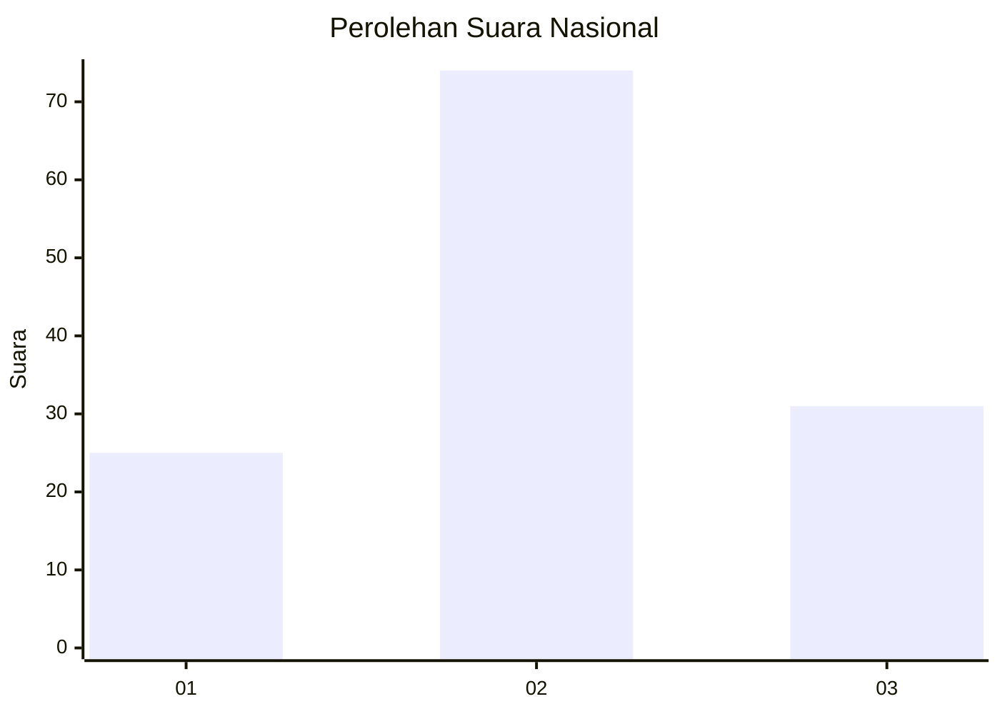
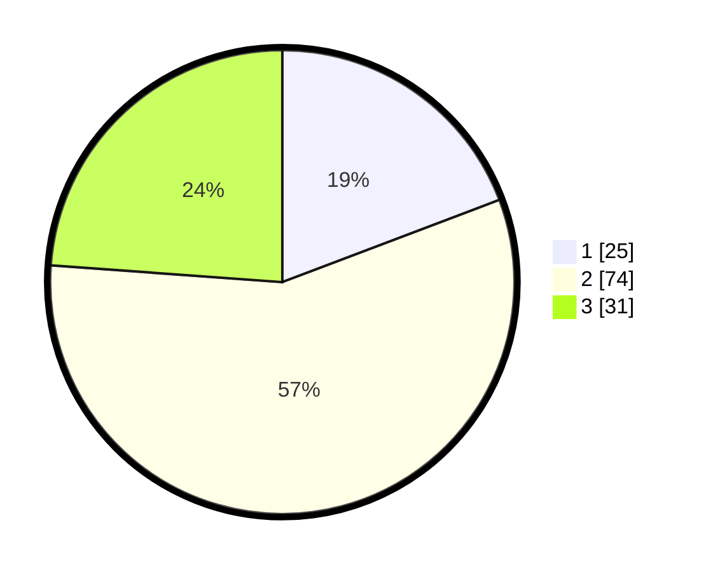

# Hasil

## Grafik

## Tabel

| No.    | Nama Paslon    | Suara | Suara (raw) | Persentase |
|:------ |:-------------- | -----:| -----------:| ----------:|
| 100025 | ANIES MUHAIMIN | 25    | [25][p-1]   | 19,23      |
| 100026 | PRABOWO GIBRAN | 74    | [74][p-2]   | 56,92      |
| 100027 | GANJAR MAHFUD  | 31    | [31][p-3]   | 23,85      |

[p-1]: https://github.com/gigit-pemilu/pemilu-2024/blob/main/pilpres/hitung-suara/sub/31-dki-jakarta/sub/72-jakarta-utara/sub/01-penjaringan/sub/1001-penjaringan/sub/115-tps/sub/paslon-1.txt
[p-2]: https://github.com/gigit-pemilu/pemilu-2024/blob/main/pilpres/hitung-suara/sub/31-dki-jakarta/sub/72-jakarta-utara/sub/01-penjaringan/sub/1001-penjaringan/sub/115-tps/sub/paslon-2.txt
[p-3]: https://github.com/gigit-pemilu/pemilu-2024/blob/main/pilpres/hitung-suara/sub/31-dki-jakarta/sub/72-jakarta-utara/sub/01-penjaringan/sub/1001-penjaringan/sub/115-tps/sub/paslon-3.txt

## Foto C Plano

https://sirekap-obj-formc.kpu.go.id/939c/pemilu/ppwp/31/72/01/10/01/3172011001115-20240226-145338--ed762953-c642-4edd-89ad-b13678d8fbcd.jpg

https://sirekap-obj-formc.kpu.go.id/939c/pemilu/ppwp/31/72/01/10/01/3172011001115-20240226-145408--e784069d-0206-4347-a9cf-67e48a02a730.jpg

https://sirekap-obj-formc.kpu.go.id/939c/pemilu/ppwp/31/72/01/10/01/3172011001115-20240226-145442--47add86e-05ea-425c-91d0-a428cf6b6b03.jpg

## Metadata

| Key        | Value               |
| ---------- | ------------------- |
| Time Stamp | 2024-02-26 16:00:00 |

