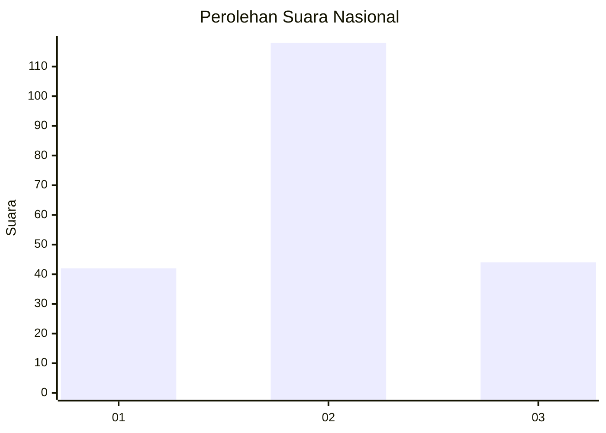
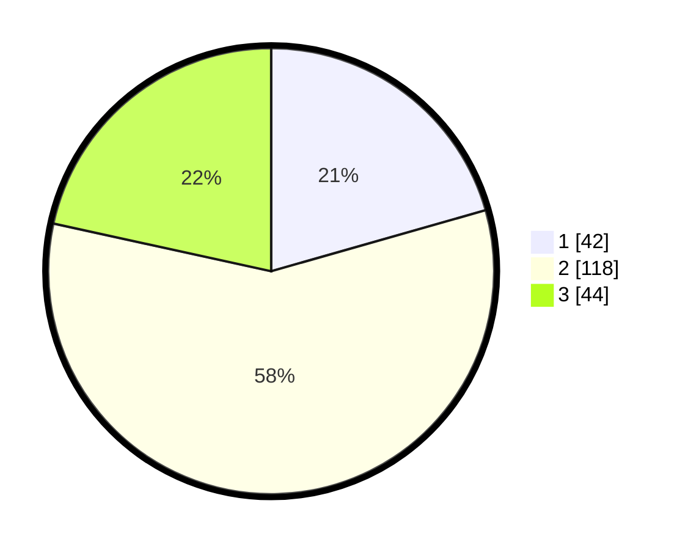

# Hasil

## Grafik

## Tabel

| No.    | Nama Paslon    | Suara | Suara (raw) | Persentase |
|:------ |:-------------- | -----:| -----------:| ----------:|
| 100025 | ANIES MUHAIMIN | 42    | [42][p-1]   | 20,59      |
| 100026 | PRABOWO GIBRAN | 118   | [118][p-2]  | 57,84      |
| 100027 | GANJAR MAHFUD  | 44    | [44][p-3]   | 21,57      |

[p-1]: https://github.com/gigit-pemilu/pemilu-2024/blob/main/pilpres/hitung-suara/sub/31-dki-jakarta/sub/72-jakarta-utara/sub/01-penjaringan/sub/1001-penjaringan/sub/117-tps/sub/paslon-1.txt
[p-2]: https://github.com/gigit-pemilu/pemilu-2024/blob/main/pilpres/hitung-suara/sub/31-dki-jakarta/sub/72-jakarta-utara/sub/01-penjaringan/sub/1001-penjaringan/sub/117-tps/sub/paslon-2.txt
[p-3]: https://github.com/gigit-pemilu/pemilu-2024/blob/main/pilpres/hitung-suara/sub/31-dki-jakarta/sub/72-jakarta-utara/sub/01-penjaringan/sub/1001-penjaringan/sub/117-tps/sub/paslon-3.txt

## Foto C Plano

https://sirekap-obj-formc.kpu.go.id/1aef/pemilu/ppwp/31/72/01/10/01/3172011001117-20240226-154617--c781965f-620e-410e-9bd8-99635317e88b.jpg

https://sirekap-obj-formc.kpu.go.id/1aef/pemilu/ppwp/31/72/01/10/01/3172011001117-20240226-154642--9fee3de0-ab3a-4939-80ef-da911a6b52cb.jpg

https://sirekap-obj-formc.kpu.go.id/1aef/pemilu/ppwp/31/72/01/10/01/3172011001117-20240226-154746--6c448612-18c0-4542-a7dc-6fc5b83cc210.jpg

## Metadata

| Key        | Value               |
| ---------- | ------------------- |
| Time Stamp | 2024-02-26 16:00:00 |

