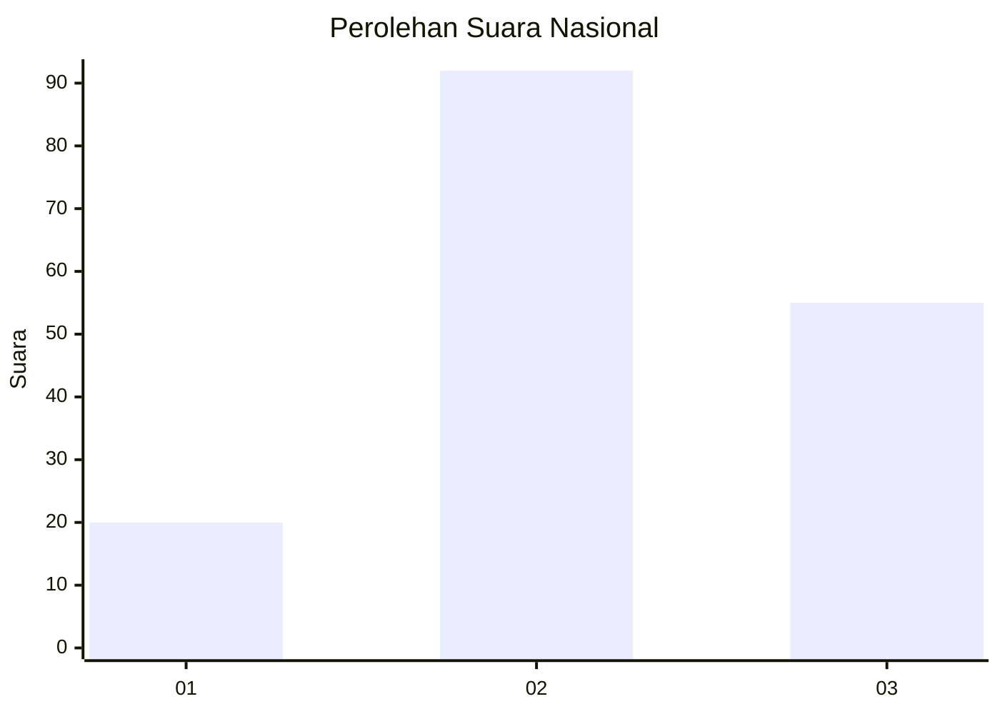
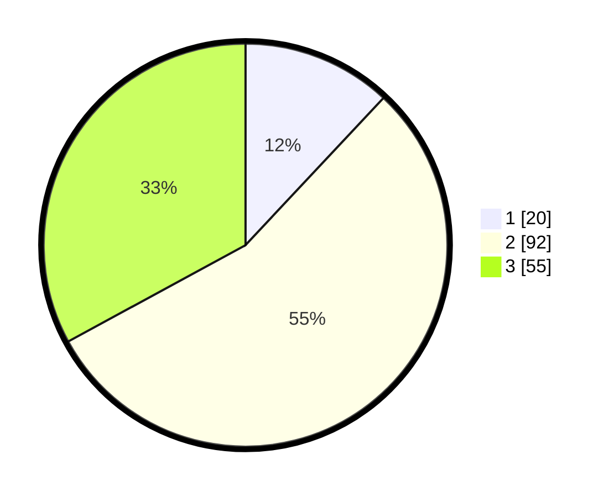

# Hasil

## Grafik

## Tabel

| No.    | Nama Paslon    | Suara | Suara (raw) | Persentase |
|:------ |:-------------- | -----:| -----------:| ----------:|
| 100025 | ANIES MUHAIMIN | 20    | [20][p-1]   | 11,98      |
| 100026 | PRABOWO GIBRAN | 92    | [92][p-2]   | 55,09      |
| 100027 | GANJAR MAHFUD  | 55    | [55][p-3]   | 32,93      |

[p-1]: https://github.com/gigit-pemilu/pemilu-2024/blob/main/pilpres/hitung-suara/sub/31-dki-jakarta/sub/72-jakarta-utara/sub/01-penjaringan/sub/1001-penjaringan/sub/120-tps/sub/paslon-1.txt
[p-2]: https://github.com/gigit-pemilu/pemilu-2024/blob/main/pilpres/hitung-suara/sub/31-dki-jakarta/sub/72-jakarta-utara/sub/01-penjaringan/sub/1001-penjaringan/sub/120-tps/sub/paslon-2.txt
[p-3]: https://github.com/gigit-pemilu/pemilu-2024/blob/main/pilpres/hitung-suara/sub/31-dki-jakarta/sub/72-jakarta-utara/sub/01-penjaringan/sub/1001-penjaringan/sub/120-tps/sub/paslon-3.txt

## Foto C Plano

https://sirekap-obj-formc.kpu.go.id/2331/pemilu/ppwp/31/72/01/10/01/3172011001120-20240226-190550--145c23a2-94a6-4992-b7b2-3804ab63c6ca.jpg

https://sirekap-obj-formc.kpu.go.id/2331/pemilu/ppwp/31/72/01/10/01/3172011001120-20240226-190620--5e96eca9-1377-4220-ba9f-24c0842a0f4f.jpg

https://sirekap-obj-formc.kpu.go.id/2331/pemilu/ppwp/31/72/01/10/01/3172011001120-20240226-190637--07bbd851-cd1e-49be-b594-2685614e80bd.jpg

## Metadata

| Key        | Value               |
| ---------- | ------------------- |
| Time Stamp | 2024-02-28 18:00:00 |

