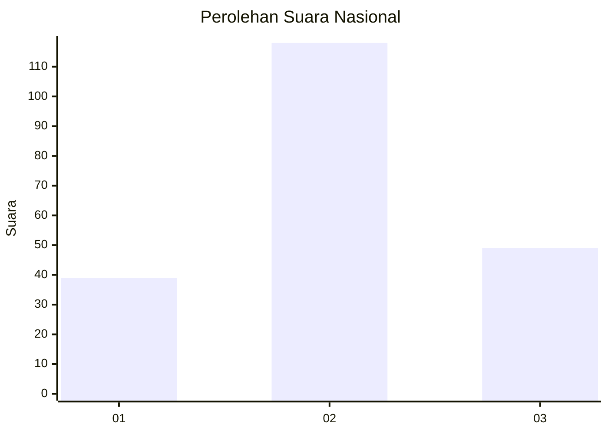
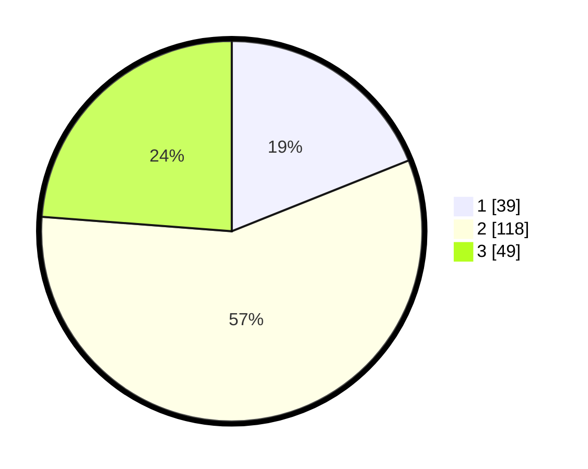

# Hasil

## Grafik

## Tabel

| No.    | Nama Paslon    | Suara | Suara (raw) | Persentase |
|:------ |:-------------- | -----:| -----------:| ----------:|
| 100025 | ANIES MUHAIMIN | 39    | [39][p-1]   | 18,93      |
| 100026 | PRABOWO GIBRAN | 118   | [118][p-2]  | 57,28      |
| 100027 | GANJAR MAHFUD  | 49    | [49][p-3]   | 23,79      |

[p-1]: https://github.com/gigit-pemilu/pemilu-2024/blob/main/pilpres/hitung-suara/sub/31-dki-jakarta/sub/72-jakarta-utara/sub/01-penjaringan/sub/1001-penjaringan/sub/122-tps/sub/paslon-1.txt
[p-2]: https://github.com/gigit-pemilu/pemilu-2024/blob/main/pilpres/hitung-suara/sub/31-dki-jakarta/sub/72-jakarta-utara/sub/01-penjaringan/sub/1001-penjaringan/sub/122-tps/sub/paslon-2.txt
[p-3]: https://github.com/gigit-pemilu/pemilu-2024/blob/main/pilpres/hitung-suara/sub/31-dki-jakarta/sub/72-jakarta-utara/sub/01-penjaringan/sub/1001-penjaringan/sub/122-tps/sub/paslon-3.txt

## Foto C Plano

https://sirekap-obj-formc.kpu.go.id/fcae/pemilu/ppwp/31/72/01/10/01/3172011001122-20240226-195827--9d53effa-88f4-479b-8bcf-d8a4b068a152.jpg

https://sirekap-obj-formc.kpu.go.id/fcae/pemilu/ppwp/31/72/01/10/01/3172011001122-20240226-195845--49728305-986b-4575-8122-1b19b99cd346.jpg

https://sirekap-obj-formc.kpu.go.id/fcae/pemilu/ppwp/31/72/01/10/01/3172011001122-20240226-195919--43bb5d89-a633-42af-9aa0-242001a4c006.jpg

## Metadata

| Key        | Value               |
| ---------- | ------------------- |
| Time Stamp | 2024-02-28 18:00:00 |

