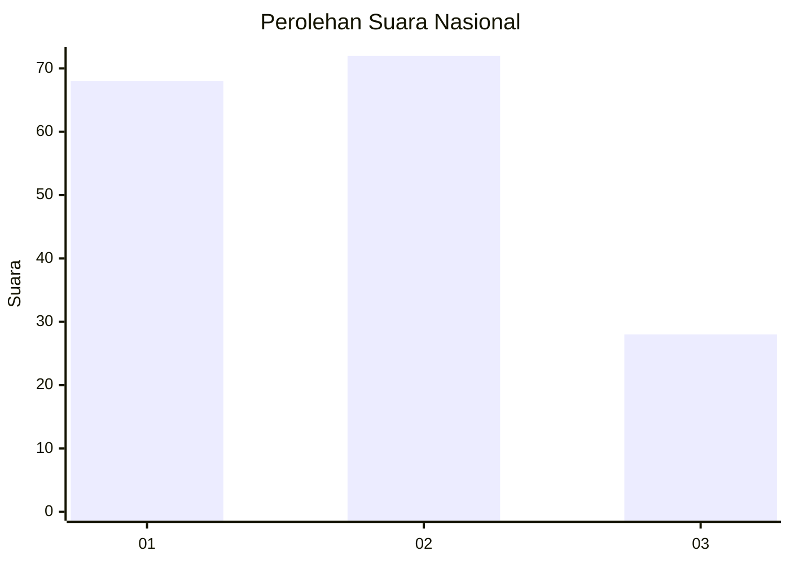
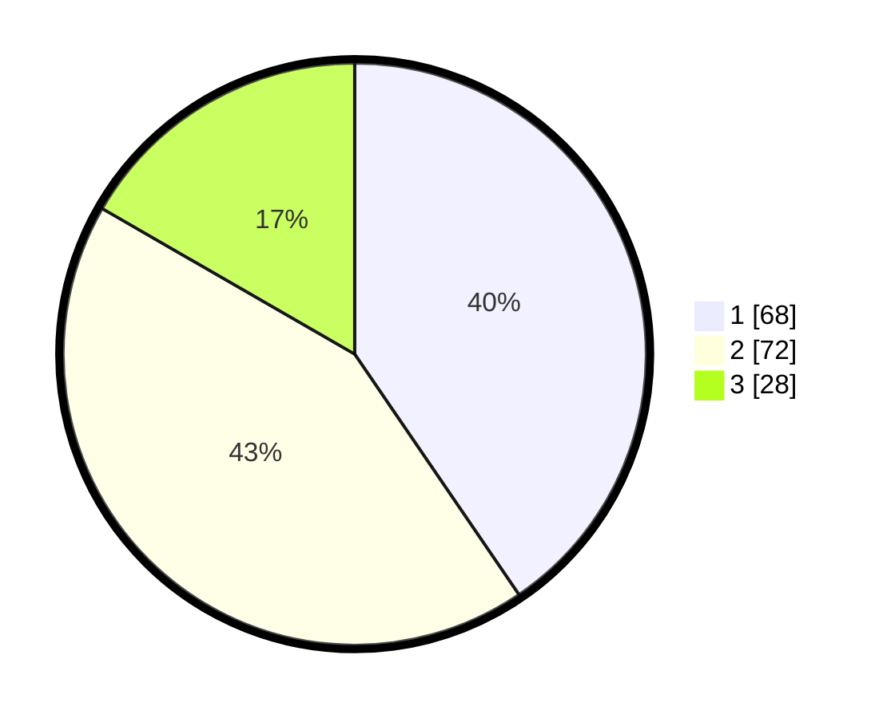

# Hasil

## Grafik

## Tabel

| No.    | Nama Paslon    | Suara | Suara (raw) | Persentase |
|:------ |:-------------- | -----:| -----------:| ----------:|
| 100025 | ANIES MUHAIMIN | 68    | [68][p-1]   | 40,48      |
| 100026 | PRABOWO GIBRAN | 72    | [72][p-2]   | 42,86      |
| 100027 | GANJAR MAHFUD  | 28    | [28][p-3]   | 16,67      |

[p-1]: https://github.com/gigit-pemilu/pemilu-2024/blob/main/pilpres/hitung-suara/sub/31-dki-jakarta/sub/72-jakarta-utara/sub/01-penjaringan/sub/1001-penjaringan/sub/124-tps/sub/paslon-1.txt
[p-2]: https://github.com/gigit-pemilu/pemilu-2024/blob/main/pilpres/hitung-suara/sub/31-dki-jakarta/sub/72-jakarta-utara/sub/01-penjaringan/sub/1001-penjaringan/sub/124-tps/sub/paslon-2.txt
[p-3]: https://github.com/gigit-pemilu/pemilu-2024/blob/main/pilpres/hitung-suara/sub/31-dki-jakarta/sub/72-jakarta-utara/sub/01-penjaringan/sub/1001-penjaringan/sub/124-tps/sub/paslon-3.txt

## Foto C Plano

https://sirekap-obj-formc.kpu.go.id/7d76/pemilu/ppwp/31/72/01/10/01/3172011001124-20240226-202420--82c2f886-4833-467e-ab9c-5dd57bd3d587.jpg

https://sirekap-obj-formc.kpu.go.id/7d76/pemilu/ppwp/31/72/01/10/01/3172011001124-20240226-202445--585040e2-fc2b-425d-872d-d31d2477f795.jpg

https://sirekap-obj-formc.kpu.go.id/7d76/pemilu/ppwp/31/72/01/10/01/3172011001124-20240226-202619--29af9b7b-56c4-4a5c-9986-76063f53facb.jpg

## Metadata

| Key        | Value               |
| ---------- | ------------------- |
| Time Stamp | 2024-02-28 18:00:00 |

