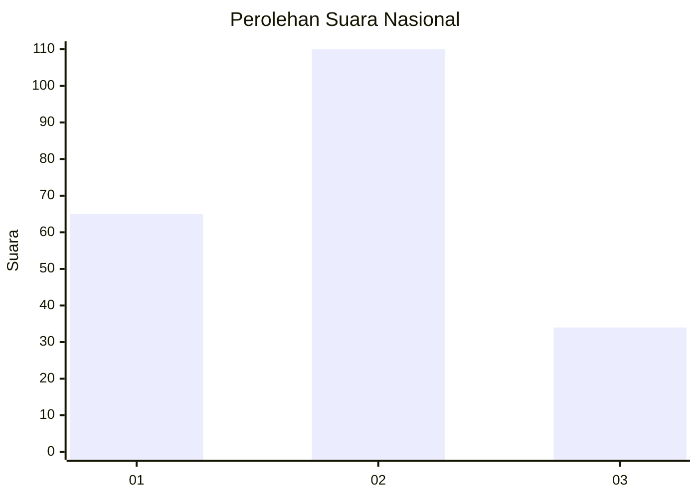
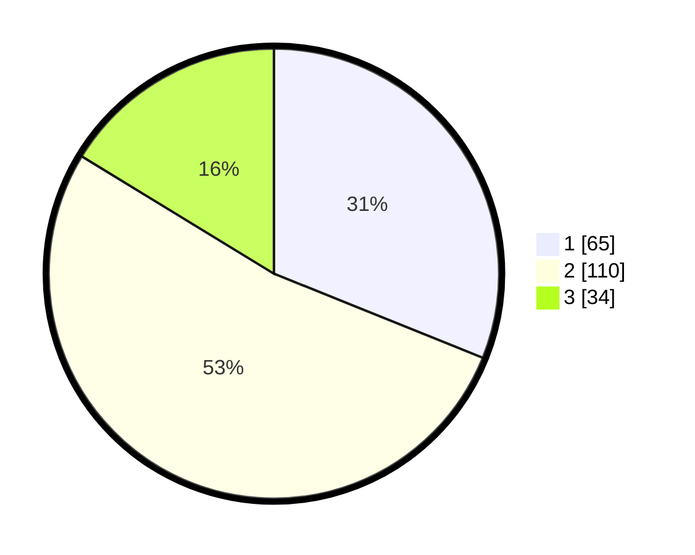

# Hasil

## Grafik

## Tabel

| No.    | Nama Paslon    | Suara | Suara (raw) | Persentase |
|:------ |:-------------- | -----:| -----------:| ----------:|
| 100025 | ANIES MUHAIMIN | 65    | [65][p-1]   | 31,10      |
| 100026 | PRABOWO GIBRAN | 110   | [110][p-2]  | 52,63      |
| 100027 | GANJAR MAHFUD  | 34    | [34][p-3]   | 16,27      |

[p-1]: https://github.com/gigit-pemilu/pemilu-2024/blob/main/pilpres/hitung-suara/sub/31-dki-jakarta/sub/72-jakarta-utara/sub/01-penjaringan/sub/1001-penjaringan/sub/129-tps/sub/paslon-1.txt
[p-2]: https://github.com/gigit-pemilu/pemilu-2024/blob/main/pilpres/hitung-suara/sub/31-dki-jakarta/sub/72-jakarta-utara/sub/01-penjaringan/sub/1001-penjaringan/sub/129-tps/sub/paslon-2.txt
[p-3]: https://github.com/gigit-pemilu/pemilu-2024/blob/main/pilpres/hitung-suara/sub/31-dki-jakarta/sub/72-jakarta-utara/sub/01-penjaringan/sub/1001-penjaringan/sub/129-tps/sub/paslon-3.txt

## Foto C Plano

https://sirekap-obj-formc.kpu.go.id/7ebb/pemilu/ppwp/31/72/01/10/01/3172011001129-20240227-113110--ae0f42eb-00c3-410d-97c2-1a0b9b1958a6.jpg

https://sirekap-obj-formc.kpu.go.id/7ebb/pemilu/ppwp/31/72/01/10/01/3172011001129-20240227-113137--4e04b3c3-11ea-4933-9a82-8f79aaf013e5.jpg

https://sirekap-obj-formc.kpu.go.id/7ebb/pemilu/ppwp/31/72/01/10/01/3172011001129-20240227-113224--060427df-97a5-48a0-a54a-d63badf3d1ca.jpg

## Metadata

| Key        | Value               |
| ---------- | ------------------- |
| Time Stamp | 2024-02-28 18:00:00 |

