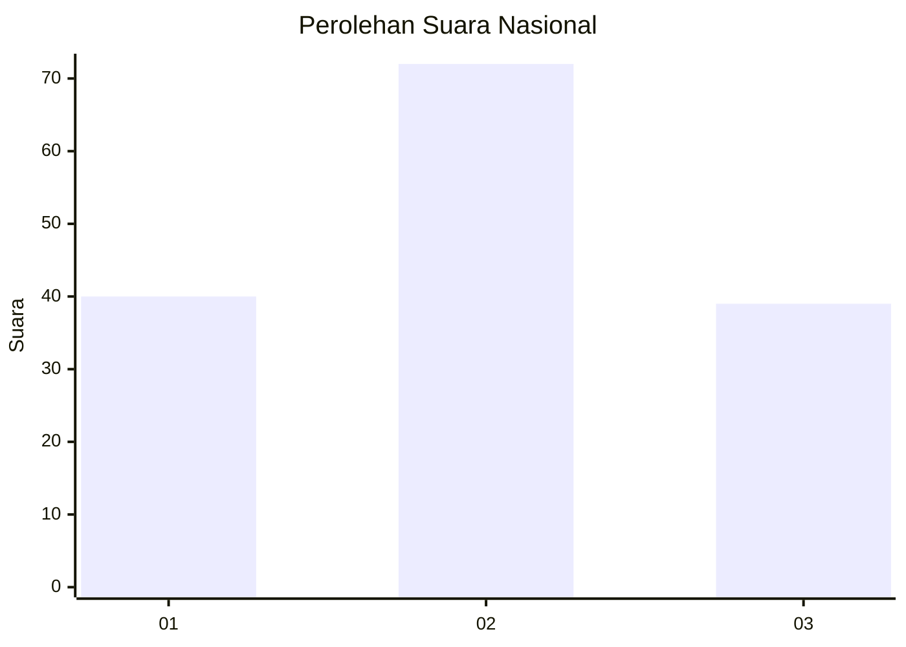
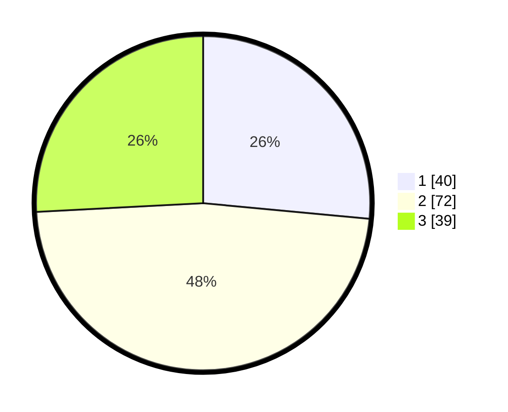

# Hasil

## Grafik

## Tabel

| No.    | Nama Paslon    | Suara | Suara (raw) | Persentase |
|:------ |:-------------- | -----:| -----------:| ----------:|
| 100025 | ANIES MUHAIMIN | 40    | [40][p-1]   | 26,49      |
| 100026 | PRABOWO GIBRAN | 72    | [72][p-2]   | 47,68      |
| 100027 | GANJAR MAHFUD  | 39    | [39][p-3]   | 25,83      |

[p-1]: https://github.com/gigit-pemilu/pemilu-2024/blob/main/pilpres/hitung-suara/sub/31-dki-jakarta/sub/72-jakarta-utara/sub/01-penjaringan/sub/1001-penjaringan/sub/130-tps/sub/paslon-1.txt
[p-2]: https://github.com/gigit-pemilu/pemilu-2024/blob/main/pilpres/hitung-suara/sub/31-dki-jakarta/sub/72-jakarta-utara/sub/01-penjaringan/sub/1001-penjaringan/sub/130-tps/sub/paslon-2.txt
[p-3]: https://github.com/gigit-pemilu/pemilu-2024/blob/main/pilpres/hitung-suara/sub/31-dki-jakarta/sub/72-jakarta-utara/sub/01-penjaringan/sub/1001-penjaringan/sub/130-tps/sub/paslon-3.txt

## Foto C Plano

https://sirekap-obj-formc.kpu.go.id/6d25/pemilu/ppwp/31/72/01/10/01/3172011001130-20240227-120538--08980346-0570-42c7-ae0b-3c701b191525.jpg

https://sirekap-obj-formc.kpu.go.id/6d25/pemilu/ppwp/31/72/01/10/01/3172011001130-20240227-120554--016e7770-5ab3-43fc-a68b-ef67b9743b6e.jpg

https://sirekap-obj-formc.kpu.go.id/6d25/pemilu/ppwp/31/72/01/10/01/3172011001130-20240227-120614--a6e5fc83-1db8-4021-9f46-e961775c2f11.jpg

## Metadata

| Key        | Value               |
| ---------- | ------------------- |
| Time Stamp | 2024-02-28 18:00:00 |

