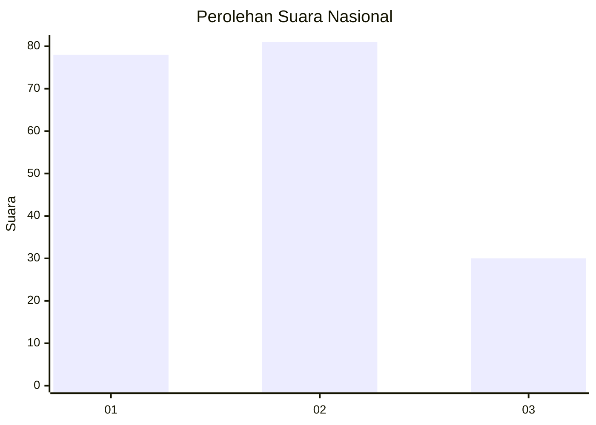
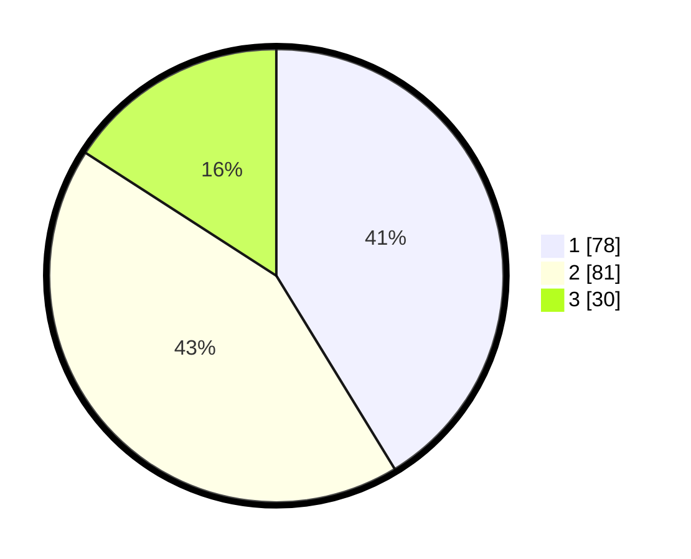

# Hasil

## Grafik

## Tabel

| No.    | Nama Paslon    | Suara | Suara (raw) | Persentase |
|:------ |:-------------- | -----:| -----------:| ----------:|
| 100025 | ANIES MUHAIMIN | 78    | [78][p-1]   | 41,27      |
| 100026 | PRABOWO GIBRAN | 81    | [81][p-2]   | 42,86      |
| 100027 | GANJAR MAHFUD  | 30    | [30][p-3]   | 15,87      |

[p-1]: https://github.com/gigit-pemilu/pemilu-2024/blob/main/pilpres/hitung-suara/sub/31-dki-jakarta/sub/72-jakarta-utara/sub/01-penjaringan/sub/1001-penjaringan/sub/137-tps/sub/paslon-1.txt
[p-2]: https://github.com/gigit-pemilu/pemilu-2024/blob/main/pilpres/hitung-suara/sub/31-dki-jakarta/sub/72-jakarta-utara/sub/01-penjaringan/sub/1001-penjaringan/sub/137-tps/sub/paslon-2.txt
[p-3]: https://github.com/gigit-pemilu/pemilu-2024/blob/main/pilpres/hitung-suara/sub/31-dki-jakarta/sub/72-jakarta-utara/sub/01-penjaringan/sub/1001-penjaringan/sub/137-tps/sub/paslon-3.txt

## Foto C Plano

https://sirekap-obj-formc.kpu.go.id/53b5/pemilu/ppwp/31/72/01/10/01/3172011001137-20240227-160146--db836448-980a-4dae-96f1-60a3bf456dbc.jpg

https://sirekap-obj-formc.kpu.go.id/53b5/pemilu/ppwp/31/72/01/10/01/3172011001137-20240227-160205--de9d6c14-bac2-43e9-8ae7-677f5e2825de.jpg

https://sirekap-obj-formc.kpu.go.id/53b5/pemilu/ppwp/31/72/01/10/01/3172011001137-20240227-160222--e891c4b6-6697-4343-add0-26b148452239.jpg

## Metadata

| Key        | Value               |
| ---------- | ------------------- |
| Time Stamp | 2024-02-28 19:00:00 |

