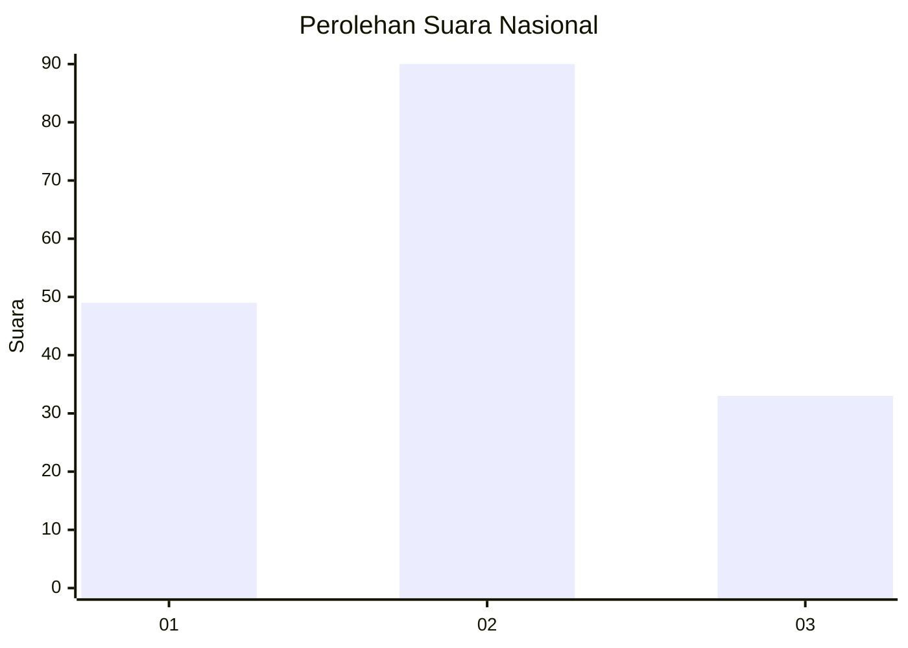
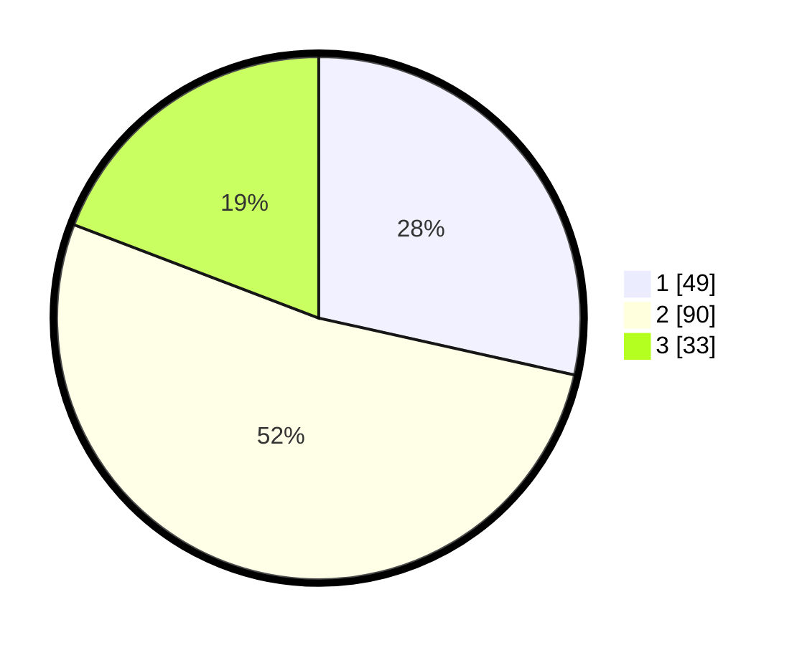

# Hasil

## Grafik

## Tabel

| No.    | Nama Paslon    | Suara | Suara (raw) | Persentase |
|:------ |:-------------- | -----:| -----------:| ----------:|
| 100025 | ANIES MUHAIMIN | 49    | [49][p-1]   | 28,49      |
| 100026 | PRABOWO GIBRAN | 90    | [90][p-2]   | 52,33      |
| 100027 | GANJAR MAHFUD  | 33    | [33][p-3]   | 19,19      |

[p-1]: https://github.com/gigit-pemilu/pemilu-2024/blob/main/pilpres/hitung-suara/sub/31-dki-jakarta/sub/72-jakarta-utara/sub/01-penjaringan/sub/1001-penjaringan/sub/139-tps/sub/paslon-1.txt
[p-2]: https://github.com/gigit-pemilu/pemilu-2024/blob/main/pilpres/hitung-suara/sub/31-dki-jakarta/sub/72-jakarta-utara/sub/01-penjaringan/sub/1001-penjaringan/sub/139-tps/sub/paslon-2.txt
[p-3]: https://github.com/gigit-pemilu/pemilu-2024/blob/main/pilpres/hitung-suara/sub/31-dki-jakarta/sub/72-jakarta-utara/sub/01-penjaringan/sub/1001-penjaringan/sub/139-tps/sub/paslon-3.txt

## Foto C Plano

https://sirekap-obj-formc.kpu.go.id/ab81/pemilu/ppwp/31/72/01/10/01/3172011001139-20240227-164953--2c85cb74-fda8-483d-ab44-eea48e5a0792.jpg

https://sirekap-obj-formc.kpu.go.id/ab81/pemilu/ppwp/31/72/01/10/01/3172011001139-20240227-165011--5997f943-f8fa-4f11-b898-35f237e2610c.jpg

https://sirekap-obj-formc.kpu.go.id/ab81/pemilu/ppwp/31/72/01/10/01/3172011001139-20240227-165040--a6888d61-b017-4ca5-8de6-911cd4957f0e.jpg

## Metadata

| Key        | Value               |
| ---------- | ------------------- |
| Time Stamp | 2024-02-29 14:00:00 |

