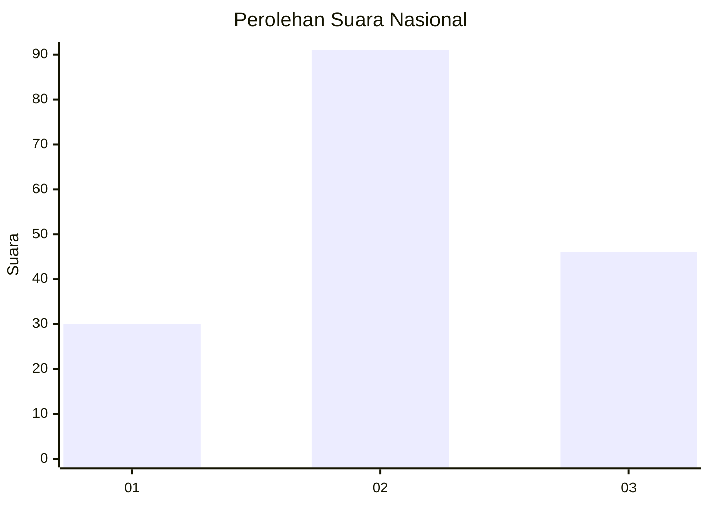

# Hasil

## Grafik

## Tabel

| No.    | Nama Paslon    | Suara | Suara (raw) | Persentase |
|:------ |:-------------- | -----:| -----------:| ----------:|
| 100025 | ANIES MUHAIMIN | 30    | [30][p-1]   | 17,96      |
| 100026 | PRABOWO GIBRAN | 91    | [91][p-2]   | 54,49      |
| 100027 | GANJAR MAHFUD  | 46    | [46][p-3]   | 27,54      |

[p-1]: https://github.com/gigit-pemilu/pemilu-2024/blob/main/pilpres/hitung-suara/sub/31-dki-jakarta/sub/72-jakarta-utara/sub/01-penjaringan/sub/1001-penjaringan/sub/140-tps/sub/paslon-1.txt
[p-2]: https://github.com/gigit-pemilu/pemilu-2024/blob/main/pilpres/hitung-suara/sub/31-dki-jakarta/sub/72-jakarta-utara/sub/01-penjaringan/sub/1001-penjaringan/sub/140-tps/sub/paslon-2.txt
[p-3]: https://github.com/gigit-pemilu/pemilu-2024/blob/main/pilpres/hitung-suara/sub/31-dki-jakarta/sub/72-jakarta-utara/sub/01-penjaringan/sub/1001-penjaringan/sub/140-tps/sub/paslon-3.txt

## Foto C Plano

https://sirekap-obj-formc.kpu.go.id/052f/pemilu/ppwp/31/72/01/10/01/3172011001140-20240227-191347--b11d36da-b503-4802-b038-26bb24732590.jpg

https://sirekap-obj-formc.kpu.go.id/052f/pemilu/ppwp/31/72/01/10/01/3172011001140-20240227-191404--45e1b70b-ac77-4f89-bb3a-902a22dc9ff6.jpg

https://sirekap-obj-formc.kpu.go.id/052f/pemilu/ppwp/31/72/01/10/01/3172011001140-20240227-191422--d7561648-079e-4853-8d90-0b6237b3ca0f.jpg

## Metadata

| Key        | Value               |
| ---------- | ------------------- |
| Time Stamp | 2024-02-28 19:00:00 |

