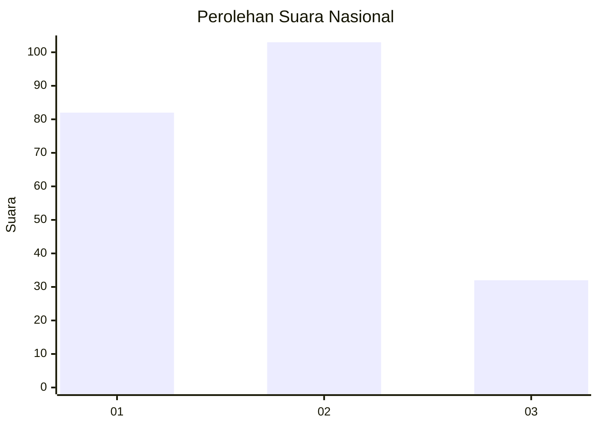
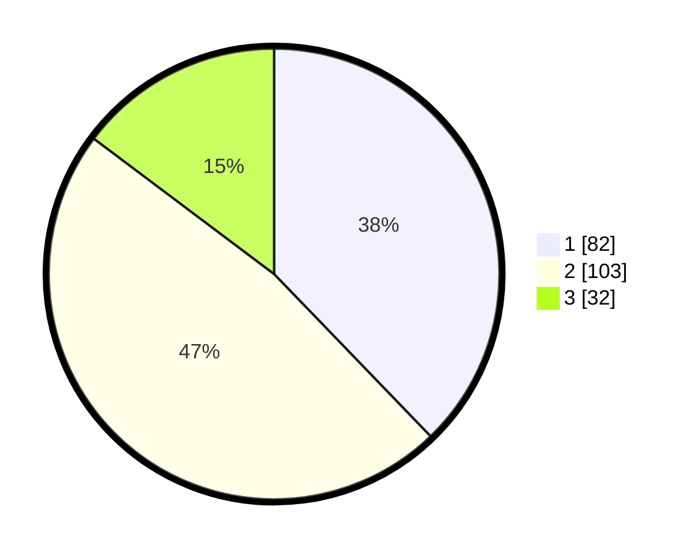

# Hasil

## Grafik

## Tabel

| No.    | Nama Paslon    | Suara | Suara (raw) | Persentase |
|:------ |:-------------- | -----:| -----------:| ----------:|
| 100025 | ANIES MUHAIMIN | 82    | [82][p-1]   | 37,79      |
| 100026 | PRABOWO GIBRAN | 103   | [103][p-2]  | 47,47      |
| 100027 | GANJAR MAHFUD  | 32    | [32][p-3]   | 14,75      |

[p-1]: https://github.com/gigit-pemilu/pemilu-2024/blob/main/pilpres/hitung-suara/sub/31-dki-jakarta/sub/72-jakarta-utara/sub/01-penjaringan/sub/1001-penjaringan/sub/172-tps/sub/paslon-1.txt
[p-2]: https://github.com/gigit-pemilu/pemilu-2024/blob/main/pilpres/hitung-suara/sub/31-dki-jakarta/sub/72-jakarta-utara/sub/01-penjaringan/sub/1001-penjaringan/sub/172-tps/sub/paslon-2.txt
[p-3]: https://github.com/gigit-pemilu/pemilu-2024/blob/main/pilpres/hitung-suara/sub/31-dki-jakarta/sub/72-jakarta-utara/sub/01-penjaringan/sub/1001-penjaringan/sub/172-tps/sub/paslon-3.txt

## Foto C Plano

https://sirekap-obj-formc.kpu.go.id/e40a/pemilu/ppwp/31/72/01/10/01/3172011001172-20240215-184829--06a03e90-b326-4cf0-a2cf-de46b8b97151.jpg

https://sirekap-obj-formc.kpu.go.id/e40a/pemilu/ppwp/31/72/01/10/01/3172011001172-20240215-185050--27c1e937-2be3-4c40-9340-98826311c916.jpg

https://sirekap-obj-formc.kpu.go.id/e40a/pemilu/ppwp/31/72/01/10/01/3172011001172-20240215-185143--8fcba6e7-9ec6-40b3-abd7-33a60af85902.jpg

## Metadata

| Key        | Value               |
| ---------- | ------------------- |
| Time Stamp | 2024-02-20 16:00:00 |

