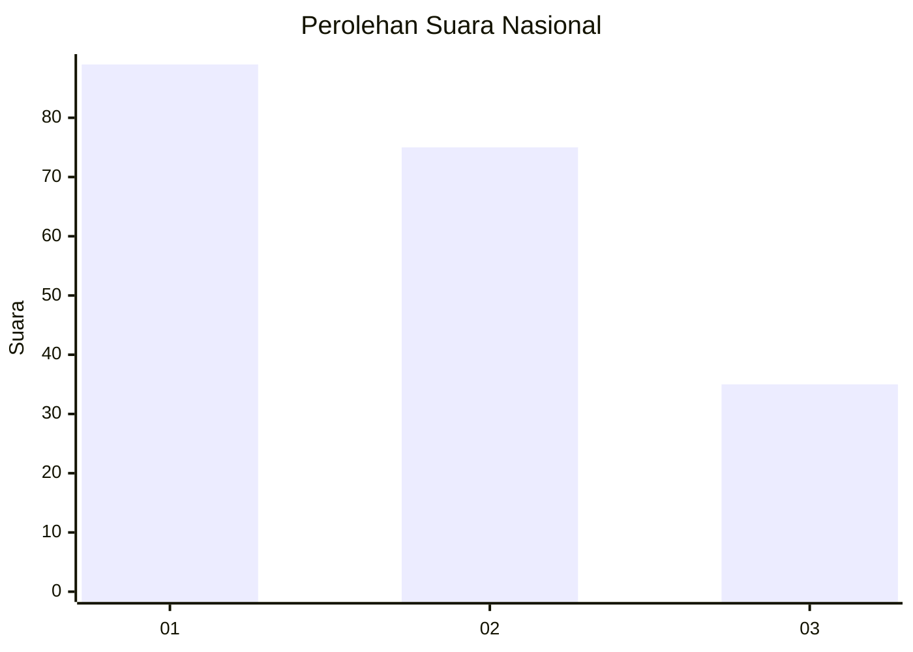
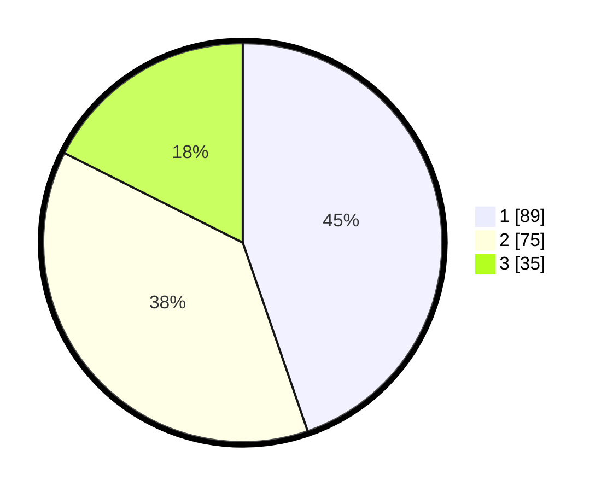

# Hasil

## Grafik

## Tabel

| No.    | Nama Paslon    | Suara | Suara (raw) | Persentase |
|:------ |:-------------- | -----:| -----------:| ----------:|
| 100025 | ANIES MUHAIMIN | 89    | [89][p-1]   | 44,72      |
| 100026 | PRABOWO GIBRAN | 75    | [75][p-2]   | 37,69      |
| 100027 | GANJAR MAHFUD  | 35    | [35][p-3]   | 17,59      |

[p-1]: https://github.com/gigit-pemilu/pemilu-2024/blob/main/pilpres/hitung-suara/sub/31-dki-jakarta/sub/72-jakarta-utara/sub/01-penjaringan/sub/1001-penjaringan/sub/175-tps/sub/paslon-1.txt
[p-2]: https://github.com/gigit-pemilu/pemilu-2024/blob/main/pilpres/hitung-suara/sub/31-dki-jakarta/sub/72-jakarta-utara/sub/01-penjaringan/sub/1001-penjaringan/sub/175-tps/sub/paslon-2.txt
[p-3]: https://github.com/gigit-pemilu/pemilu-2024/blob/main/pilpres/hitung-suara/sub/31-dki-jakarta/sub/72-jakarta-utara/sub/01-penjaringan/sub/1001-penjaringan/sub/175-tps/sub/paslon-3.txt

## Foto C Plano

https://sirekap-obj-formc.kpu.go.id/54be/pemilu/ppwp/31/72/01/10/01/3172011001175-20240215-033105--8ca18c9c-6dcb-4c8e-bfaf-0f77858ac231.jpg

https://sirekap-obj-formc.kpu.go.id/54be/pemilu/ppwp/31/72/01/10/01/3172011001175-20240215-033216--93f2d012-5c3f-4162-a3c7-2167a8ea5405.jpg

https://sirekap-obj-formc.kpu.go.id/54be/pemilu/ppwp/31/72/01/10/01/3172011001175-20240215-033329--63a36d23-442d-42e8-bf68-86a2da106f50.jpg

## Metadata

| Key        | Value               |
| ---------- | ------------------- |
| Time Stamp | 2024-02-21 18:00:00 |

