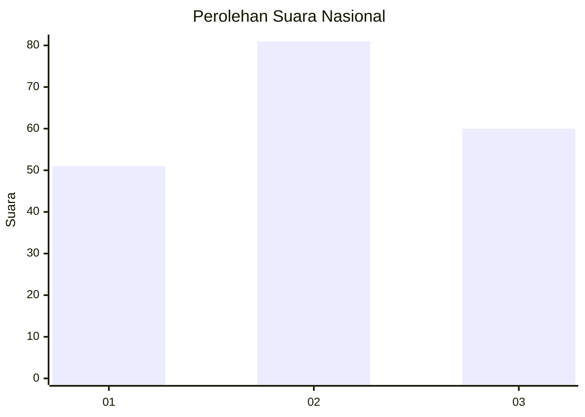
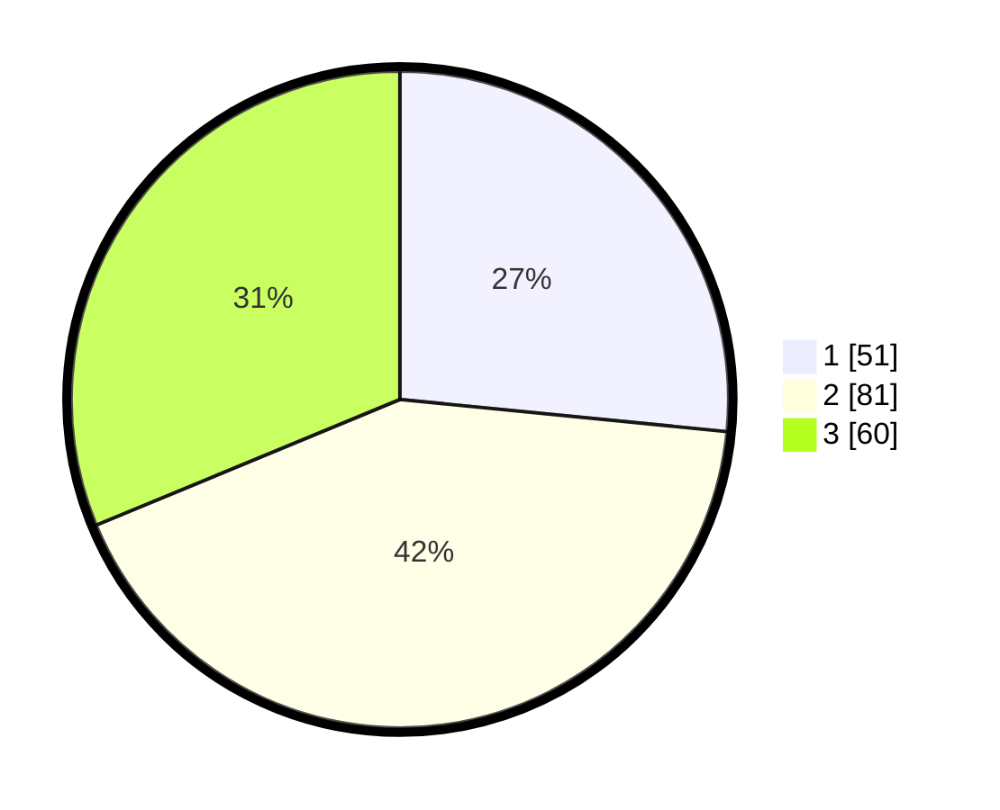

# Hasil

## Grafik

## Tabel

| No.    | Nama Paslon    | Suara | Suara (raw) | Persentase |
|:------ |:-------------- | -----:| -----------:| ----------:|
| 100025 | ANIES MUHAIMIN | 51    | [51][p-1]   | 26,56      |
| 100026 | PRABOWO GIBRAN | 81    | [81][p-2]   | 42,19      |
| 100027 | GANJAR MAHFUD  | 60    | [60][p-3]   | 31,25      |

[p-1]: https://github.com/gigit-pemilu/pemilu-2024/blob/main/pilpres/hitung-suara/sub/31-dki-jakarta/sub/72-jakarta-utara/sub/01-penjaringan/sub/1001-penjaringan/sub/204-tps/sub/paslon-1.txt
[p-2]: https://github.com/gigit-pemilu/pemilu-2024/blob/main/pilpres/hitung-suara/sub/31-dki-jakarta/sub/72-jakarta-utara/sub/01-penjaringan/sub/1001-penjaringan/sub/204-tps/sub/paslon-2.txt
[p-3]: https://github.com/gigit-pemilu/pemilu-2024/blob/main/pilpres/hitung-suara/sub/31-dki-jakarta/sub/72-jakarta-utara/sub/01-penjaringan/sub/1001-penjaringan/sub/204-tps/sub/paslon-3.txt

## Foto C Plano

https://sirekap-obj-formc.kpu.go.id/fe87/pemilu/ppwp/31/72/01/10/01/3172011001204-20240214-233243--d6718f7e-3247-4006-9dc6-c16823e680db.jpg

https://sirekap-obj-formc.kpu.go.id/fe87/pemilu/ppwp/31/72/01/10/01/3172011001204-20240214-233322--70e31b5e-b9a8-4be2-849e-764b32d93ba5.jpg

https://sirekap-obj-formc.kpu.go.id/fe87/pemilu/ppwp/31/72/01/10/01/3172011001204-20240214-233401--78d4cec3-fcd9-45e2-a67b-0ba4f50b6080.jpg

## Metadata

| Key        | Value               |
| ---------- | ------------------- |
| Time Stamp | 2024-02-21 18:00:00 |

