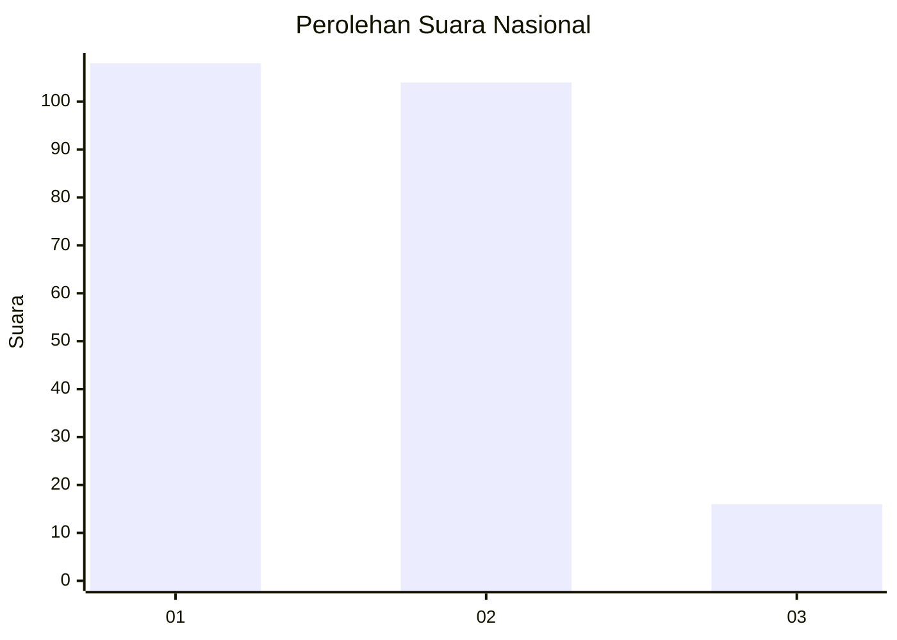
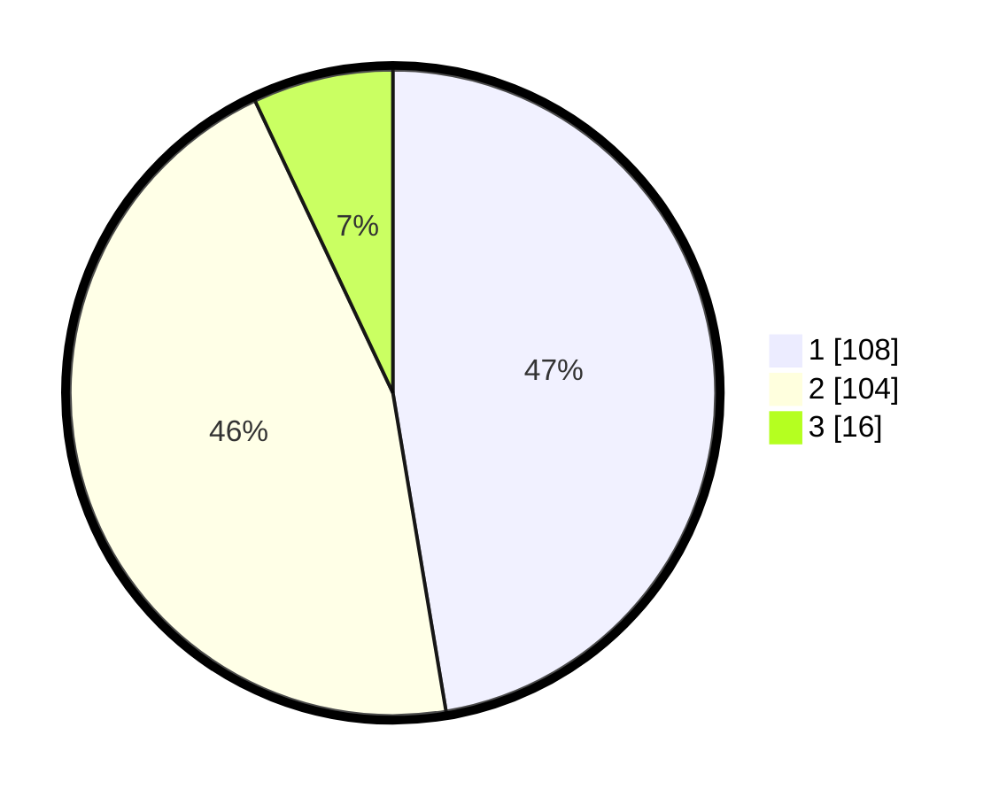

# Hasil

## Grafik

## Tabel

| No.    | Nama Paslon    | Suara | Suara (raw) | Persentase |
|:------ |:-------------- | -----:| -----------:| ----------:|
| 100025 | ANIES MUHAIMIN | 108   | [108][p-1]  | 47,37      |
| 100026 | PRABOWO GIBRAN | 104   | [104][p-2]  | 45,61      |
| 100027 | GANJAR MAHFUD  | 16    | [16][p-3]   | 7,02       |

[p-1]: https://github.com/gigit-pemilu/pemilu-2024/blob/main/pilpres/hitung-suara/sub/31-dki-jakarta/sub/72-jakarta-utara/sub/01-penjaringan/sub/1001-penjaringan/sub/227-tps/sub/paslon-1.txt
[p-2]: https://github.com/gigit-pemilu/pemilu-2024/blob/main/pilpres/hitung-suara/sub/31-dki-jakarta/sub/72-jakarta-utara/sub/01-penjaringan/sub/1001-penjaringan/sub/227-tps/sub/paslon-2.txt
[p-3]: https://github.com/gigit-pemilu/pemilu-2024/blob/main/pilpres/hitung-suara/sub/31-dki-jakarta/sub/72-jakarta-utara/sub/01-penjaringan/sub/1001-penjaringan/sub/227-tps/sub/paslon-3.txt

## Foto C Plano

https://sirekap-obj-formc.kpu.go.id/eb6d/pemilu/ppwp/31/72/01/10/01/3172011001227-20240214-234636--7a7cced7-14c5-4f53-b280-bd36c2b95ac7.jpg

https://sirekap-obj-formc.kpu.go.id/eb6d/pemilu/ppwp/31/72/01/10/01/3172011001227-20240214-234759--b54e2768-e8a5-4eda-bfd9-d9bdd487842d.jpg

https://sirekap-obj-formc.kpu.go.id/eb6d/pemilu/ppwp/31/72/01/10/01/3172011001227-20240214-234910--a3edfe6d-9e05-4ca8-b591-748e3951a681.jpg

## Metadata

| Key        | Value               |
| ---------- | ------------------- |
| Time Stamp | 2024-02-21 13:00:00 |

