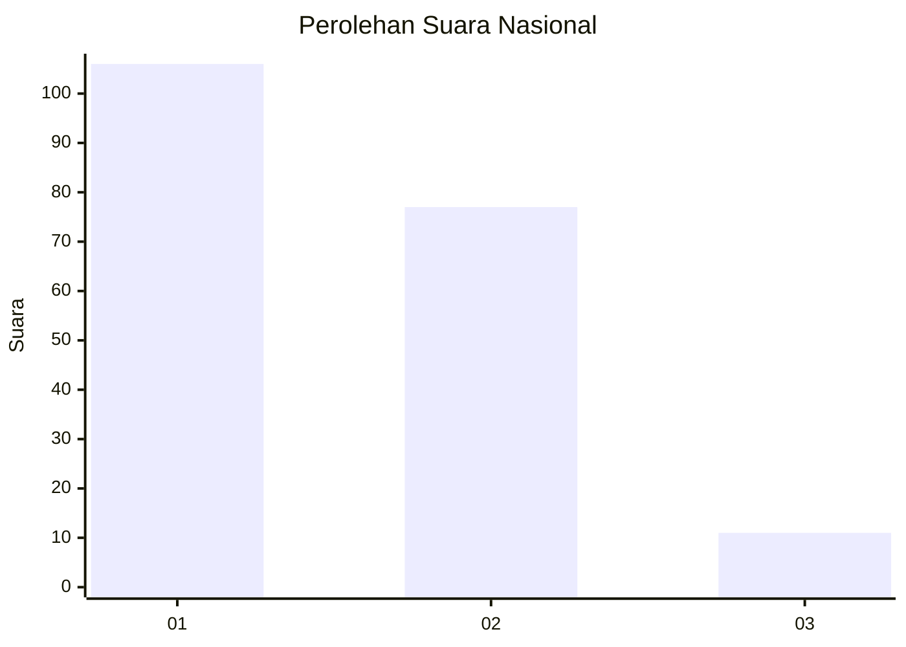
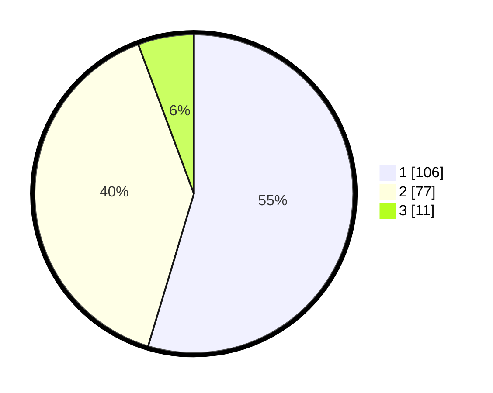

# Hasil

## Grafik

## Tabel

| No.    | Nama Paslon    | Suara | Suara (raw) | Persentase |
|:------ |:-------------- | -----:| -----------:| ----------:|
| 100025 | ANIES MUHAIMIN | 106   | [106][p-1]  | 54,64      |
| 100026 | PRABOWO GIBRAN | 77    | [77][p-2]   | 39,69      |
| 100027 | GANJAR MAHFUD  | 11    | [11][p-3]   | 5,67       |

[p-1]: https://github.com/gigit-pemilu/pemilu-2024/blob/main/pilpres/hitung-suara/sub/31-dki-jakarta/sub/72-jakarta-utara/sub/01-penjaringan/sub/1001-penjaringan/sub/229-tps/sub/paslon-1.txt
[p-2]: https://github.com/gigit-pemilu/pemilu-2024/blob/main/pilpres/hitung-suara/sub/31-dki-jakarta/sub/72-jakarta-utara/sub/01-penjaringan/sub/1001-penjaringan/sub/229-tps/sub/paslon-2.txt
[p-3]: https://github.com/gigit-pemilu/pemilu-2024/blob/main/pilpres/hitung-suara/sub/31-dki-jakarta/sub/72-jakarta-utara/sub/01-penjaringan/sub/1001-penjaringan/sub/229-tps/sub/paslon-3.txt

## Foto C Plano

https://sirekap-obj-formc.kpu.go.id/2bd9/pemilu/ppwp/31/72/01/10/01/3172011001229-20240215-143215--7824dbec-6c99-4903-99cf-8884c5cd702a.jpg

https://sirekap-obj-formc.kpu.go.id/2bd9/pemilu/ppwp/31/72/01/10/01/3172011001229-20240215-143232--3f07d5ef-4d25-4c9f-bc4a-dddff22be274.jpg

https://sirekap-obj-formc.kpu.go.id/2bd9/pemilu/ppwp/31/72/01/10/01/3172011001229-20240215-143243--2e7a145e-82bf-4afe-b532-d663d219a055.jpg

## Metadata

| Key        | Value               |
| ---------- | ------------------- |
| Time Stamp | 2024-02-21 18:00:00 |

