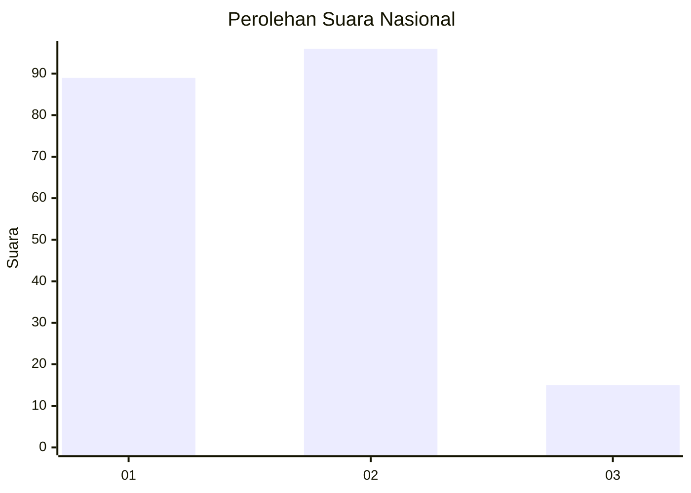
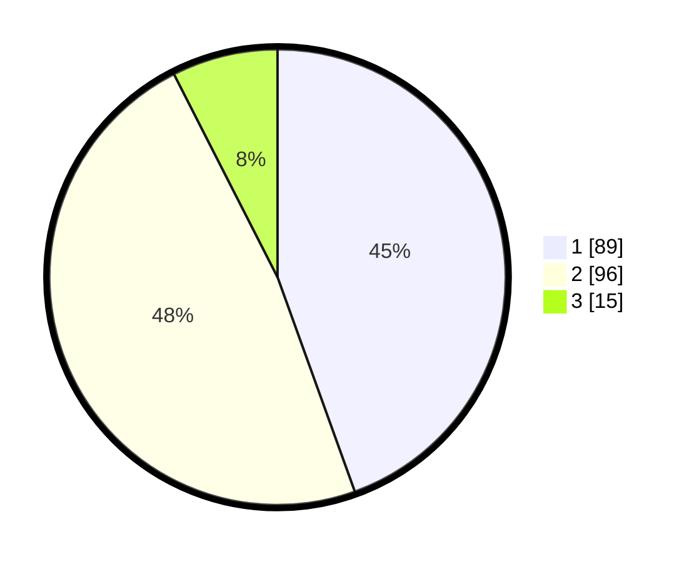

# Hasil

## Grafik

## Tabel

| No.    | Nama Paslon    | Suara | Suara (raw) | Persentase |
|:------ |:-------------- | -----:| -----------:| ----------:|
| 100025 | ANIES MUHAIMIN | 89    | [89][p-1]   | 44,50      |
| 100026 | PRABOWO GIBRAN | 96    | [96][p-2]   | 48,00      |
| 100027 | GANJAR MAHFUD  | 15    | [15][p-3]   | 7,50       |

[p-1]: https://github.com/gigit-pemilu/pemilu-2024/blob/main/pilpres/hitung-suara/sub/31-dki-jakarta/sub/72-jakarta-utara/sub/01-penjaringan/sub/1001-penjaringan/sub/233-tps/sub/paslon-1.txt
[p-2]: https://github.com/gigit-pemilu/pemilu-2024/blob/main/pilpres/hitung-suara/sub/31-dki-jakarta/sub/72-jakarta-utara/sub/01-penjaringan/sub/1001-penjaringan/sub/233-tps/sub/paslon-2.txt
[p-3]: https://github.com/gigit-pemilu/pemilu-2024/blob/main/pilpres/hitung-suara/sub/31-dki-jakarta/sub/72-jakarta-utara/sub/01-penjaringan/sub/1001-penjaringan/sub/233-tps/sub/paslon-3.txt

## Foto C Plano

https://sirekap-obj-formc.kpu.go.id/b025/pemilu/ppwp/31/72/01/10/01/3172011001233-20240214-231833--27c1860b-8e46-4307-9776-029c065e1cd0.jpg

https://sirekap-obj-formc.kpu.go.id/b025/pemilu/ppwp/31/72/01/10/01/3172011001233-20240214-232012--85a7b87e-7c53-47e6-b874-c787b8a006c1.jpg

https://sirekap-obj-formc.kpu.go.id/b025/pemilu/ppwp/31/72/01/10/01/3172011001233-20240214-225356--63d7885d-c293-4050-8679-ec72cf056700.jpg

## Metadata

| Key        | Value               |
| ---------- | ------------------- |
| Time Stamp | 2024-02-20 16:00:00 |

