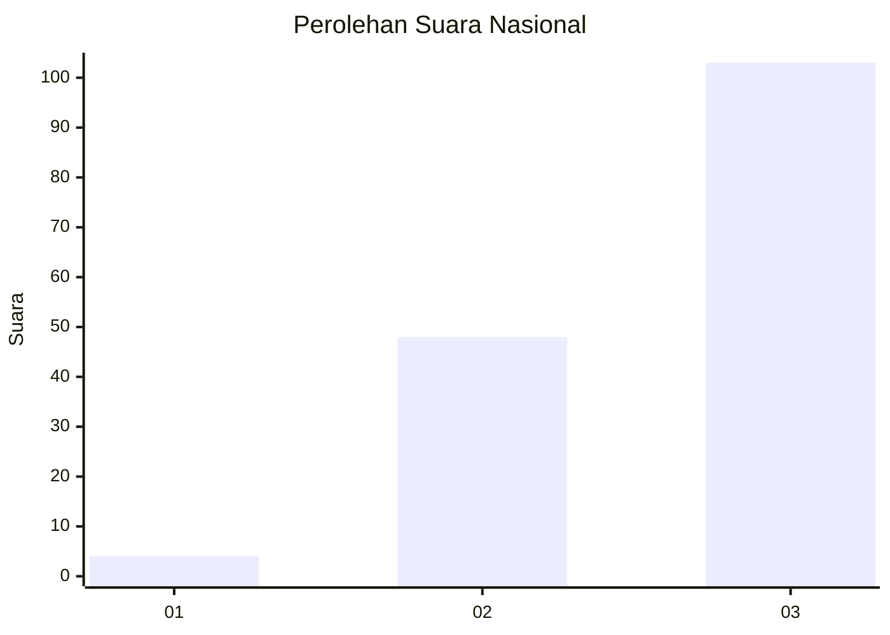
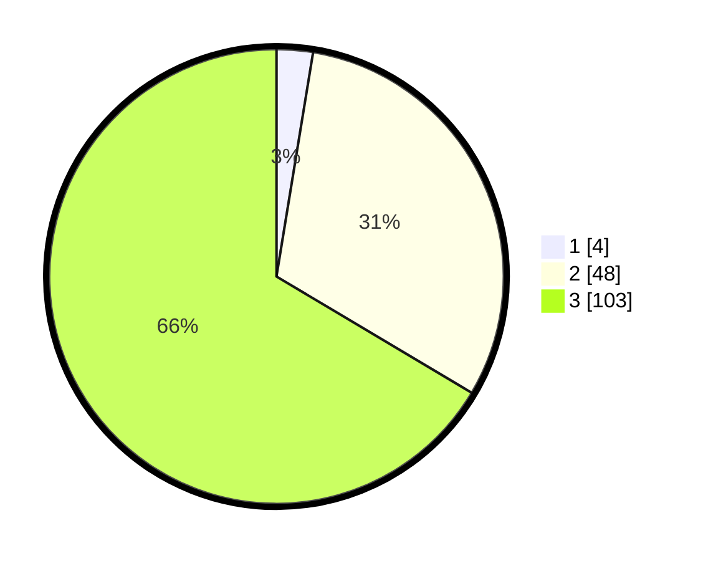

# Hasil

## Grafik

## Tabel

| No.    | Nama Paslon    | Suara | Suara (raw) | Persentase |
|:------ |:-------------- | -----:| -----------:| ----------:|
| 100025 | ANIES MUHAIMIN | 4     | [4][p-1]    | 2,58       |
| 100026 | PRABOWO GIBRAN | 48    | [48][p-2]   | 30,97      |
| 100027 | GANJAR MAHFUD  | 103   | [103][p-3]  | 66,45      |

[p-1]: https://github.com/gigit-pemilu/pemilu-2024/blob/main/pilpres/hitung-suara/sub/31-dki-jakarta/sub/72-jakarta-utara/sub/01-penjaringan/sub/1001-penjaringan/sub/295-tps/sub/paslon-1.txt
[p-2]: https://github.com/gigit-pemilu/pemilu-2024/blob/main/pilpres/hitung-suara/sub/31-dki-jakarta/sub/72-jakarta-utara/sub/01-penjaringan/sub/1001-penjaringan/sub/295-tps/sub/paslon-2.txt
[p-3]: https://github.com/gigit-pemilu/pemilu-2024/blob/main/pilpres/hitung-suara/sub/31-dki-jakarta/sub/72-jakarta-utara/sub/01-penjaringan/sub/1001-penjaringan/sub/295-tps/sub/paslon-3.txt

## Foto C Plano

https://sirekap-obj-formc.kpu.go.id/ad93/pemilu/ppwp/31/72/01/10/01/3172011001295-20240214-231139--3ecc8a64-cb3d-4be6-a378-ca8dc2d6d560.jpg

https://sirekap-obj-formc.kpu.go.id/ad93/pemilu/ppwp/31/72/01/10/01/3172011001295-20240214-231305--e8336cad-1fe3-40fd-9525-7ea6b25ec53a.jpg

https://sirekap-obj-formc.kpu.go.id/ad93/pemilu/ppwp/31/72/01/10/01/3172011001295-20240214-231526--0452e042-b11b-4502-97ce-1c64db4ac27f.jpg

## Metadata

| Key        | Value               |
| ---------- | ------------------- |
| Time Stamp | 2024-02-21 18:00:00 |

