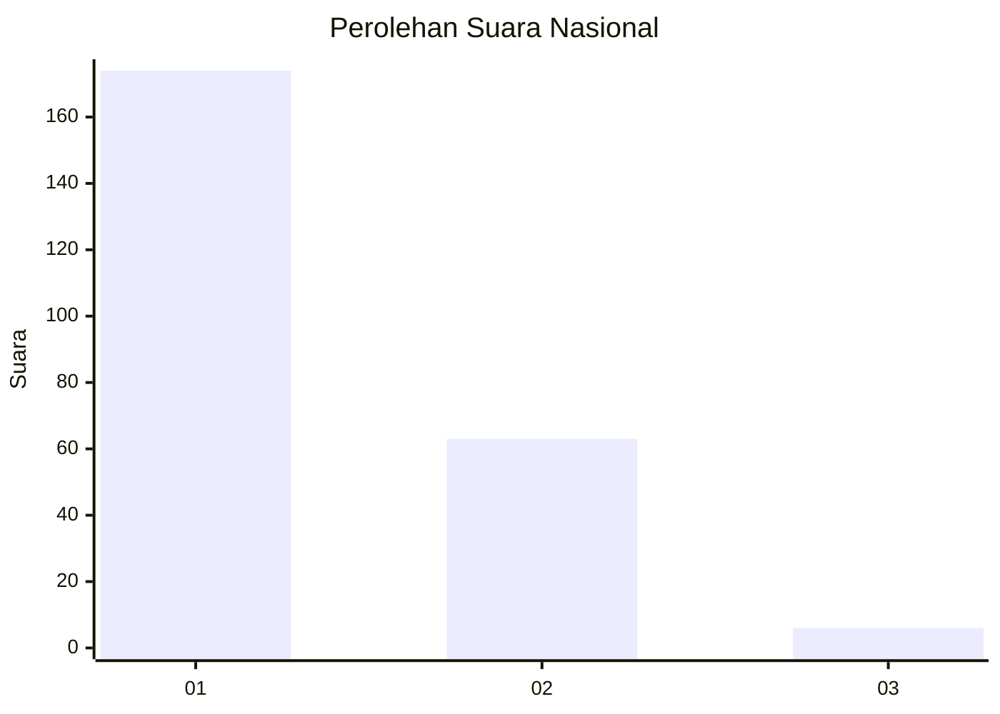
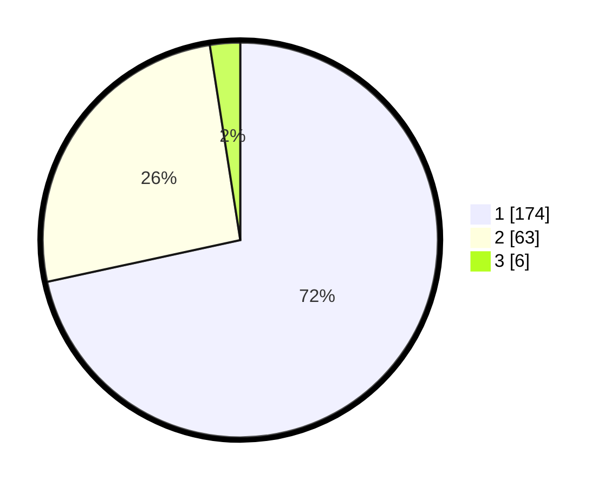

# Hasil

## Grafik

## Tabel

| No. | Nama Paslon    | Suara | Suara (raw) | Persentase |
|:--- |:-------------- | -----:| -----------:| ----------:|
| 1   | ANIES MUHAIMIN | 174   | [174][p-1]  | 71,60      |
| 2   | PRABOWO GIBRAN | 63    | [63][p-2]   | 25,93      |
| 3   | GANJAR MAHFUD  | 6     | [6][p-3]    | 2,47       |

[p-1]: https://github.com/gigit-pemilu/pemilu-2024/blob/main/pilpres/hitung-suara/sub/31-dki-jakarta/sub/72-jakarta-utara/sub/01-penjaringan/sub/1002-kamal-muara/sub/001-tps/sub/paslon-1.txt
[p-2]: https://github.com/gigit-pemilu/pemilu-2024/blob/main/pilpres/hitung-suara/sub/31-dki-jakarta/sub/72-jakarta-utara/sub/01-penjaringan/sub/1002-kamal-muara/sub/001-tps/sub/paslon-2.txt
[p-3]: https://github.com/gigit-pemilu/pemilu-2024/blob/main/pilpres/hitung-suara/sub/31-dki-jakarta/sub/72-jakarta-utara/sub/01-penjaringan/sub/1002-kamal-muara/sub/001-tps/sub/paslon-3.txt

## Foto C Plano

https://sirekap-obj-formc.kpu.go.id/79a2/pemilu/ppwp/31/72/01/10/02/3172011002001-20240222-201933--c28592e3-f19b-4d03-8e64-3200ee117b41.jpg

https://sirekap-obj-formc.kpu.go.id/79a2/pemilu/ppwp/31/72/01/10/02/3172011002001-20240222-202059--888bb025-2ac2-424a-807f-eb2508c6d272.jpg

https://sirekap-obj-formc.kpu.go.id/79a2/pemilu/ppwp/31/72/01/10/02/3172011002001-20240222-202540--67d100a5-3a96-4603-ba69-2e3e95133e44.jpg

## Metadata

| Key        | Value               |
| ---------- | ------------------- |
| Time Stamp | 2024-02-24 22:31:28 |

