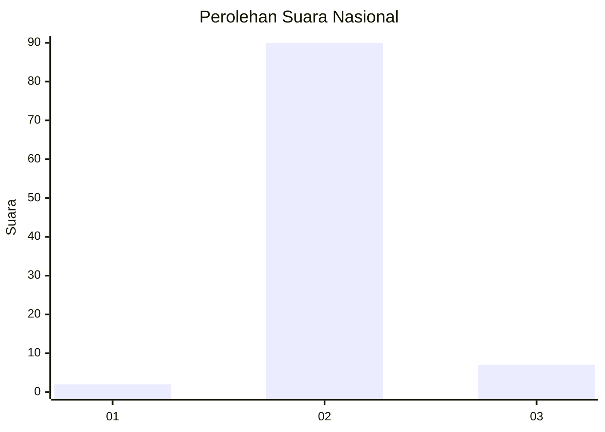
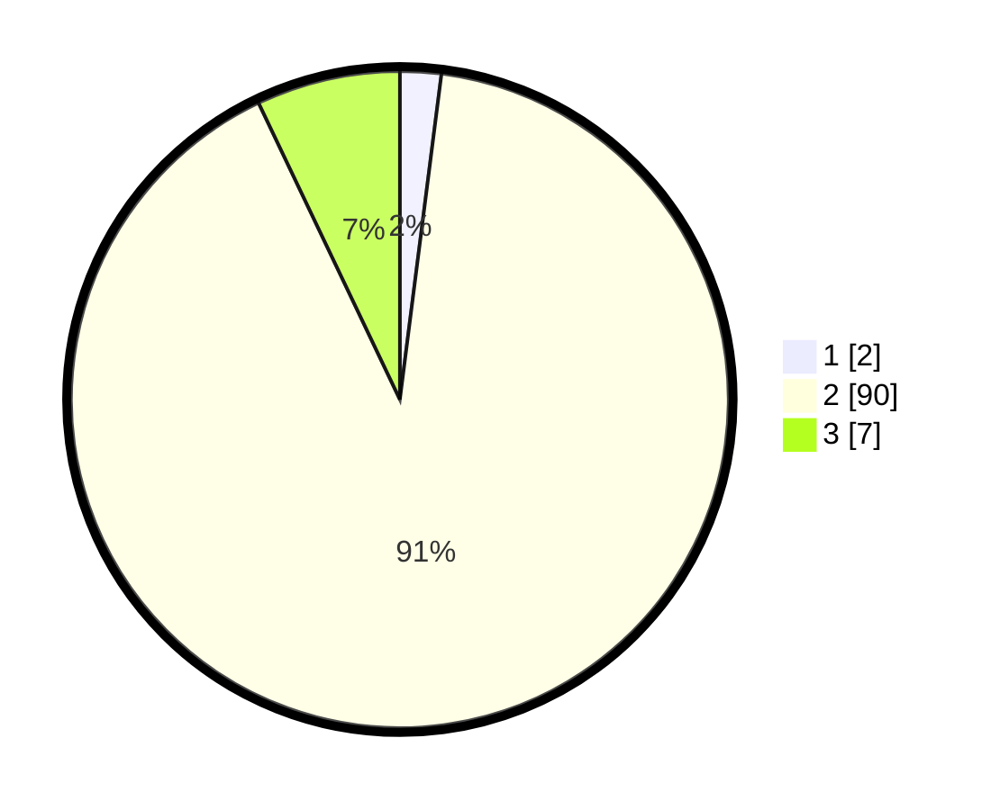

# Hasil

## Grafik

## Tabel

| No.    | Nama Paslon    | Suara | Suara (raw) | Persentase |
|:------ |:-------------- | -----:| -----------:| ----------:|
| 100025 | ANIES MUHAIMIN | 2     | [2][p-1]    | 2,02       |
| 100026 | PRABOWO GIBRAN | 90    | [90][p-2]   | 90,91      |
| 100027 | GANJAR MAHFUD  | 7     | [7][p-3]    | 7,07       |

[p-1]: https://github.com/gigit-pemilu/pemilu-2024/blob/main/pilpres/hitung-suara/sub/31-dki-jakarta/sub/72-jakarta-utara/sub/01-penjaringan/sub/1002-kamal-muara/sub/007-tps/sub/paslon-1.txt
[p-2]: https://github.com/gigit-pemilu/pemilu-2024/blob/main/pilpres/hitung-suara/sub/31-dki-jakarta/sub/72-jakarta-utara/sub/01-penjaringan/sub/1002-kamal-muara/sub/007-tps/sub/paslon-2.txt
[p-3]: https://github.com/gigit-pemilu/pemilu-2024/blob/main/pilpres/hitung-suara/sub/31-dki-jakarta/sub/72-jakarta-utara/sub/01-penjaringan/sub/1002-kamal-muara/sub/007-tps/sub/paslon-3.txt

## Foto C Plano

https://sirekap-obj-formc.kpu.go.id/c849/pemilu/ppwp/31/72/01/10/02/3172011002007-20240222-205606--f70abb42-3571-4f47-8bb2-ea16b53a2f73.jpg

https://sirekap-obj-formc.kpu.go.id/c849/pemilu/ppwp/31/72/01/10/02/3172011002007-20240222-205635--a8af122f-65ca-4ad9-bd13-501b70356c1b.jpg

https://sirekap-obj-formc.kpu.go.id/c849/pemilu/ppwp/31/72/01/10/02/3172011002007-20240222-205708--718e4d57-c294-485c-9176-989525bf86aa.jpg

## Metadata

| Key        | Value               |
| ---------- | ------------------- |
| Time Stamp | 2024-02-24 22:31:28 |

