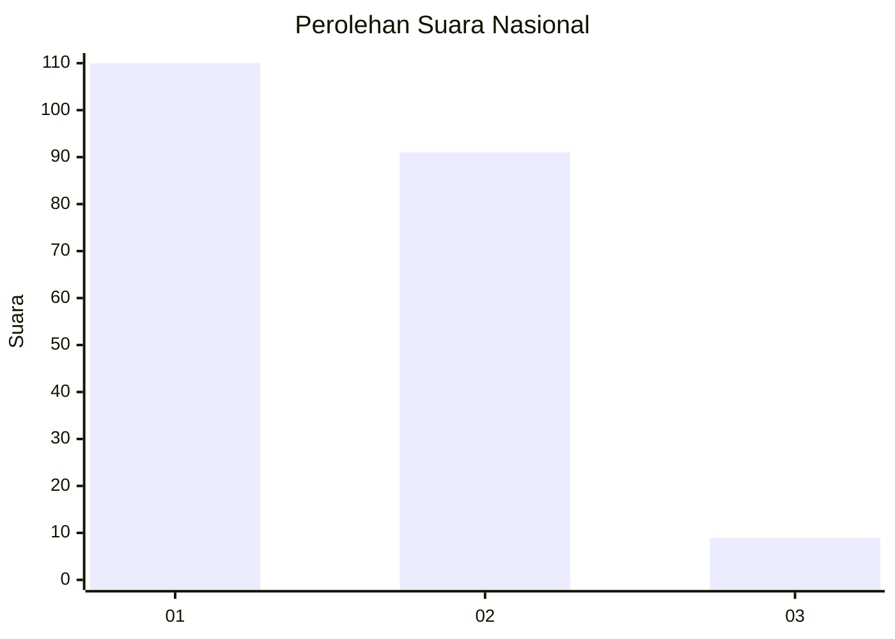
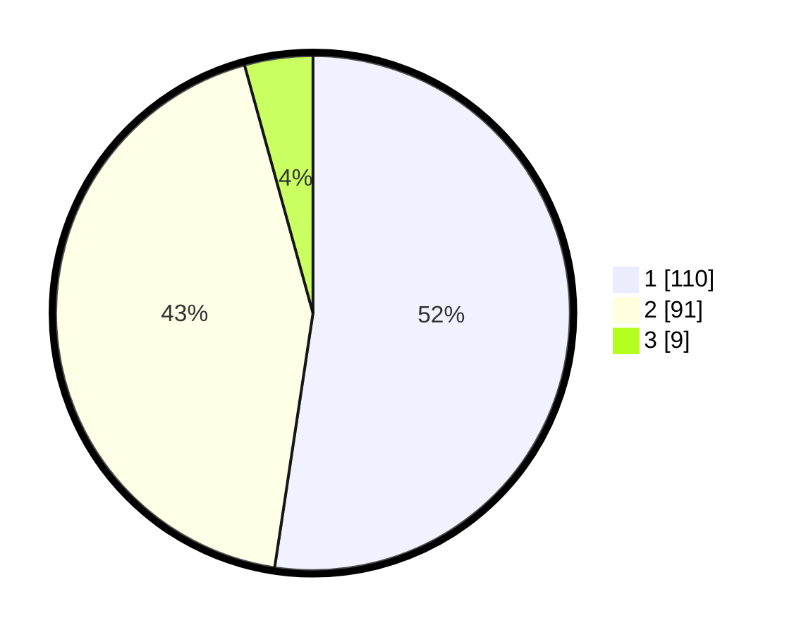

# Hasil

## Grafik

## Tabel

| No.    | Nama Paslon    | Suara | Suara (raw) | Persentase |
|:------ |:-------------- | -----:| -----------:| ----------:|
| 100025 | ANIES MUHAIMIN | 110   | [110][p-1]  | 52,38      |
| 100026 | PRABOWO GIBRAN | 91    | [91][p-2]   | 43,33      |
| 100027 | GANJAR MAHFUD  | 9     | [9][p-3]    | 4,29       |

[p-1]: https://github.com/gigit-pemilu/pemilu-2024/blob/main/pilpres/hitung-suara/sub/31-dki-jakarta/sub/72-jakarta-utara/sub/01-penjaringan/sub/1002-kamal-muara/sub/008-tps/sub/paslon-1.txt
[p-2]: https://github.com/gigit-pemilu/pemilu-2024/blob/main/pilpres/hitung-suara/sub/31-dki-jakarta/sub/72-jakarta-utara/sub/01-penjaringan/sub/1002-kamal-muara/sub/008-tps/sub/paslon-2.txt
[p-3]: https://github.com/gigit-pemilu/pemilu-2024/blob/main/pilpres/hitung-suara/sub/31-dki-jakarta/sub/72-jakarta-utara/sub/01-penjaringan/sub/1002-kamal-muara/sub/008-tps/sub/paslon-3.txt

## Foto C Plano

https://sirekap-obj-formc.kpu.go.id/62c3/pemilu/ppwp/31/72/01/10/02/3172011002008-20240222-210023--95b19421-05f5-475e-bd45-8da18243d4d8.jpg

https://sirekap-obj-formc.kpu.go.id/62c3/pemilu/ppwp/31/72/01/10/02/3172011002008-20240222-210109--283e514d-d9ee-4aca-88c1-893137bd0f39.jpg

https://sirekap-obj-formc.kpu.go.id/62c3/pemilu/ppwp/31/72/01/10/02/3172011002008-20240222-210149--e16e423c-89b9-401d-b84d-2d7bd51b7d46.jpg

## Metadata

| Key        | Value               |
| ---------- | ------------------- |
| Time Stamp | 2024-02-24 22:31:28 |

